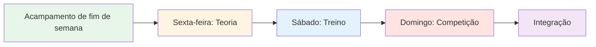
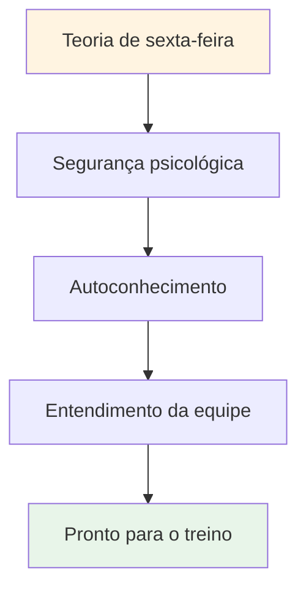

# Campo de Treinamento: Intensivo de Jogo Mental de Fim de Semana

## Visão geral

Um acampamento de treinamento completo de fim de semana (sexta a domingo) para 10 a 20 jogadores que combina teoria mental do jogo, prática na pista e aplicação competitiva. Este formato intensivo proporciona um aprendizado transformador por meio da integração dos três elementos.

::: tip Este guia está dividido em duas seções.
- **[Para Participantes](#for-participants)** - O que os jogadores vivenciarão durante o fim de semana
- **[Para Organizadores](#for-organizers)** - Como planejar e executar o campo de treinamento
:::

::: tip A filosofia do campo de treinamento
**Teoria sem prática é apenas informação. Prática sem teoria é apenas repetição. Competição sem reflexão é apenas brincadeira.** Este fim de semana integra os três para uma aprendizagem transformadora.
:::

## Acesso rápido

| Seção | Propósito | Acesso |
|---------|---------|--------|
| **Para Participantes** | Programação do fim de semana e o que levar. | [Ver seção](#for-participants) |
| **Para organizadores** | Guia completo de planejamento e facilitação | [Ver seção](#for-organizers) |
| **Horários Diários** | Cronograma e atividades detalhadas | [Sexta-feira](#sexta-à-noite-fundamentos-do-jogo-mental-3-4-horas) • [Sábado](#sábado-prática-aplicação-dia-inteiro) • [Domingo](#domingo-integração-da-competição-dia-inteiro) |
| **Guias relacionados** | Outros formatos de treinamento | [Jornada Mental](/pt/guides/mental-journey/) • [Oficina](/pt/guides/workshop/) |

---

## Para os participantes

### O que esperar

Este é um fim de semana intenso que irá desafiá-lo mentalmente, fisicamente e emocionalmente. Você aprenderá conceitos de jogo mental, os praticará na pista e os aplicará em competições — tudo isso enquanto constrói conexões profundas com outros jogadores.

**Estrutura do fim de semana:**

### Resumo diário

#### Sexta-feira à noite: Fundamentos do Jogo Mental (3-4 horas)
**O quê:** Sessão teórica sobre conceitos de jogos mentais
**Onde:** Sala de reuniões interna
**Formato:** Discussão em círculo e exercícios

**Você aprenderá:**
- Os estados de zona e fluxo
- Crítico Interior vs. Treinador Interior
- Padrões de resposta à pressão
- fundamentos da rotina pré-arremesso

**Atividades:**
- Check-in e regras básicas
- O Iceberg da Pétanque
- Criação de Manual do Usuário
- Exercício &quot;Medo no Chapéu&quot;

#### Sábado: Treino e Aplicação (Dia Inteiro)
**Manhã (3 horas):** Prática estruturada com foco mental
**Tarde (3 horas):** Exercícios de simulação de pressão
**Noite (2 horas):** Reflexão e integração

**Você praticará:**
- Rotinas pré-arremesso em arremessos reais
- Reajustar as técnicas após erros
- Âncoras de foco sob pressão
- protocolos de comunicação da equipe

**Formatar:**
- Exercícios em pequenos grupos (3-4 jogadores)
- Análise em vídeo de padrões mentais
- cenários de pressão
- Sessão de avaliação noturna

#### Domingo: Competição e Integração (Dia inteiro)
**Manhã (3 horas):** Jogo de torneio
**Tarde (2 horas):** Rodadas finais
**Noite (1 hora):** Reflexão final

**Você irá se candidatar a:**
- Todas as ferramentas mentais em competição
- Protocolos de equipe sob pressão
- Recuperação de erros em tempo real
- Processo de reflexão pós-jogo

### O que levar

**Obrigatório:**
- Suas bolas e equipamentos
- Roupas confortáveis para todos os climas.
- Caderno e caneta
- Mente aberta e disposição para compartilhar
- Garrafa de água

**Opcional:**
- Diário de treinamento
- Perguntas sobre desafios mentais específicos
- Exemplos de situações de pressão que você enfrenta

**Não é necessário:**
- Solicitações de treinamento técnico (com foco no aspecto mental do jogo)
- Ego ou necessidade de provar algo a alguém
- Julgamento dos outros

### Regras básicas para o fim de semana

::: tip O contêiner
Todos os participantes concordam com:
1. **Confidencialidade** - O que for compartilhado, permanecerá aqui.
2. **Respeito** - Honre a vulnerabilidade dos outros.
3. **Participação** - Envolva-se plenamente em todas as atividades.
4. **Mentalidade de Crescimento** - Encare o desconforto como aprendizado.
5. **Apoio** - Ajude os colegas de equipe a aplicar os conceitos.
:::

### O que você levará consigo

**Conhecimento:**
- Compreensão profunda dos seus padrões mentais.
- Ferramentas práticas para gestão da pressão
- Protocolos de equipe para competição
- Rotina pré-injeção personalizada

**Habilidades:**
- Capacidade de acessar estados de fluxo
- Técnicas de recuperação de erros
- Reformulação do Coach Interior
- Âncoras de foco

**Conexão:**
- Laços mais profundos com os colegas de equipe
- Linguagem compartilhada para jogos mentais
- Rede de apoio para o crescimento contínuo

**Materiais:**
- Folhas de exercícios e atividades concluídas
- Análise em vídeo dos seus padrões mentais
- Plano de ação para os próximos 30 dias
- Acesso a todos os módulos educacionais

### Horário típico

**Sexta-feira:**
- 18:00 - Chegada e check-in
- 19:00 - Jantar
- 20:00 - Sessão de abertura (teoria)
- 23:00 - Tempo livre / descanso

**Sábado:**
- 08:00 - Café da manhã
- 09:00 - Sessão de treino matinal
- 12:00 - Almoço
- 13h30 - Sessão de treino da tarde
- 17:00 - Intervalo
- 18:00 - Jantar
- 19h30 - Sessão de reflexão noturna
- 21:00 - Tempo livre / descanso

**Domingo:**
- 08:00 - Café da manhã
- 09:00 - Início do torneio
- 12:00 - Almoço
- 13:00 - Rodadas finais
- 15:00 - Premiações e reconhecimentos
- 16:00 - Círculo de encerramento
- 17:00 - Partida

---

## Para organizadores

### Visão geral do planejamento

Esta seção fornece tudo o que você precisa para organizar e realizar um acampamento de treinamento de fim de semana bem-sucedido para 10 a 20 jogadores.

### Planejamento pré-acampamento (6 a 8 semanas antes)

### Tamanho e estrutura do grupo

**Ideal para:** 10-20 jogadores
- **Acampamento pequeno (10-12):** Compartilhamento mais íntimo e profundo
- **Acampamento grande (16-20):** Perspectivas mais diversas, requer subgrupos

**Estrutura da Equipe:**
- Dividam-se em equipes de 3 a 4 pessoas para treino e competição.
- Misture níveis de habilidade e estilos de jogo.
- Rotacione as equipes ao longo do fim de semana.

### Requisitos de pessoal

| Papel | Responsabilidades | Quantidade |
|------|------------------|----------|
| **Coordenador(a) de Desempenho Mental** | Facilitar sessões teóricas e dinâmicas de grupo. | 1 |
| **Treinador Técnico** | Supervisionar a prática, fornecer feedback | 1-2 |
| **Diretor de Competição** | Organizar torneio, gerenciar logística | 1 |
| **Equipe de Apoio** | Refeições, preparação, administração | 1-2 |

### Requisitos de localização

::: info Necessidades das instalações
**Pista:**
- Múltiplos terrenos (mínimo 3-4 pistas)
- Diferentes superfícies, se possível (cascalho, areia, piso duro).
- Iluminação para brincadeiras noturnas

**Espaço interno:**
- Espaço para 20 pessoas em círculo (sessões teóricas)
- Separado da pista
- Quadro branco/projetor
- Assentos confortáveis

**Alojamento:**
- No local ou nas proximidades (a uma curta distância a pé)
- Quartos compartilhados incentivam a criação de laços.
- Espaço tranquilo para reflexão

**Serviço de catering:**
- Refeições com foco em nutrição (consulte o [Guia Alimentar](./food))
- Evite quedas bruscas de açúcar
- Postos de hidratação
:::

### Lista de Materiais

::: details Lista completa de materiais
**Sessões teóricas:**
- [ ] Cadeiras para círculo (sem mesas)
- [ ] Bocha e cochonnet para o centro
- [ ] Flip charts e marcadores
- [ ] notas adesivas
- [ ] Folhas de exercícios (Manual do Usuário, Crítico Interior, etc.)
- [ ] Papel e canetas
- [ ] Projetor (para conteúdo do site)

**Sessões de prática:**
- [ ] fita métrica
- [ ] Cones/marcadores para exercícios
- [ ] Câmera de vídeo/tripé
- [ ] Prancheta e papel (rastreamento)
- [ ] Assobiar

**Concorrência:**
- [ ] Folhas de pontuação
- [ ] Chaveamento do torneio
- [ ] Prêmios/reconhecimento
- [ ] kit de primeiros socorros

**Logística:**
- [ ] Etiquetas de identificação
- [ ] Lista de participantes com contatos
- [ ] Informações de contato de emergência
- [ ] Garrafas de água
- [ ] Protetor solar
- [ ] Lenços de papel (para lidar com as emoções!)
:::

## Programação do fim de semana

### Sexta-feira à noite (3 horas)

**18:00-18:30 - Chegada e boas-vindas**
- Check-in
- Atribuição de quartos
- Visão geral do fim de semana

**18:30-19:30 - Jantar**
- Refeição com foco em nutrição
- Apresentações informais

**19:30-22:30 - Sessão Teórica: Fundamentos**

Utilize o [Guia do Workshop](./workshop) para obter instruções detalhadas sobre a facilitação:

1. **Regras básicas (15 min)** - Estabelecer segurança psicológica
2. **Matriz de Check-in (20 min)** - Avaliar a energia do grupo
3. **O Iceberg (30 min)** - Explore pensamentos íntimos
4. **Manual do Usuário (45 min)** - Desenvolver o entendimento da equipe
5. **Medo em um Chapéu (45 min)** - Quebre o isolamento
6. **Finalização da compra (15 min)** - Feche o circuito

**22:30 - Tempo Livre**
- socialização informal
- Descanso e reflexão

### Sábado (Dia inteiro - Teoria + Prática)

**08:00-09:00 - Café da Manhã e Mindfulness**
- Café da manhã tranquilo
- Meditação guiada opcional de 15 minutos
- Defina suas intenções para o dia.

**09:00-10:30 - Sessão Teórica: Conectando Conteúdo à Experiência**

Escolha de 3 a 4 tópicos do site da Academia e explore o jogo interior:

**Exemplos de tópicos:**

1. **[Nutrição](./education/nutrition/)** (20 min)
   - &quot;Como suas escolhas alimentares mudam sob pressão?&quot;
   - Você come o que seu corpo precisa ou o que sua ansiedade deseja?
   - Prática: Planeje a nutrição para o dia da competição.

2. **[Força Mental](./education/mental-game/mental-strength/)** (25 min)
   - Qual é a sua relação com o fracasso?
   - &quot;Como você conversa consigo mesmo depois de errar um golpe?&quot;
   - Atividade: Reformule o crítico interno para treinador interno

3. **[Mindfulness](./education/mental-game/mindfulness/)** (25 min)
   - &quot;Para onde vai sua mente durante a pausa antes do arremesso?&quot;
   - O que te tira do momento presente?
   - Prática: escaneamento corporal de 5 minutos

4. **[Táticas](./education/technique/tactics/)** (20 min)
   - &quot;Sua escolha de jogada é baseada em estratégia ou medo?&quot;
   - &quot;Quando é melhor optar pela segurança e quando é melhor arriscar?&quot;
   - Discussão: Perfis de risco no grupo

**10:30-10:45 - Intervalo**

**10:45-12:30 - Integração na pista: Exercícios com foco mental**

**Exercício 1: Faça sua previsão (30 min)**

Do [Guia do Workshop](./workshop) - pratique assumir a responsabilidade pela intenção e pela dúvida:

1. Anuncie o alvo: &quot;Estou atirando no ferro&quot;
2. Estado de confiança: &quot;Estou com nota 7 de 10&quot;
3. Nomeie o pensamento interno: &quot;Minha voz interior está preocupada com o efeito reverso&quot;
4. Execute o golpe
5. Reflita: &quot;O que aconteceu? O que você aprendeu?&quot;

**Exercício 2: Interferência Cognitiva (30 min)**

Teste se a técnica se tornou automática:
- O coordenador faz perguntas complexas enquanto o jogador chuta.
- &quot;Nomeie 5 capitais&quot; ou &quot;Conte de trás para frente a partir de 100, subtraindo 7 a cada 100&quot;
- Sucesso = a técnica é implícita, não processada conscientemente.

**Exercício 3: Prática com o Manual do Usuário (30 min)**

Aplique os Manuais do Usuário de sexta-feira:
- Jogue em equipes de 3.
- Após cada disparo, os companheiros de equipe respondem de acordo com o Manual do Usuário.
- &quot;Marc precisa de silêncio após um erro&quot; - a equipe respeita isso.
- Debriefing: &quot;Como foi se sentir compreendido?&quot;

**12:30-14:00 - Almoço e Descanso**
- Refeição com foco em nutrição
- Momento de silêncio para reflexão
- Opcional: Reuniões individuais com o coordenador

**14:00-17:00 - Sessão prática: Adaptação ao terreno**

**Objetivo:** Desenvolver adaptabilidade e flexibilidade mental

**Configurar:**
- Gire por 3-4 terrenos/pistas diferentes
- 45 minutos por terreno
- Foque na adaptação mental, não apenas na técnica.

**Estrutura de Rotação:**

| Terreno | Foco mental | Prática |
|---------|--------------|----------|
| **Terreno 1: Macio/Areia** | Aceitação da incerteza | &quot;O dom - aceitar o que é&quot; |
| **Terreno 2: Duro/Cascalho** | Precisão sob pressão | &quot;Confie na sua técnica&quot; |
| **Terreno 3: Irregular** | Regulação emocional | &quot;Mantenha a calma quando for injusto&quot; |
| **Terreno 4: Competição** | Acesso ao estado de fluxo | &quot;Encontre a zona&quot; |

**Facilitação:**
- O treinador técnico fornece feedback sobre a técnica.
- MPC pergunta: &quot;O que está passando pela sua cabeça agora?&quot;
- Diário dos jogadores entre as rotações

**17:00-18:00 - Intervalo e Reflexão**
- Diário individual
- O que você aprendeu sobre si mesmo hoje?
- &quot;O que você fará de diferente amanhã?&quot;

**18:00-19:00 - Jantar**

**19:00-21:00 - Teoria Noturna: Vulnerabilidade Profunda**

**Atividade 1: Reinterpretando o Crítico Interior (45 min)**

Consulte o [Guia do Workshop](./workshop) para obter o protocolo completo:
1. Identifique a frase exata do crítico.
2. Reenquadre como Coach Interior
3. Prática de sócios

**Atividade 2: Preparação para a Competição (45 min)**

Amanhã é dia de competição. Prepare-se mentalmente:

1. **Visualização (15 min)**
   - Feche os olhos
   - Imagine a foto perfeita
   - Sinta a confiança
   - Observe a calma

2. **Protocolos da Equipe (20 min)**
   - Criar sinais de apoio
   - &quot;Preciso de um reset&quot; = toque nas bolas
   - &quot;Preciso de incentivo&quot; = toque de punho
   - &quot;Preciso de espaço&quot; = recuar

3. **Definir Intenções (10 min)**
   - &quot;Amanhã, vou me concentrar em...&quot;
   - &quot;Meu objetivo não é vencer, mas sim...&quot;
   - &quot;Vou praticar...&quot;

**Check-out (30 min)**
- Compartilhe um medo sobre o amanhã.
- Compartilhe uma intenção
- apoio de grupo

**21:00 - Tempo Livre**
- Deitar cedo (competição amanhã!)
- Reflexão silenciosa

### Domingo (Dia da Competição)

**08:00-09:00 - Café da manhã e preparação mental**
- Café da manhã leve (consulte o [Guia de Nutrição](./education/nutrition/))
- Prática de atenção plena de 15 minutos
- Reuniões de equipe

**09:00-09:30 - Reunião Informativa sobre a Competição**

**Formato:** Torneio de todos contra todos
- Equipes de 3
- Jogue até 13 pontos.
- Todo mundo interpreta todo mundo
- Foque no PROCESSO, não no resultado.

**A reviravolta: Avaliação do desempenho mental**

::: tip Sistema de Pontuação Dupla
**Tradicional:** Pontos ganhos
**Desempenho Mental:** Avaliado pelo MPC

Pontos de Desempenho Mental (0-5 por jogo):
- Ferramentas do Manual do Usuário Utilizadas
- Apoiei os colegas de equipe de forma eficaz.
- Crítica interna controlada
- Mantive-me presente (sem me apegar a fotos antigas).
- Segurança psicológica comprovada

**Vencedor:** Melhor pontuação combinada (tradicional + mental)
:::

**09:30-13:00 - Competição Matinal**
- jogos de todos contra todos
- O MPC observa e pontua
- O treinador técnico fornece um breve feedback entre os jogos.
- Pausas para hidratação e lanches

**13:00-14:00 - Almoço**
- Com foco em nutrição
- reflexão informal
- Descansar

**14:00-17:00 - Competição da tarde**
- Continue o torneio de todos contra todos.
- Semifinais e finais
- Aumento da pressão
- Aplicar os ensinamentos da manhã

**17:00-17:30 - Prêmios e Reconhecimento**

**Categorias:**
- Vencedor tradicional
- Vencedor do desempenho mental
- Maior melhoria
- Melhor companheiro de equipe
- Prêmio Coragem (mais vulnerável)

**17:30-19:00 - Sessão de Reflexão Final**

**Fundamental:** É aqui que a aprendizagem se consolida.

**Estrutura:**

**1. Reflexão Individual (15 min)**
Escreva no diário:
- O que você aprendeu sobre si mesmo neste fim de semana?
- O que te surpreendeu?
- O que você fará de diferente?
- O que você vai levar para casa?

**2. Partilha em Pequenos Grupos (30 min)**
Grupos de 4 a 5 pessoas:
- Compartilhe insights importantes
- O que mais lhe chamou a atenção?
- Qual foi a parte mais difícil?
- O que era mais valioso?

**3. Integração completa do grupo (30 min)**
Formem um círculo:
- Cada pessoa compartilha UMA principal conclusão.
- O MPC valida e conecta temas.
- Discuta: &quot;Como você aplicará isso?&quot;

**4. Compromissos (15 min)**
- Cada pessoa declara um compromisso.
- &quot;Na minha próxima competição, eu irei...&quot;
- Testemunhas e apoiadores do grupo

**5. Encerramento (15 min)**
- Agradecemos a coragem dos participantes.
- Lembre-se da confidencialidade.
- Trocar contatos
- Planejar acompanhamento (sessão online opcional)

**19:00 - Jantar e Partida**

## Dicas de Facilitação

### Equilibrando teoria e prática

::: warning Não sobrecarregue a teoria
**O erro:** Falar demais e fazer de menos.

**O saldo:**
- A teoria cria consciência
- A prática leva à perfeição.
- Integração de testes de competição
- A reflexão consolida o aprendizado.

**Regra geral:** 30% teoria, 40% prática, 20% competição, 10% reflexão
:::

### Gerenciando a dinâmica de grupo

**O Alfa Competitivo:**
- Quer vencer a qualquer custo.
- Resiste à vulnerabilidade
- **Estratégia:** Canalizar a competitividade para a pontuação do desempenho mental.

**O Observador Silencioso:**
- Absorve tudo, não compartilha.
- **Estratégia:** Criar pontos de entrada de baixo risco, validar a observação como participação.

**O Cético:**
- &quot;Essa coisa de ficar tocando em algo não funciona&quot;
- **Estratégia:** Aikido Verbal - alinhar e pivotar (ver [Guia do Workshop](./workshop))

**A pessoa que compartilha demais:**
- Domina a discussão
- **Estratégia:** &quot;Obrigado, vamos ouvir a opinião de outros&quot;

### Lidando com Momentos Emocionais

**Alguém chora durante Fear in a Hat:**
- ✅ Normalizar: &quot;Lágrimas são coragem, não fraqueza&quot;
- ✅ Ofereça lenços de papel, não tenha pressa.
- ✅ Pergunte: &quot;Do que você precisa agora?&quot;
- ❌ Não diga: &quot;Está tudo bem, não chore&quot;

**Conflito entre jogadores:**
- ✅ Faça uma pausa e aborde
- ✅ &quot;O que está acontecendo agora?&quot;
- ✅ Use como momento de aprendizado
- ❌ Não ignore nem minimize

**Alguém desliga:**
- ✅ Faça o check-in em particular durante o intervalo
- ✅ &quot;Notei que você ficou quieto(a). O que houve?&quot;
- ✅ Ofereça opções: participe de maneiras diferentes, faça uma pausa
- ❌ Não faça isso: Denuncie publicamente

## Acompanhamento pós-acampamento

### Imediato (24-48 horas)

**Enviar a todos os participantes:**
- Mensagem de agradecimento
- Resumo dos principais pontos
- Fotos do fim de semana
- Lista de contatos (com permissão)
- Link para recursos no site

**Check-ins individuais:**
- Envie mensagem para qualquer pessoa que tenha compartilhado muito
- &quot;Como você se sente em relação ao fim de semana?&quot;
- Corrija qualquer resquício de vulnerabilidade.

### Curto prazo (2 semanas)

**Sessão online opcional (60-90 min):**
- Como você aplicou os aprendizados?
- O que está funcionando? O que está sendo desafiador?
- Apoio entre pares e resolução de problemas
- Reforçar os compromissos

### Longo prazo (1-3 meses)

**Participantes da pesquisa:**
- O que há de diferente no seu jogo?
- Quais ferramentas você ainda está usando?
- O que tornaria o próximo acampamento melhor?
- Você recomendaria para outras pessoas?

**Impacto na pista:**
- Resultados da competição
- Autoconfiança relatada
- Dinâmica de equipe
- engajamento contínuo

## Adaptação para diferentes tamanhos de grupo

### Acampamento pequeno (10-12 jogadores)

**Vantagens:**
- Compartilhamento mais profundo
- Mais atenção individualizada
- Laços mais fortes

**Ajustes:**
- Teoria de grupo único para todos
- Mais tempo por pessoa nas atividades
- Formato de competição intimista

### Acampamento grande (16-20 jogadores)

**Vantagens:**
- Diversas perspectivas
- Mais variedade de competição
- Economias de escala

**Ajustes:**
- Dividam-se em 2 grupos para algumas sessões teóricas.
- São necessários 2 MPCs/facilitadores
- Tabela de torneio maior
- Rotações mais estruturadas

## Considerações orçamentárias

### Receita

| Item | Preço por pessoa | 20 pessoas | 10 pessoas |
|------|------------------|-----------|-----------|
| **Inscrição** | €150-250 | € 3.000-5.000 | € 1.500-2.500 |

### Despesas

| Categoria | Custo | Notas |
|----------|------|-------|
| **Aluguel de instalações** | €500-1.000 | Tarifa de fim de semana |
| **Alojamento** | €40-60 por pessoa por noite | Quartos compartilhados |
| **Refeições** | €30-40 por pessoa por dia | 6 refeições |
| **Funcionários** | €500-1.000 | MPC + treinadores |
| **Materiais** | €100-200 | Folhas de exercícios, materiais |
| **Prêmios** | €100-200 | Itens de reconhecimento |

**Total por pessoa:** €120-180
**Margem de lucro:** €30-70 por pessoa (ou ponto de equilíbrio para atividades de integração comunitária)

## Métricas de sucesso

### Indicadores imediatos

- [ ] Pontuação de segurança psicológica (média de 1 a 10 &gt;7)
- [ ] Taxa de participação (&gt;80% de compartilhamento ativo)
- [ ] Taxa de conclusão (&gt;90% de permanência durante todo o fim de semana)
- [ ] Pontuação de satisfação (média de 1 a 10 &gt; 8)

### Indicadores de longo prazo

- [ ] Mudança de comportamento (utilizando ferramentas na competição)
- [ ] Melhoria de desempenho (autoavaliada)
- [ ] Construção de comunidade (manter contato)
- [ ] Indicações (recomendar a outros)

## Erros comuns a evitar

::: danger Armadilhas
**1. Conteúdo em excesso**
- Tentando abranger tudo
- **Correção:** Foque na profundidade, não na amplitude.

**2. Ignorar a reflexão**
- Correndo para a próxima atividade
- **Correção:** Incluir tempo de processamento

**3. Ignorar a resistência**
- Superando o ceticismo
- **Solução:** Aborde o problema diretamente com Aikido Verbal.

**4. Acompanhamento técnico durante a aula teórica**
- Misturando papéis
- **Correção:** Definir claramente os limites entre o MPC e o treinador técnico.

**5. Sem acompanhamento**
- O fim de semana acaba, o aprendizado para.
- **Correção:** Planejar pontos de contato pós-acampamento
:::

## Recursos

### Deste site

- [Guia do Workshop](./workshop) - Protocolos de facilitação detalhados
- [Guia da Sessão de Treinamento](./training-session) - Para prática contínua
- [Nutrição](./education/nutrition/) - Protocolos para o dia da competição
- [Força Mental](./education/mental-game/mental-strength/) - Conceitos de jogo interior
- [Mindfulness](./education/mental-game/mindfulness/) - Técnicas de presença
- [Táticas](./education/technique/tactics/) - Pensamento estratégico

### Leitura recomendada

- *O Jogo Interior do Tênis*, de Timothy Gallwey
- *Mentalidade*, de Carol Dweck
- *A Organização Destemida*, de Amy Edmondson

