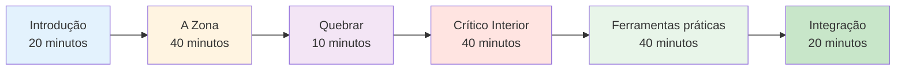

# Guia da Sessão: Introdução ao Jogo Mental (2-3 horas)


## Visão geral

Este guia ajuda você a conduzir uma sessão introdutória de 2 a 3 horas sobre treinamento mental para jogadores de petanca. Perfeito para treinadores, dirigentes de clubes ou jogadores experientes que desejam introduzir o treinamento mental em suas equipes.

::: tip Este guia está dividido em duas seções.
- **[Para Participantes](#for-participants)** - O que os jogadores aprenderão
- **[Para Facilitadores](#for-facilitators)** - Como conduzir a sessão
:::

## Acesso rápido

| Seção | Propósito | Acesso |
|---------|---------|--------|
| **Para Participantes** | O que esperar da sessão | [Ver seção](#for-participants) |
| **Para Facilitadores** | Plano de sessão completo e duração | [Ver seção](#para-facilitadores) |
| **Materiais da Sessão** | Guias, slides e folhas de exercícios | [Ver Materiais](/en/mental-journey/materials) |
| **Lista de verificação de preparação** | O que preparar antes da sessão | [Ver lista de verificação](#preparação-1-semana-antes) |

---

## Para os participantes

### O que esperar

Esta sessão apresenta o aspecto mental do jogo de petanca através de discussões, exercícios e técnicas práticas que você pode usar imediatamente.

**Você aprenderá:**
- Por que o treinamento mental é importante para o desempenho?
- A diferença entre &quot;modo técnico&quot; e &quot;modo de fluxo&quot;
- Como reconhecer e lidar com seu crítico interno
- Técnicas simples para o gerenciamento da pressão arterial.
- Uma rotina básica antes da foto

**O que você vai precisar:**
- Mente aberta e disposição para compartilhar
- Caderno e caneta
- Compartilhe suas próprias experiências
- 2 a 3 horas de tempo concentrado

### Estrutura da Sessão



### Conceitos-chave que você explorará

#### 1. A Zona (Estado de Fluxo)
- A sensação de quando tudo se encaixa.
- Por que pensar na técnica atrapalha o desempenho
- A &quot;transição&quot; do planejamento para a execução.

#### 2. O Crítico Interior
- Como a autocrítica negativa afeta o desempenho
- A diferença entre o crítico interno e o treinador interno
- Observação neutra versus julgamento severo

#### 3. Resposta à pressão
- Por que você joga de forma diferente em competições?
- Sinais físicos de pressão
- Técnicas de reinicialização rápida

#### 4. Ferramentas Práticas
- Reinicialização em 3 respirações
- rotina simples antes da foto
- Protocolo de recuperação de erros

### O que levar

**Obrigatório:**
- Você e suas experiências
- Disposição para participar

**Opcional:**
- Exemplos de desafios mentais que você enfrenta
- Perguntas sobre situações específicas
- Caderno para anotações pessoais

### Após a sessão

Você receberá:
- Resumo dos principais conceitos
- Exercícios práticos para a semana
- Links para módulos educacionais detalhados
- Modelo de objetivos para o desenvolvimento de jogos mentais


---

## Para Facilitadores

### Lista de verificação de preparação

**1 semana antes:**
- [ ] Reserve um quarto por 2 a 3 horas.
- [ ] Convide de 6 a 12 participantes.
- [ ] Adicione as páginas de materiais aos seus favoritos (consulte [Materiais](/en/mental-journey/materials))
- [ ] Analise este guia cuidadosamente.
- [ ] Prepare um flip chart ou um quadro branco.

**1 dia antes:**
- [ ] Confirme presença
- [ ] Preparar a sala (com assentos em círculo)
- [ ] Teste qualquer tecnologia (slides, etc.)
- [ ] Preparar os materiais

**1 hora antes:**
- [ ] Chegue cedo
- [ ] Disponha os assentos em círculo.
- [ ] Preparar materiais
- [ ] Centralize-se

### Seu papel como facilitador

::: warning Importante
Você **não** é um terapeuta ou um coach técnico. Você é um **facilitador** que:
- Discussão sobre guias
- Cria um espaço seguro
- Conecta conceitos à experiência.
- Gerencia a dinâmica de grupo
:::

**Habilidades Essenciais:**
- Escuta ativa
- Presença neutra
- Gerenciar diferentes personalidades
- Saber a hora de seguir em frente

### Plano de Sessão Detalhado

---

#### Parte 1: Introdução (20 minutos)

**Objetivos:**
- Criar segurança psicológica
- Defina expectativas
- Criar conexão de grupo

**Roteiro:**

&quot;Sejam todos bem-vindos. Esta sessão é sobre o aspecto mental do jogo de petanca - os pensamentos, sentimentos e padrões que afetam o seu desempenho.&quot;

**Regras básicas:**
1. O que é compartilhado aqui, fica aqui.
2. Sem julgamentos sobre as experiências alheias.
3. A participação é voluntária.
4. Não existem respostas erradas.

**Perguntas rápidas:** Nome, há quanto tempo você joga, um desafio mental que você enfrenta.

**Notas do Facilitador:**
- Comece por modelar a vulnerabilidade.
- Mantenha as apresentações breves (1 minuto cada).
- Observe os temas comuns
- Valide todas as respostas.

---

#### Parte 2: O Estado de Zona/Fluxo (40 minutos)

**Objetivos:**
- Compreender os estados de fluxo
- Reconhecer o modo técnico versus o modo de fluxo
- Aprenda o conceito de &quot;interruptor&quot;

**Pergunta inicial:**
&quot;Pense em uma vez em que você jogou sua melhor partida de petanca. Como você se sentiu? O que foi diferente?&quot;

**Sugestões para discussão:**
1. &quot;Quantos de vocês já tiveram jogos em que tudo simplesmente se encaixou?&quot;
2. &quot;No que você estava pensando durante esses momentos?&quot;
3. &quot;Qual a diferença entre isso e quando você está passando por dificuldades?&quot;

**Pontos-chave de ensino:**

Use o quadro branco para desenhar:
```
PLANNING MODE          →    EXECUTION MODE
(Outside circle)            (Inside circle)
- Analyze situation         - Eyes on target
- Choose strategy           - Trust training
- Decide throw type         - Automatic movement
```

**Exercício: A Troca (10 minutos)**

&quot;Vamos praticar o momento da troca:
1. Ficar de pé
2. Imagine que você está fora do círculo - pense em uma tacada.
3. Respire fundo.
4. Dê um passo à frente (para dentro de um círculo imaginário)
5. Ao dar o passo, deixe de lado a análise.
6. &quot;Concentre-se apenas em um alvo imaginário&quot;

**Relatório:**
- &quot;O que você notou?&quot;
- &quot;Foi fácil ou difícil deixar de pensar?&quot;
- &quot;Como isso se aplicaria em jogos reais?&quot;

---

#### Parte 3: Intervalo (10 minutos)

**Ações do Facilitador:**
- Incentive discussões informais.
- Observe a energia do grupo
- Prepare-se para a próxima seção.

---

#### Parte 4: O Crítico Interior (40 minutos)

**Objetivos:**
- Reconheça padrões de diálogo interno negativo.
- Diferencie o crítico interno do treinador interno.
- Pratique a observação neutra.

**Abertura:**
&quot;Todos nós temos uma voz interior que comenta nosso desempenho. Às vezes é útil, às vezes é dura. Vamos explorar isso.&quot;

**Exercício: Inventário do Crítico Interior (15 minutos)**

&quot;Em seu papel, escreva:
1. O que sua voz interior diz depois de um arremesso ruim
2. O que isso significa quando você está sob pressão
3. O que isso diz sobre suas habilidades&quot;

*Dê 5 minutos para escrever*

&quot;Agora, quem está disposto a compartilhar um exemplo?&quot;

**Notas do Facilitador:**
- Normalizar a autocrítica severa
- Não tente &quot;consertar&quot; ninguém.
- Procure padrões comuns

**Aula: Crítico Interior vs. Orientador Interior (15 minutos)**

Desenhe duas colunas no quadro branco:

| Crítico Interior | Treinador Interior |
|--------------|-------------|
| &quot;Como você pôde perder isso?!&quot; | &quot;Isso foi para a esquerda&quot; |
| &quot;Você sempre se engasga&quot; | &quot;Vamos tentar novamente&quot; |
| &quot;Você é terrível&quot; | &quot;O que posso aprender?&quot; |

**Discussão:**
- &quot;Percebe a diferença?&quot;
- &quot;Qual voz ajuda na performance?&quot;
- &quot;Você consegue mudar a voz?&quot;

**Prática: Reestruturação Mental (10 minutos)**

&quot;Escolha uma das suas afirmações de Crítico Interior. Como um Coach Interior a expressaria?&quot;

Compartilhe exemplos.

---

#### Parte 5: Ferramentas Práticas (40 minutos)

**Objetivos:**
- Aprenda a técnica de reinicialização em 3 respirações.
- Crie uma rotina simples antes da gravação
- Entenda a recuperação de erros

**Ferramenta 1: Reinicialização em 3 respirações (10 minutos)**

&quot;Este é o seu botão de reinicialização de emergência. Use-o quando sentir que a pressão está aumentando.&quot;

**Demonstrar:**
1. Inspire contando até 4.
2. Mantenha a posição por 2 tempos.
3. Expire contando até 6.
4. Repita 3 vezes

&quot;Vamos praticar juntos agora.&quot;

*Conduza o grupo através de 3 ciclos*

**Relatório:**
- &quot;O que você notou em seu corpo?&quot;
- &quot;Quando você poderia usar isso?&quot;

**Ferramenta 2: Rotina simples de preparação para a foto (15 minutos)**

&quot;Uma rotina ajuda você a passar do planejamento à execução de forma consistente.&quot;

**Estrutura básica:**
```
Outside Circle (Planning):
- Look at situation
- Decide on throw
- See the result in your mind

Walking to Circle (Transition):
- One deep breath
- Let go of analysis

Inside Circle (Execution):
- Eyes on target only
- Trust your training
- Execute
```

**Exercício:**
&quot;Crie sua própria rotina de 3 passos. Anote-a.&quot;

Compartilhe exemplos.

**Ferramenta 3: Protocolo de Recuperação de Erros (15 minutos)**

&quot;Jogadores de elite não cometem menos erros. Eles se recuperam mais rápido.&quot;

**Protocolo de 3 etapas:**
1. **Observe** - Apresente o fato de forma neutra (&quot;Aquilo foi para a esquerda&quot;)
2. **Aprender** - Extrair informações (&quot;Vento mais forte do que eu pensava&quot;)
3. **Recomeçar** - Seguir em frente (recomeço de 3 respirações, olhar para a frente)

**Prática:**
&quot;Pense em um erro recente. Descreva os 3 passos.&quot;

---

#### Parte 6: Integração e Encerramento (20 minutos)

**Objetivos:**
- Consolidar o aprendizado
- Criar planos de ação
- Fornecer recursos

**Questões para reflexão:**
1. &quot;Qual é a principal lição que você leva consigo?&quot;
2. &quot;Qual é uma coisa que você vai experimentar esta semana?&quot;
3. &quot;Que perguntas ainda restam?&quot;

**Planejamento de Ações (10 minutos)**

&quot;Na sua folha de atividades, escreva:
1. Uma técnica que você praticará esta semana
2. Quando/onde você vai praticar isso
3. Como você acompanhará seu progresso&quot;

**Recursos:**
- Distribua a folha de resumo.
- Compartilhe o site: carreau.app
- Módulo inicial recomendado: [The Zone](/en/education/the-zone/)

**Círculo de Encerramento:**
&quot;Uma palavra para descrever como você está se sentindo agora.&quot;

**Considerações finais:**
&quot;O treinamento mental é uma habilidade como qualquer outra - requer prática. Comece devagar, seja paciente consigo mesmo e observe as mudanças. Agradeço sua abertura hoje.&quot;

---

### Dicas para o Facilitador

#### Lidando com situações difíceis

**Se alguém domina:**
- &quot;Obrigado [nome]. Vamos ouvir a opinião dos outros.&quot;
- Use a alternância de turnos estruturada.

**Se alguém resistir:**
- Não discuta
- &quot;Essa é uma perspectiva válida. O que os outros pensam?&quot;
- Alinhe-se com a preocupação deles

**Se alguém ficar emocionado:**
- Normalize-o
- &quot;Isso toca em algo real. Obrigada por compartilhar.&quot;
- Não tente consertar

**Caso a discussão fique estagnada:**
- Use instruções específicas
- Compartilhe seu próprio exemplo.
- Passe para um exercício

#### Gestão de energia

**Alta energia:** Utilize exercícios e movimento
**Baixa energia:** Faça perguntas provocativas
**Dispersos:** Restaure à estrutura
**Tempo verbal:** Use humor ou faça uma pausa.

### Pós-sessão

**Seguir:**
- Enviar e-mail de resumo em até 24 horas.
- Inclua links para recursos.
- Ofereça-se para responder às perguntas.
- Agende uma sessão de acompanhamento opcional.

**Autoavaliação:**
- O que funcionou bem?
- O que você mudaria?
- O que te surpreendeu?
- O que você aprendeu?


---

## Materiais

- [Guia do Participante](/en/mental-journey/materials#participant-guide)
- [Slides do Facilitador](/en/mental-journey/materials#facilitator-slides)
- [Folha Resumo](/en/mental-journey/materials#summary-sheet)
- [Folhas de exercícios](/en/mental-journey/materials#exercise-worksheets)

---

::: tip Pronto para facilitar?
1. Analise este guia cuidadosamente.
2. Baixe os materiais
3. Pratique os exercícios você mesmo
4. Agende sua sessão
5. Confie no processo
:::

