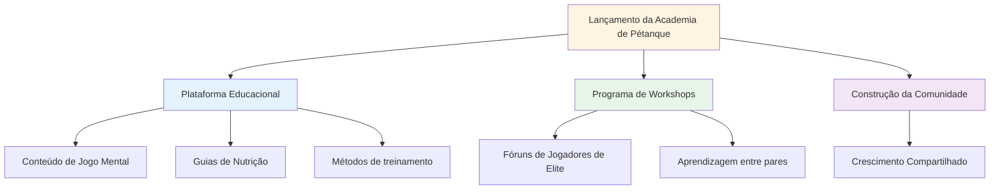
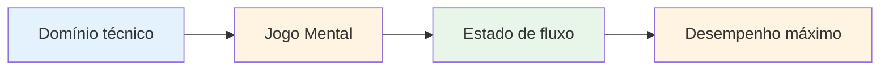

# Notícias
<AdBanner />

## Bem-vindo à Academia de Pétanque

::: tip Lançamento emocionante! 🎉
**Esta é a primeira startup!**

Estamos muito animados em lançar a Academia de Pétanque - uma nova iniciativa dedicada a ajudar jogadores de elite de pétanque a atingirem seu potencial máximo.
:::

<AdInArticle />

## O que está por vir

::: info Fique ligado para mais informações.
- 📅 **Próximos workshops** - Sessões em pequenos grupos para jogadores de elite
- 📚 **Novo conteúdo educativo** - Jogo mental, nutrição, métodos de treino
- 🎯 **Eventos da comunidade** - Conecte-se com jogadores que compartilham seus interesses
- 💡 **Histórias e percepções dos jogadores** - Aprenda com as experiências de outros
:::

## Nossa missão

::: tip O Próximo Nível
Jogadores de elite já dominam a técnica. O próximo passo é o aspecto mental: aprender a entrar em estado de fluxo, lidar com a pressão e ter um desempenho consistente no seu melhor nível.
:::

## Comece agora

Enquanto aguarda o anúncio dos workshops, explore nossa seção completa de educação:

| Seção | O que você aprenderá | Comece aqui |
|---------|-------------------|------------|
| **A Zona** | Como entrar em estado de fluxo de forma consistente | [Entendendo o Fluxo](/en/education/the-zone/) |
| **Força Mental** | Lidar com a pressão e criar rotinas | [Jogo Mental](/en/education/mental-strength/) |
| **Atenção plena** | Consciência do momento presente para o desempenho | [Prática de Mindfulness](/en/education/mindfulness/) |
| **Nutrição** | Alimente seu cérebro para um foco estável. | [Nutrição de Precisão](/en/education/nutrition/) |
| **Metas** | Defina e alcance metas significativas. | [Definição de metas](/en/education/goals/) |

::: info Junte-se à jornada
Isto é apenas o começo. Estamos construindo algo especial para jogadores de elite que desejam dar o próximo passo. Bem-vindos à Academia de Pétanque.
:::

<AdBanner />
