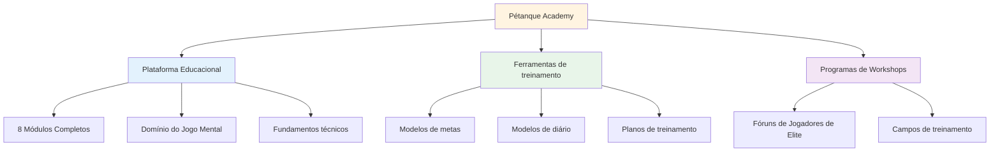
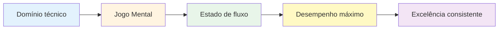

# Notícias e atualizações

<AdBanner />

## Bem-vindo à Academia de Pétanque

::: tip Plataforma já disponível! 🎉
**A Academia de Petanca já está em pleno funcionamento!**

Lançamos uma plataforma completa dedicada a ajudar jogadores de petanca de elite a atingirem seu potencial máximo por meio do domínio do jogo mental, treinamento estruturado e ferramentas práticas.
:::

<AdInArticle />

## O que está disponível agora

### 📚 Plataforma Educacional Completa

Lançamos **8 módulos educacionais abrangentes** que cobrem tudo, desde estados de fluxo até nutrição:

| Módulo | O que tem dentro | Principais características |
|--------|---------------|--------------|
| **[A Zona](/en/education/the-zone/)** | Domínio do estado de fluxo | 4 guias detalhados sobre como entrar e manter o fluxo |
| **[Força Mental](/en/education/mental-strength/)** | manuseio de pressão | Rotinas pré-filmagem, gerenciamento do crítico interno |
| **[Atenção plena](/en/education/mindfulness/)** | Consciência do momento presente | Práticas diárias, técnicas de competição |
| **[Metas](/en/educação/metas/)** | Planejamento estratégico | Metas SMART, hierarquia, sistemas de acompanhamento |
| **[Táticas](/en/education/tactics/)** | Estratégia de jogo | Tomada de decisão, probabilidade, posicionamento |
| **[Jogador de Equipe](/en/education/team-player/)** | Habilidades de colaboração | Comunicação, confiança, dinâmica de equipe |
| **[Treinamento](/en/education/training/)** | Métodos de prática | Exercícios, prática deliberada, progressão |
| **[Nutrição](/en/education/nutrition/)** | Combustível de alto desempenho | Controle do açúcar no sangue, nutrição para competições |

### 🛠️ Ferramentas Práticas

**Modelos e programas prontos para uso:**

- **[Workshop](/en/workshop)** - Sessões estruturadas de 3 horas para desenvolvimento de jogos mentais
- **[Campo de Treinamento](/en/training-camp)** - Programas intensivos de fim de semana para jogadores de elite
- **[Sessão de Treinamento](/en/training-session)** - Estruturas práticas de 2 a 3 horas
- **[Modelo de Metas](/en/goal-template)** - Sistema completo para definição e acompanhamento de metas
- **[Modelo de Diário](/en/diary-template)** - Diário de prática e reflexão diária

### 🎯 Orientação Técnica

A seção **[Aconselhamento Técnico](/en/technical/)** inclui:
- Guia completo para todos os lançamentos de petanca
- Estratégias de seleção de trajetória
- técnicas de controle de rotação
- estruturas de seleção de planos

### 🍽️ Nutrição para Desempenho

**[Comida](/en/food)** - Guia completo para:
- Controle da glicemia para manter o foco estável
- Estratégias de nutrição pré-competição
- Otimização de energia para torneios

### 📝 Artigos e Insights

**NOVO: 14 artigos aprofundados** abordando tópicos sobre o jogo mental:

| Categoria | Artigos |
|----------|----------|
| **Entendendo o Crítico Interior** | [Crítico Interior](/en/blog/inner-critic) - Domine seu diálogo interno |
| **Criando Rotinas Pré-Gravação** | [Rotinas pré-filmagem](/en/blog/pre-shot-routines) - Crie consistência |
| **Gestão de Pressão** | [Gestão da Pressão](/en/blog/pressure-management) - Desempenho sob pressão |
| **Psicologia do Desempenho** | [Estados de Fluxo](/en/blog/flow-state-science) • [Atenção Plena](/en/blog/mindfulness-competition) • [Definição de Metas](/en/blog/elite-goal-setting) • [Resiliência Mental](/en/blog/mental-resilience) |
| **Dinâmica de Equipe** | [Comunicação](/en/blog/team-communication) • [Química de Equipe](/en/blog/team-chemistry) • [Liderança](/en/blog/team-leadership) |
| **Treinamento e Desenvolvimento** | [Erros no Treinamento Mental](/en/blog/mental-training-mistakes) • [Estrutura de Prática](/en/blog/practice-structure) • [Preparação para Competição](/en/blog/competition-prep) |

➡️ **[Ver todos os artigos](/en/blog/)**

### 📖 Recursos

**Estudos de Caso e Depoimentos:**

- **[Estudos de Caso](/en/case-studies)** - Exemplos reais de jogadores de elite utilizando treinamento mental no jogo
- **[Depoimentos](/en/testimonials)** - Feedback de jogadores que implementaram esses métodos

## Nossa missão

::: tip O Próximo Nível
Jogadores de elite já dominam a técnica. O próximo avanço vem do **jogo mental** — aprender a acessar estados de fluxo, lidar com a pressão e ter um desempenho consistente no seu melhor nível.

**A Academia de Petanca oferece o roteiro completo.**
:::

## Estatísticas da plataforma

::: info O que construímos
- ✅ **8 módulos educacionais** com mais de 30 guias detalhados
- ✅ **5 ferramentas práticas** prontas para usar
- ✅ **10 idiomas** - acessível em todo o mundo
- ✅ **Mais de 100 páginas** de conteúdo de alto nível
- ✅ **Diagramas de sereias** para aprendizagem visual
- ✅ **Modelos para copiar e colar** para uso imediato
:::

## Como começar

### Para novos visitantes

**Comece pelo básico:**

1. **[Ambição](/en/ambition)** - Compreender a filosofia por trás do desenvolvimento de elite.
2. **A Zona** - Aprenda sobre estados de fluxo
3. **[Modelo de Metas](/en/goal-template)** - Defina suas primeiras metas estruturadas

### Para jogadores experientes

**Aprofunde-se em tópicos avançados:**

1. **[Força Mental](/en/education/mental-strength/)** - Domine situações de pressão
2. **[Táticas](/en/education/tactics/)** - Aprimorar a tomada de decisões estratégicas
3. **[Workshop](/en/workshop)** - Implementar sessões estruturadas de jogos mentais

### Para equipes

**Construir a excelência coletiva:**

1. **[Jogador de Equipe](/en/education/team-player/)** - Melhore a dinâmica da equipe
2. **[Campo de Treinamento](/en/training-camp)** - Organizar cursos intensivos de fim de semana
3. **[Sessão de Treinamento](/en/training-session)** - Estruturar as práticas da equipe

## O que torna isso diferente?

::: warning Por que a Academia de Pétanque se destaca
**A maioria dos treinos foca na técnica. Nós focamos no que os jogadores de elite realmente precisam:**

1. **Domínio do jogo mental** - O verdadeiro diferencial em níveis elevados
2. **Ferramentas práticas** - Não apenas teoria, mas modelos prontos para uso
3. **Programas estruturados** - Estruturas claras para workshops e acampamentos
4. **Baseado em evidências** - Fundamentado em pesquisas sobre psicologia do esporte e estado de fluxo.
5. **Focado em jogadores de elite** - Projetado para jogadores que já dominam o básico.
:::

## Envolva-se

**Deseja contribuir ou dar feedback?**

Visite nossa página **[Sobre](/en/about)** para:
- Saiba mais sobre a plataforma
- Compartilhe sua opinião
- Solicitar conteúdo específico
- Conecte-se conosco

---

::: tip Comece sua jornada hoje mesmo!
Tudo o que você precisa para levar seu jogo para o próximo nível já está aqui. Escolha um módulo, pegue um modelo e comece a implementar.

**Bem-vindo à Academia de Pétanque - onde jogadores de elite se tornam excepcionais.**
:::

<AdBanner />
