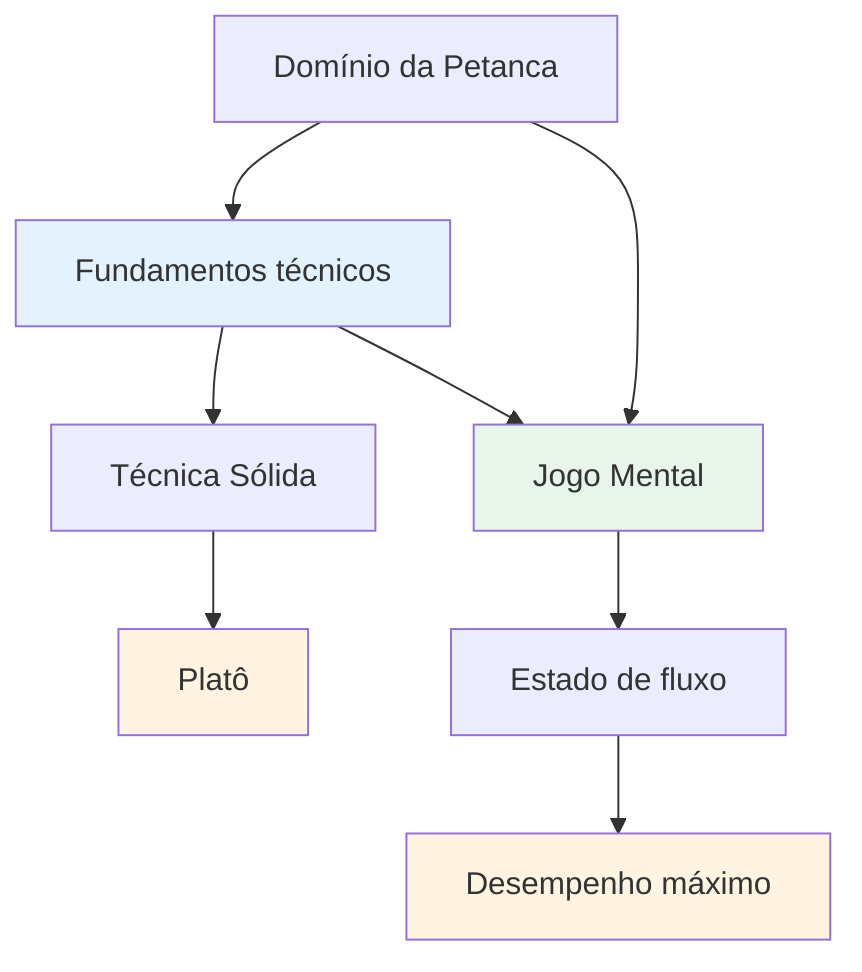

# Assessoria técnica

## Uma nota sobre técnica

Embora nosso foco principal seja o aspecto mental e o estado de fluxo, reconhecemos que a técnica é a base sobre a qual tudo o mais se constrói.

::: info Nossa filosofia
**A técnica é a base, mas a fluidez é o teto.** Você precisa de uma técnica sólida para alcançar o nível de elite, mas o domínio mental é o que te leva além.
:::

## Nossa Perspectiva

::: tip Você não precisa dominar tudo.
**Você não precisa dominar todas as técnicas**, mas entender toda a gama de possibilidades ajuda você a:

- ✅ Saiba o que é possível
- ✅ Faça escolhas informadas sobre o que desenvolver
- ✅ Aprecie o jogo em um nível mais profundo
- ✅ Entenda o que os jogadores de elite conseguem fazer
:::

::: info O objetivo
Se você tem um foco técnico e deseja expandir seu repertório, esta seção descreve o objetivo final: a gama completa de lançamentos disponíveis para um jogador de petanca.

**Lembre-se:** O objetivo não é dominar tudo. É ter uma base técnica suficiente para que você consiga entrar no estado de fluxo e deixar seu corpo escolher o arremesso certo naturalmente.
:::

## Tópicos

### [Paleta de Arremessos](/en/technical/throws)
Quais são todos os tipos de arremesso que existem? Uma visão geral abrangente das possibilidades técnicas na petanca.

::: tip Depois da técnica, o que vem a seguir?
Depois de dominar a técnica, o verdadeiro crescimento vem de:
- **[A Zona](/en/education/the-zone/)** - Acessando estados de fluxo
- **[Força Mental](/en/education/mental-strength/)** - Lidar com a pressão
- **[Métodos de Treinamento](/en/education/training/)** - Como praticar com eficácia
:::

