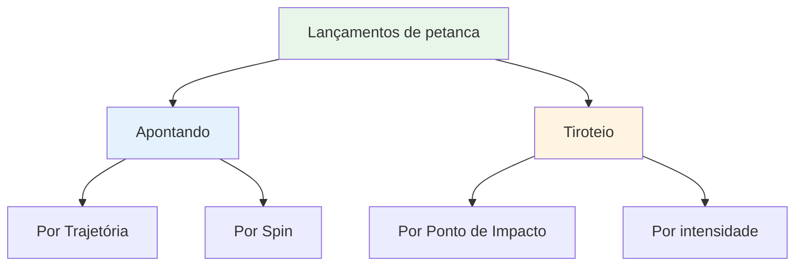
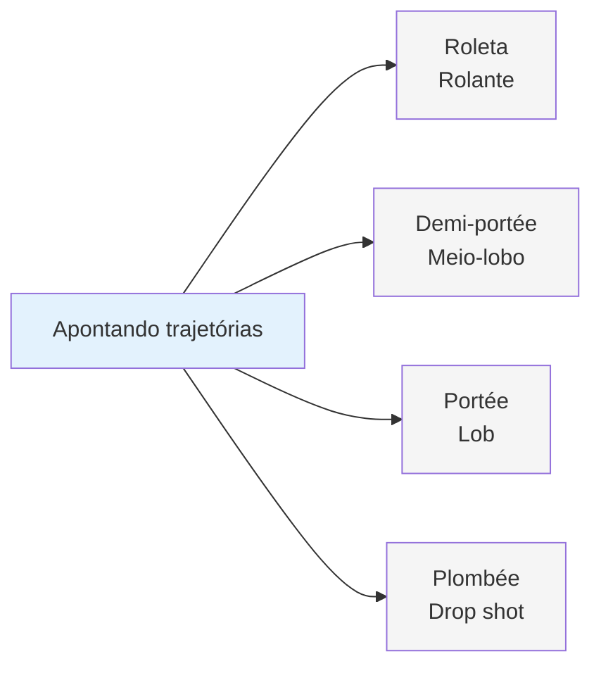
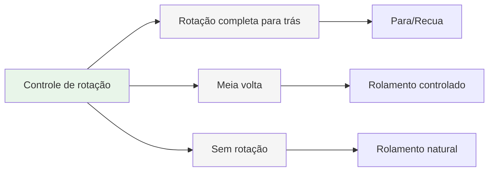
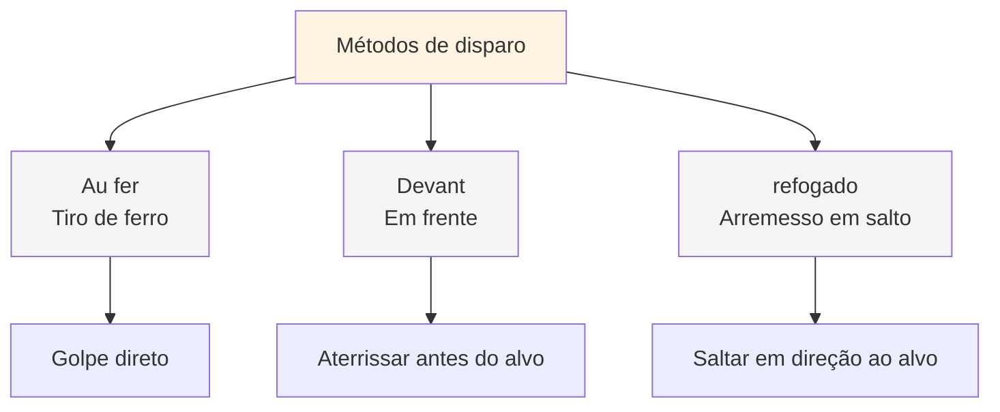
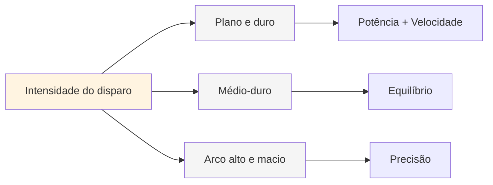
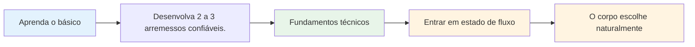

# Paleta de Mantas

## O Repertório Técnico Completo

Esta é uma visão geral dos lançamentos disponíveis na petanca. Você não precisa dominar todos eles, mas saber quais existem ajuda a compreender a amplitude do jogo.

::: tip O panorama geral
Compreender toda a paleta de recursos ajuda você a tomar decisões mais informadas sobre o que desenvolver. Você não precisa dominar tudo — concentre-se no que funciona para o seu jogo.
:::

## Técnicas de apontamento

### Por Trajetória

| Lançar | Termo francês | Trajetória | Quando usar |
|-------|-------------|------------|-------------|
| **Em movimento** | Roleta | Baixo, rola quase o tempo todo | Terreno plano, curta distância |
| **Meio-lobo** | Demi-portée | Médio, pousa na metade do caminho | Mais comum, versátil |
| **Lob** | Portée | Alto, aterrissa perto do alvo | Obstáculos, terreno acidentado |
| **Drop shot** | Plombée | Muito alto, cai verticalmente | Espaços apertados, posicionamento preciso |

### Por Spin

| Tipo de rotação | Efeito na aterrissagem | Quando usar |
|-----------|-------------------|-------------|
| **Rotação completa (spin reverso)** | Para ou recua ao aterrissar. | Precisa parar rapidamente, evite passar direto. |
| **Meia volta** | Rotação para trás moderada, rolamento controlado | Mais versátil e previsível. |
| **Sem rotação** | Rolamento neutro e natural na aterrissagem | Deixe o terreno ditar o ritmo |

## Técnicas de Tiro

### Por Ponto de Impacto

| Técnica | Termo francês | Ponto de impacto | Características |
|-----------|-------------|--------------|-----------------|
| **Tiro de ferro** | Au fer | Acerto direto na bola | Contato limpo mais comum |
| **Na frente** | Devant | Aterrissagem pouco antes do alvo | Mais seguro, requer menos precisão |
| **Arremesso em suspensão** | refogado | Saltando em direção ao alvo | Avançado, para obstáculos |

### Por intensidade

| Intensidade | Trajetória | Quando usar |
|-----------|------------|-------------|
| **Tiro plano e duro** | Direto, poderoso, plano | Linha livre, precisa de distância no golpe |
| **Dificuldade média** | Potência e controle equilibrados | Mais versátil |
| **Macio com arco alto** | Arremesso por cima, cai de cima | Obstáculos, espaços apertados |

## A Paleta Completa

::: details Referência rápida: Todos os lançamentos
**Apontando:**
- Roleta (rolando)
- Demi-portée (meio-lobo)
- Portée (lob)
- Plombée (drop shot)
- Giro completo / Meio giro / Sem giro

**Tiroteio:**
- Au fer (chumbo de ferro)
- Devant (na frente)
- Saltear (tiro de salto)
- Arco plano rígido / Médio / Arco alto macio
:::

## Caminho da Maestria

::: tip Lembrar
**O objetivo não é dominar tudo.** É ter uma base técnica suficiente para que você consiga entrar no estado de fluxo e deixar seu corpo escolher o arremesso certo naturalmente.

Focar em:
1. **2 a 3 técnicas de apontamento** em que você pode confiar.
2. **1-2 métodos de disparo** que funcionam para você
3. **Execução consistente** sob pressão
4. **Jogo mental** para acessar o estado de fluxo
:::

::: info Próximos passos
Depois de dominar a técnica, o verdadeiro crescimento vem de:
- **A Zona** - Acessando estados de fluxo de forma consistente
- **[Métodos de Treinamento](/en/education/training/)** - Como praticar com eficácia
- **[Força Mental](/en/education/mental-strength/)** - Desempenho sob pressão
:::

