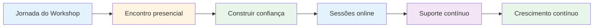
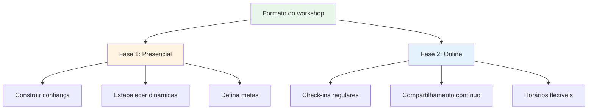

# Oficina

## Fóruns para Jogadores de Elite

Nossos workshops são fóruns intimistas onde jogadores de elite compartilham experiências e revelam seus pensamentos mais íntimos sobre o jogo, o desempenho e os desafios mentais.

::: tip O que torna nossos workshops diferentes?
**Pequenos grupos selecionados de jogadores de elite em um ambiente seguro para discussões honestas.** Não se trata de uma palestra, mas sim de uma experiência de aprendizado entre pares, onde você compartilha, aprende e cresce em conjunto.
:::



## Formatar

### Grupos pequenos
::: info Tamanho do grupo
- **6 a 8 jogadores** por oficina
- Grupos cuidadosamente selecionados para uma dinâmica ideal.
- Espaço seguro para conversas honestas
- Todos contribuem, todos aprendem.
:::

### Abordagem híbrida



| Fase | Formatar | Propósito | Benefícios |
|-------|--------|---------|----------|
| **Primeiro Encontro** | Presencialmente (IRL) | Construir a base | Confiança, conexão, dinâmica de grupo |
| **Sessões em andamento** | On-line | Mantenha o ritmo | Apoio regular, flexibilidade, responsabilidade |

::: details Fase 1: Reunião Presencial
**Por que começar presencialmente?**
- Construir confiança e conexão cara a cara
- Estabelecer dinâmicas de grupo e segurança
- Definam juntos as intenções e os objetivos.
- Criar as bases para uma partilha honesta

**O que acontece:**
- Apresentações e definição de objetivos
- Exercícios e discussões iniciais
- Estabelecer normas de grupo
- Construindo relacionamento
:::

::: details Fase 2: Sessões online
**Por que online para cursos contínuos?**
- Check-ins regulares sem viagens
- Continuem compartilhando e apoiando
- Horários flexíveis para jogadores ocupados.
- Manter o ritmo entre as reuniões presenciais

**O que acontece:**
- Atualizações de progresso e desafios
- Apoio entre pares e resolução de problemas
- Reuniões de acompanhamento de responsabilidade
- Aprendizagem e crescimento contínuos
:::

## O que esperar

### Tópicos que exploramos

| Área | Foco | Resultados |
|------|-------|----------|
| **Jogo Mental** | Estado de fluxo, pressão, foco | Desempenho máximo consistente |
| **Desafios Pessoais** | Medos, bloqueios, frustrações | Inovações e soluções |
| **Aprendizagem entre pares** | experiências compartilhadas | Novas perspectivas e ideias |
| **Ferramentas Práticas** | Técnicas e exercícios | Candidatura imediata |
| **Comunidade** | Apoio contínuo | Crescimento a longo prazo |

::: tip Experiência de Workshop
- 🧠 Discussões aprofundadas sobre os aspectos mentais do jogo
- 💬 Compartilhamento de experiências e desafios pessoais
- 🤝 Apoio e responsabilização entre pares
- 🛠️ Exercícios e técnicas práticas
- 👥 Uma comunidade de jogadores comprometidos com o crescimento
:::

## Quem deve participar?

::: info Participantes ideais
- **Jogadores de elite** que desejam dar o próximo passo
- Jogadores que **dominam a técnica**, mas querem mais.
- Para aqueles interessados no **jogo mental**
- Jogadores abertos à **autoavaliação honesta**
- Comprometido com o **crescimento pessoal**
:::

::: warning Não é uma boa opção se
- Você está procurando apenas por treinamento técnico?
- Você não se sente à vontade para compartilhar em grupo.
- Você não está disposto a ser vulnerável.
- Você quer soluções rápidas sem ter o trabalho.
:::

## O valor da aprendizagem entre pares

```mermaid
graph TD
    A[Aprendizagem entre pares] --> B[Experiências Compartilhadas]
    A --> C[Múltiplas Perspectivas]
    A --> D[Apoio mútuo]

    B --> E[Você não está sozinho(a)]
    C --> F[Novas Perspectivas]
    D --> G[Responsabilidade]

    E --> H[Avanço]
    F --> H
    G --> H

    style A fill:#e8f5e9
    style H fill:#fff4e1
```

::: tip Por que os grupos de pares funcionam
Jogadores de elite enfrentam desafios únicos que outros não compreendem. Em um workshop, você está com pessoas que **entendem** — a pressão, as expectativas, as batalhas mentais. Isso cria um ambiente seguro para o crescimento real.
:::

## Pronto para participar?

::: info Próximos passos
Os workshops são anunciados na nossa seção de [Notícias](/en/news/). Fique atento para as próximas datas e informações sobre inscrições.
:::

