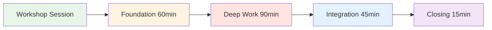
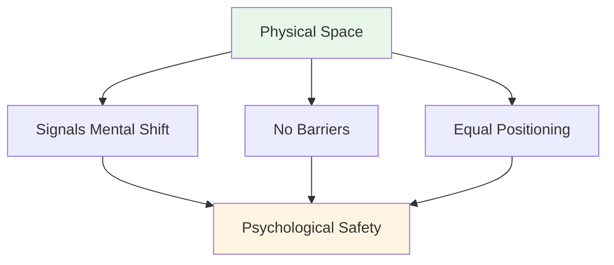
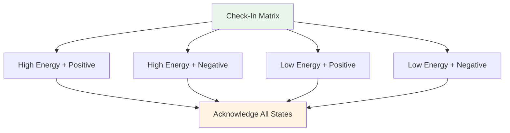
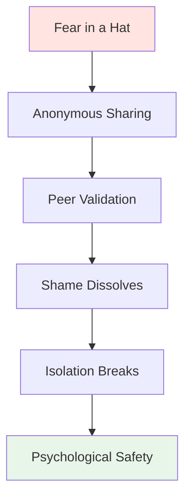

# Workshop: Guia da Sessão Teórica

<AdBanner />

## Um Guia Abrangente para Coordenadores

Este guia ajuda você a conduzir um workshop teórico de 3 a 4 horas com 6 a 8 jogadores de elite. Como **Coordenador de Desempenho Mental (CDM)**, você facilitará discussões aprofundadas sobre o aspecto mental do jogo, criando um ambiente psicológico seguro que se traduz em melhor desempenho nas pistas.

::: warning Conceito Crítico
**Você não é um treinador técnico nem um terapeuta.** Seu papel é facilitar o aprendizado baseado na vulnerabilidade, ajudando os jogadores a compreender a conexão entre seus pensamentos internos e seu desempenho.
:::

## Preparação Pré-Workshop

### O Papel do Coordenador

::: informações Suas responsabilidades
- **Facilite, não dê palestras** - Você guia a discussão, não ensina técnicas.
- **Mantenha o espaço seguro** - Crie e mantenha um ambiente de segurança psicológica.
- **Transformar a teoria em prática** - Conectar o conteúdo do site à experiência pessoal
- **Monitore a dinâmica do grupo** - Observe quem está engajado e quem está resistindo.
- **Mantenha limites** - Saiba quando recorrer à ajuda profissional
:::

### Competências Essenciais

Competência | O que significa | Como desenvolver |
|------------|---------------|----------------|
| **Inteligência Emocional** | Detectar microexpressões de desconforto | Praticar a observação ativa |
| **Autoridade Neutra** | Inspire respeito sem poder técnico | Estabeleça credibilidade através da presença |
| **Contexto Esportivo** | Compreenda a mecânica da pressão | Aprenda a terminologia e a cultura da petanca |
Aikido Verbal | Alinhe-se com a resistência, não lute contra ela | Pratique a comunicação não defensiva |

::: details Termos-chave de petanca para conhecer
- **Carreau** - Golpe perfeito que desloca a bola do oponente
- **Bibber** - O &quot;yips&quot; - tremor involuntário durante a liberação
- **Donnée** - O &quot;dado&quot; - aceitar o terreno como ele é
- **Portée** - Arremesso sem quicar
- **Roleta** - Tiro rolante
- **Cochonnet** - A bola alvo (jack)
:::

## Configuração Física: O Círculo Mágico

### Requisitos de localização

::: warning Configuração Crítica
**Escolha um espaço neutro, AFASTADO da pista.** Isso sinaliza uma mudança do trabalho físico para o mental.

Requisitos:
- ✅ À prova de som ou privativo
- ✅ Temperatura confortável
- ✅ Sem distrações (celulares desligados)
- ✅ Luz natural, se possível
- ✅ Separado da área de treinamento
:::

### A Configuração Circular

**Lugares disponíveis:**
- Círculo perfeito de cadeiras
- **SEM MESAS** - Mesas criam barreiras e escondem a linguagem corporal.
- Todas as cadeiras na mesma altura (sem posições de ajuste elétrico)
- O coordenador senta-se no meio do círculo (não na frente).

**Artefatos do Centro:**
- Coloque bocha e cochonnet no centro
- Ancora o trabalho ao esporte
- Lembrete visual de propósito compartilhado

## Estrutura da Sessão (3-4 Horas)

### Fase 1: Fundamentos (60 minutos)

#### 1. Boas-vindas e regras básicas (15 min)

**O Contrato Social:**

::: tip O Contêiner - Regras Básicas Essenciais
Antes de qualquer compartilhamento começar, o grupo DEVE concordar com o seguinte:

1. **Confidencialidade** - O que for dito aqui, fica aqui.
2. **A Regra de Vegas** - As lições saem da sala, as histórias ficam.
3. **Sem consertos** - Observe e compreenda, não tente resolver.
4. **Direito de Passagem** - A vulnerabilidade não pode ser coagida.
5. **Respeite o processo** - Confie no desconforto
:::

**Seu roteiro:**
&quot;Bem-vindos. Este espaço é diferente da pista. Aqui, exploramos o que acontece *dentro* de você quando está diante daquela foto. Tudo o que for compartilhado aqui é confidencial. As lições que você aprender pode ir embora, mas as histórias pessoais permanecem. Vocês não estão aqui para consertar uns aos outros, mas sim para entender. E vocês sempre podem desistir. Todos concordam com isso?&quot;

#### 2. Atividade: A Matriz de Check-in (20 min)

**Objetivo:** Normalizar a admissão de fadiga ou estresse.

**Materiais:** Quadro branco ou flip chart, notas adesivas

**Procedimento:**
1. Desenhe uma matriz 2x2: Alta/Baixa Energia (vertical), Positivo/Negativo (horizontal)
2. Cada jogador escreve seu nome em um post-it.
3. Coloque a nota no quadrante atual.
4. Discussão: &quot;Temos três pessoas com &#39;Baixa Energia/Negativa&#39;. Como isso afeta nossa sessão de hoje?&quot;

**Dicas de Facilitação:**
- Não julgue nenhum quadrante como &quot;ruim&quot;
- Pergunte: &quot;Do que seu corpo precisa neste momento?&quot;
- Observe os padrões: &quot;Três de vocês estão no mesmo espaço - o que será isso?&quot;

#### 3. Atividade: O Iceberg da Petanca (25 min)

**Objetivo:** Visualizar pensamentos internos ocultos

**Materiais:** Papel grande, marcadores

**Procedimento:**
1. Desenhe um iceberg no papel.
2. **Acima da água:** Escreva &quot;Técnica, O Arremesso, O Resultado&quot;
3. **Debaixo d&#39;água:** Pergunte: &quot;O que está acontecendo em sua mente que ninguém vê?&quot;

**Sugestões:**
— &quot;Do que você tem medo quando se prepara para atirar?&quot;
— &quot;De que tipo de julgamento você está preocupado?&quot;
— O que sua voz interior diz quando você erra o alvo?

**A Pergunta de Reflexão:**
O que acontece com o seu braço de arremesso quando o equipamento subaquático fica muito pesado?

Isso relaciona a carga mental à tensão física (o nervosismo/yips).

::: details Respostas comuns &quot;abaixo da água&quot;
- Medo de decepcionar a equipe
- Preocupe-se em parecer estúpido
- Dúvida sobre a capacidade
- Comparação com os outros
- Pressão para provar o seu valor
- Medo de ser julgado pelo treinador/colegas de equipe
Síndrome do impostor
:::

<AdInArticle />

### Fase 2: Trabalho Profundo (90 minutos)

#### 4. Atividade: O Manual do Usuário (30 min)

**Objetivo:** Colocar a empatia em prática – ajudar os membros da equipe a se entenderem.

**Materiais:** Folhas de atividades (uma por jogador)

**Modelo de Manual do Usuário:**

| Seção | Instrução | Exemplo |
|---------|--------|---------|
| **Minha Assinatura de Estresse** | &quot;Quando estou ansioso(a), eu...&quot; | &quot;...fico completamente em silêncio&quot; |
| **Como lidar comigo** | &quot;Quando erro um arremesso crucial, preciso de...&quot; | &quot;...silêncio, não de incentivo&quot; |
| **Meus Pensamentos Íntimos** | &quot;A mentira que conto a mim mesmo é...&quot; | &quot;...que não sou bom o suficiente&quot; |
| **Meu gatilho** | &quot;Eu fico na defensiva quando...&quot; | &quot;...alguém questiona minha escolha de tiro&quot; |

**Procedimento:**
1. Dê aos jogadores 10 minutos para completar a atividade em silêncio.
2. Em círculo, cada pessoa compartilha UMA seção.
3. Outras pessoas podem fazer perguntas para esclarecer dúvidas (não para dar conselhos!).
4. O coordenador valida cada compartilhamento.

**Roteiro de Facilitação:**
&quot;Este é o seu manual de instruções. Quando seu colega de equipe sabe que você fica em silêncio quando está ansioso, ele não levará para o lado pessoal. Quando ele sabe que você precisa de silêncio depois de um erro, ele não tentará &#39;consertá-lo&#39;. É assim que construímos inteligência de equipe.&quot;

#### 5. Conectando o conteúdo do site ao pensamento interior (30 min)

**Objetivo:** Conectar conteúdo técnico à experiência psicológica.

Escolha de 2 a 3 seções do site da Academia e explore o jogo interior:

**Exemplo 1: Técnica - A Pegada e a Soltura**

**A questão da confiança:**
&quot;Quando você está com 12-12 em um torneio, sua mão *se sente* como na descrição da técnica? São os músculos que mudam ou o pensamento &#39;Não deixe cair&#39; que altera sua pegada?&quot;

**O Microtremor:**
&quot;Quem aqui sente o &#39;microtremor&#39; da ansiedade? Que pensamento interno o desencadeia?&quot;

**Exemplo 2: Táticas - Apontar vs. Atirar**

**Perfil de Risco:**
&quot;Quando o guia diz &#39;Atire para ganhar&#39;, sua reação é de entusiasmo ou de pavor? O que isso revela sobre sua relação com o risco?&quot;

**O Impostor:**
&quot;Você já apontou a arma quando *sabe* que deveria atirar, só para evitar o constrangimento de errar o alvo? Qual o preço dessa segurança?&quot;

**Exemplo 3: Nutrição - Dia da Competição**

**A Armadilha da Comida Reconfortante:**
Você come o que seu corpo precisa ou o que sua ansiedade deseja? Como você sabe a diferença?

::: tip Técnica de Facilitação
Não dê uma palestra sobre o conteúdo. Faça perguntas que conectem as informações técnicas à experiência de vida deles. A compreensão vem DELES, não de você.
:::

#### 6. Atividade: Medo em um Chapéu (30 min)

**Objetivo:** Quebrar o ciclo de isolamento - mostrar que os colegas compartilham inseguranças profundas.

**Materiais:** Papel, caneta, chapéu/bolsa

**Procedimento:**
1. Todo mundo escreve anonimamente sobre um medo profundo relacionado à carreira/equipe.
2. Dobre os papéis e misture no chapéu.
3. Cada jogador tira uma nota (que não seja a sua própria).
4. Leia em voz alta.
5. Valide: &quot;Eu consigo entender por que alguém se sentiria assim porque...&quot;

**Exemplos de medos:**
— &quot;Receio ter atingido o meu auge e nunca mais conseguirei melhorar.&quot;
— &quot;Tenho receio que meus colegas de equipe me considerem superestimado.&quot;
— &quot;Tenho medo de travar no momento decisivo&quot;
— &quot;Tenho medo de ser substituído por jogadores mais jovens&quot;

**O Poder:**
Quando os jogadores ouvem seu medo secreto lido em voz alta e validado por seus colegas, a vergonha se dissipa. Eles percebem: &quot;Não estou sozinho. Isso é normal.&quot;

**Função do Coordenador:**
- Valide TODOS os medos como legítimos.
Não minimize: &quot;Isso não é verdade!&quot; invalida o sentimento.
- Pergunte: &quot;Quantos de vocês já se sentiram em algo parecido?&quot;

### Fase 3: Integração (45 minutos)

#### 7. Atividade: Reformulando o Crítico Interior (25 min)

**Objetivo:** Reestruturação cognitiva - mudança do diálogo interno

**Materiais:** Folha de exercícios

**Procedimento:**

**Etapa 1: Identificar o crítico (10 min)**
&quot;Anote a frase EXATA que seu crítico interno diz depois de um erro. Não a versão educada, mas a brutal.&quot;

Exemplos:
— &quot;Você sempre se engasga&quot;
- &quot;Todos estão assistindo você fracassar&quot;
— Você está se envergonhando.
— &quot;Você não pertence a este lugar&quot;

**Etapa 2: Reformule como Coach Interior (10 min)**
&quot;Agora reescreva isso como seu Coach Interior - firme, mas acolhedor.&quot;

Exemplos:
- Crítico: &quot;Você sempre se atrapalha&quot; → Treinador: &quot;Reajuste-se e respire. Próxima tentativa.&quot;
Crítico: &quot;Todos estão assistindo você fracassar&quot; → Treinador: &quot;Concentre-se no alvo, não na multidão&quot;
- Crítico: &quot;Você está se envergonhando&quot; → Treinador: &quot;Um arremesso de cada vez. Você já fez isso antes.&quot;

**Etapa 3: Prática em Dupla (5 min)**
Compartilhe sua frase de Coach com um parceiro. Ele(a) se lembrará dela quando vir o Crítico surgir.

#### 8. Ponte para a pista (20 min)

**Objetivo:** Criar protocolos acionáveis para a competição.

**Questões para discussão:**
1. &quot;Qual é a ÚNICA coisa que você aprendeu hoje e usará na sua próxima competição?&quot;
2. &quot;Como seus colegas de equipe saberão que você precisa de apoio?&quot;
3. &quot;Qual é o seu sinal para &#39;Preciso de uma pausa para recarregar as energias&#39;?&quot;

**Criar protocolos de equipe:**

| Situação | Protocolo | Exemplo |
|-----------|----------|---------|
| **Após um erro** | Consulte o Manual do Usuário | &quot;Marc precisa de silêncio, Lisa precisa de um toque de punho&quot; |
| **Sentindo pressão** | Use a frase do Coach | &quot;Reajuste-se e respire&quot; |
| **Tensão na equipe** | Pedir tempo | &quot;Vamos fazer uma pausa de 2 minutos&quot; |
| **Voz crítica interna alta** | Reinício físico | Toque nas bolas, respire fundo |

### Fase 4: Encerramento (15 minutos)

#### 9. O Check-Out (10 min)

**Procedimento:**
Em círculo, cada pessoa compartilha:
1. **Uma coisa que você levará consigo:** &quot;Que aprendizado ou ferramenta você levará consigo?&quot;
2. **Uma coisa que você está deixando para trás:** &quot;Do que você está se desapegando?&quot;

**Função do Coordenador:**
- Agradeça a cada pessoa pela sua contribuição.
- Validar o trabalho realizado
- Lembrete sobre a confidencialidade

#### 10. Protocolo de Acompanhamento (5 min)

::: warning Crítico: Evite a Ressaca da Vulnerabilidade
O trabalho que exige concentração profunda causa uma &quot;ressaca de vulnerabilidade&quot; - arrependimento ou vergonha por ter compartilhado suas experiências.

**Seu protocolo de 24 horas:**
- Envie uma mensagem para qualquer pessoa que tenha compartilhado conteúdo em excesso nas últimas 24 horas.
- Mensagem: &quot;Obrigado pela sua coragem ontem. O que você compartilhou ajudou a todos.&quot;
- Pergunta de acompanhamento: &quot;Como você está se sentindo em relação à sessão?&quot;
:::

**Roteiro de Encerramento:**
&quot;O que aconteceu aqui hoje exigiu coragem. Vocês compareceram, se abriram, confiaram no processo. Essa mesma coragem é o que vocês levarão para a pista. Lembrem-se: as lições saem desta sala, mas as histórias permanecem. Obrigado.&quot;

<AdInArticle />

## Resistência ao manuseio

### O Atleta &quot;Descolado Demais&quot;

**Cenário:** Um jogador revira os olhos durante um exercício de vulnerabilidade.

**Estratégia:** Aikido Verbal (Alinhar e Pivotar)

**Roteiro:**
&quot;Eu percebo essa reação, [Nome]. Sinceramente, eu entendo. Falar sobre sentimentos parece delicado. Mas a pista é desconfortável. Se não conseguirmos lidar com o desconforto desta sala, não estaremos treinando nossa tolerância ao desconforto do jogo. Você consegue confiar em mim por 20 minutos?&quot;

### O Participante Silencioso

**Cenário:** Alguém não falou nos últimos 45 minutos

**Estratégia:** Criar um ponto de entrada de baixo risco

**Roteiro:**
&quot;[Nome], percebo que você está absorvendo tudo. Qual é a coisa que mais te chamou a atenção até agora? Mesmo que seja apenas uma palavra.&quot;

### Quem Compartilha Demais

**Cenário:** Alguém domina a situação com histórias longas.

**Estratégia:** Redirecionamento suave

**Roteiro:**
&quot;Obrigado por isso, [Nome]. Quero garantir que todos tenham espaço. Vamos ouvir alguém que ainda não compartilhou.&quot;

### O Consertador

**Cenário:** Alguém tenta resolver os problemas dos outros.

**Estratégia:** Reforçar as regras básicas

**Roteiro:**
&quot;Agradeço sua vontade de ajudar, mas lembre-se da nossa regra: observar e compreender, não consertar. [Orador original], do que você precisa agora?&quot;

Lista de Materiais

::: details Materiais do Workshop
**Configuração física:**
- [ ] Cadeiras (6-8, sem mesas)
- [] Bocha e cochonnet para o centro
- [ ] Flip chart ou quadro branco
- [ ] Marcadores

**Atividades:**
- [ ] Notas adesivas (Matriz de Check-In)
- [ ] Papel grande (Atividade Iceberg)
- [ ] Planilhas do Manual do Usuário
- [ ] Papel e canetas (Medo em um Chapéu)
- [ ] Planilhas de Crítico/Coach Interior

**Logística:**
- [ ] Água para os participantes
- [ ] Lenços de papel (trabalho emocional!)
- [ ] Temporizador (manter o cronograma)
- [ ] Lista de contatos dos participantes (para acompanhamento)
:::

## Coordenador de Autocuidado

::: warning Você também precisa de apoio
Acolher a vulnerabilidade é emocionalmente exigente.

**Após o workshop:**
- Realizar uma reunião de avaliação com um colega ou supervisor.
- Escreva em um diário o que surgiu para você.
- Faça uma caminhada ou uma pausa física
- Não leve as histórias deles para casa.
:::

## Medindo o impacto

### Feedback imediato

Ao final, pergunte:
1. &quot;Em uma escala de 1 a 10, quão seguro(a) você se sentiu ao compartilhar hoje?&quot;
2. &quot;O que poderia melhorar a próxima sessão?&quot;

### Acompanhamento de Longo Prazo

Acompanhamento após 2 a 4 semanas:
— Você utilizou alguma ferramenta da oficina?
— &quot;Como mudou sua relação com seu crítico interno?&quot;
— &quot;O que mudou na sua mentalidade em relação à competição?&quot;

## Próximos passos

::: tip Construindo sobre esta base
Este workshop é a Fase 1. Considere:
- **Sessões de acompanhamento** (online ou presenciais)
- **Integração na pista** (consulte o guia da sessão de treinamento)
- **Protocolos de equipe** (implementar manuais do usuário em competições)
- **Acompanhamentos individuais** (para jogadores que precisam de mais apoio)
:::

<AdBanner />

