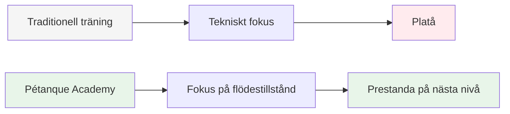
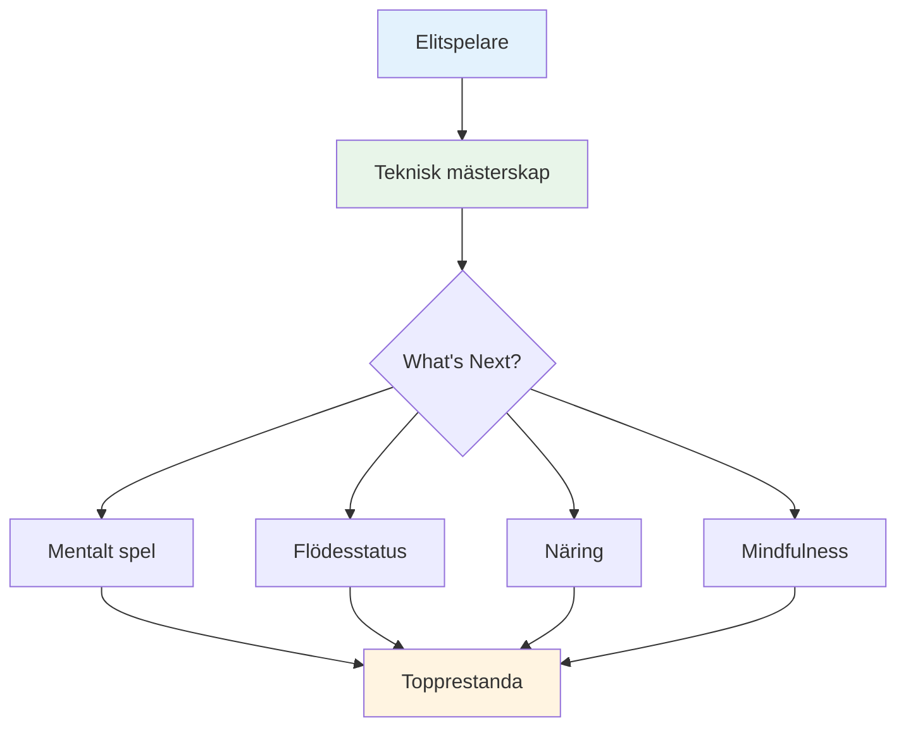

# Ambition

Vårt uppdrag är att hjälpa elitspelare att ta nästa steg i sin utveckling.

::: tip Vår vision
**Förvandla elitspelare från tekniskt skickliga till mentalt ostoppbara.** Vi hjälper dig att nå ett flow-tillstånd där perfekta boulespel blir ett naturligt uttryck för din mästerskapsförmåga.
:::

## Att gå bortom tekniken

Traditionell träning fokuserar starkt på tekniska aspekter – grepp, hållning och släpp. Även om dessa grunder är viktiga, har elitspelare redan bemästrat dem.

::: info Genombrottet
**Nästa nivå handlar inte om att finslipa tekniken – det handlar om att komma in i ett flödestillstånd.**

Vi hjälper spelare att gå från ett tekniskt träningsperspektiv till ett **flödesperspektiv (i zonen)**, där perfekta bouler blir ett naturligt uttryck för deras behärskning snarare än en medveten ansträngning.
:::

## Resan

## Vad vi erbjuder

| Erbjudande | Beskrivning | Inverkan |
|----------|-------------|--------|
| **Workshops** | Små grupper av elitspelare (6-8) | Djupt kamratligt lärande och stöd |
| **Utbildning** | Mentala aspekter av topprestationer | Praktiska tekniker som du kan använda direkt |
| **Gemenskap** | Liksinnade spelare som tänjer på gränserna | Ansvarsskyldighet och gemensam tillväxt |
| **Holistiskt tillvägagångssätt** | Kost, tankesätt och mental träning | Fullständig prestandaoptimering |

::: tip Varför det fungerar
Elitspelare har redan den tekniska grunden. Det som skiljer bra från fantastiska är förmågan att prestera på topp under press. Det är det vi fokuserar på.
:::

## Vårt tillvägagångssätt

### 1. Flödestillståndsträning
Lär dig att gå in i &quot;zonen&quot; konsekvent, inte av en slump.

### 2. Mental styrka
Utveckla rutiner, mindfulness och presshantering.

### 3. Smart näring
Ge din hjärna bränsle för stabilt fokus och stadiga händer.

### 4. Kamratlig lärande
Dela erfarenheter med andra elitspelare i en trygg och stödjande miljö.

::: info Redo att ta nästa steg?
Utforska vår sektion [Utbildning](/sv/utbildning/) eller läs mer om våra [Workshops](/sv/workshop).
:::

