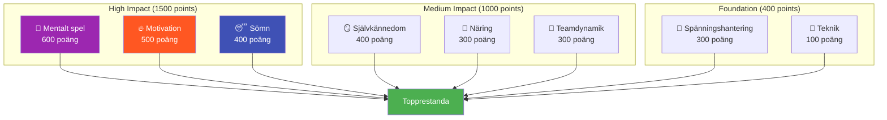

# Ambition

Vårt uppdrag är att hjälpa elitspelare att ta nästa steg i sin utveckling.

::: tip Vår vision
**Förvandla elitspelare från tekniskt skickliga till mentalt ostoppbara.** Vi använder en datadriven metod för att identifiera era förbättringsområden med störst effekt.
:::

## 8-faktorers prestationsmodell

Forskning och erfarenhet visar att prestationer i boule på elitnivå beror på **8 sammankopplade faktorer**. De flesta spelare överinvesterar i teknik samtidigt som de försummar de faktorer som faktiskt skiljer bra från fantastiskt.

### Varför teknik har den lägsta vikten

::: warning Den obekväma sanningen
**Tekniken står endast för 100 av totalt 2 900 poäng** i vår modell.

Det beror inte på att teknik inte spelar någon roll – det beror på att elitspelare redan har utvecklat adekvat teknik. Den marginella förbättringen av att finslipa din spänning är liten jämfört med att optimera din sömn, hantera spänningar eller stärka ditt mentala spel.
:::

## ROI-principen

Alla förbättringar är inte likadana. Vi använder **Avkastning på investeringen (ROI)**-beräkningar för att identifiera var din utbildningstid kommer att ha störst effekt.

| Din nivå | Faktorvikt | Avkastningspotential |
|------------|---------------|---------------|
| Låg skicklighet i högviktsområde | Hög (t.ex. 600) | **Maximal** |
| Hög skicklighet inom högviktsområde | Hög (t.ex. 600) | Låg (minskande avkastning) |
| Låg skicklighet i lågviktsområde | Låg (t.ex. 100) | Måttlig |
| Hög skicklighet inom lågviktsområde | Låg (t.ex. 100) | **Minimal** |

**Exempel:** Att förbättra din sömn från 30 % till 60 % (hög viktfaktor, låg nuvarande färdighet) kommer sannolikt att ha större effekt än att förbättra tekniken från 75 % till 85 % (låg viktfaktor, redan hög färdighet).

## De 8 faktorerna förklarade

| Faktor | Vikt | Vad det täcker |
|--------|--------|----------------|
| 🧠 **Mentalt spel** | 600 | Tankemönster, fokus, självförtroende, tillgång till flödestillstånd |
| 🔥 **Motivation** | 500 | Drivkraft, syfte, målinriktning, uthållighet |
| 😴 **Sömn och återhämtning** | 400 | Kvalitetsvila, protokoll före tävling, energihantering |
| 🪞 **Självkännedom** | 400 | Noggrann självuppfattning, blindvinkeligenkänning, feedbackanvändning |
| 🥗 **Näringsinnehåll** | 300 | Blodsockerstabilitet, hydrering, bränsletillförsel till tävlingar |
| 🤝 **Teamdynamik** | 300 | Kommunikation, förtroende, rolltydlighet, teambidrag |
| 💆 **Spänningshantering** | 300 | Fysisk avslappning, andningskontroll, optimal upphetsning |
| 🎯 **Teknik** | 100 | Fysisk mekanik, kastrepertoar, konsekvens |

## Upptäck din väg

Vi har skapat ett **kostnadsfritt bedömningsverktyg** som analyserar dina nuvarande nivåer utifrån alla 8 faktorer och beräknar dina personliga förbättringsprioriteringar.

::: info Gör bedömningen
**[→ Starta din spelarutvecklingsbedömning](/sv/bedömning/)**

Om 5 minuter får du:
- Ditt radardiagram över alla 8 faktorer
- ROI-rankade rekommendationer för vad man ska arbeta med
- Länkar till specifikt utbildningsinnehåll för dina högsta prioriteringar
- Möjlighet att få feedback från kollegor
:::

## Vad vi erbjuder

| Erbjudande | Beskrivning | Länk |
|----------|-------------|------|
| **Utvärderingsverktyg** | Identifiera dina förbättringsområden med högst ROI | [Gör bedömning](/sv/bedömning/) |
| **Utbildningsmoduler** | Djupgående innehåll om alla 8 faktorer | [Bläddra bland Utbildning](/sv/utbildning/) |
| **Workshops** | 3-4 timmars sessioner för grupper om 6-8 spelare | [Verkstadsguide](/sv/guider/verkstad/) |
| **Träningsläger** | Helgintensivkurser som blandar teori och praktik | [Lägerguide](/sv/guider/träningsläger/) |

## Vårt tillvägagångssätt

### 1. Bedöm först
Börja med ärlig självvärdering. Få feedback från kollegor för att identifiera blinda fläckar.

### 2. Prioritera efter avkastning på investeringen
Fokusera på viktiga faktorer där du har utrymme att utvecklas – inte det som känns bekvämt.

### 3. Lär dig vetenskapen
Förstå *varför* något fungerar, inte bara *vad* man ska göra.

### 4. Öva medvetet
Tillämpa tekniker i träningen före tävling. Bygg upp vanor, inte bara kunskap.

### 5. Omvärdera regelbundet
Följ dina framsteg. Dina prioriteringar kommer att förändras allt eftersom du förbättrar dig.

::: tip Redo att ta nästa steg?
**[→ Börja med bedömningen](/sv/bedömning/)** — Det är gratis och tar 5 minuter.

Eller utforska vår sektion [Utbildning](/sv/utbildning/) för att fördjupa dig i någon av de 8 faktorerna.
:::

