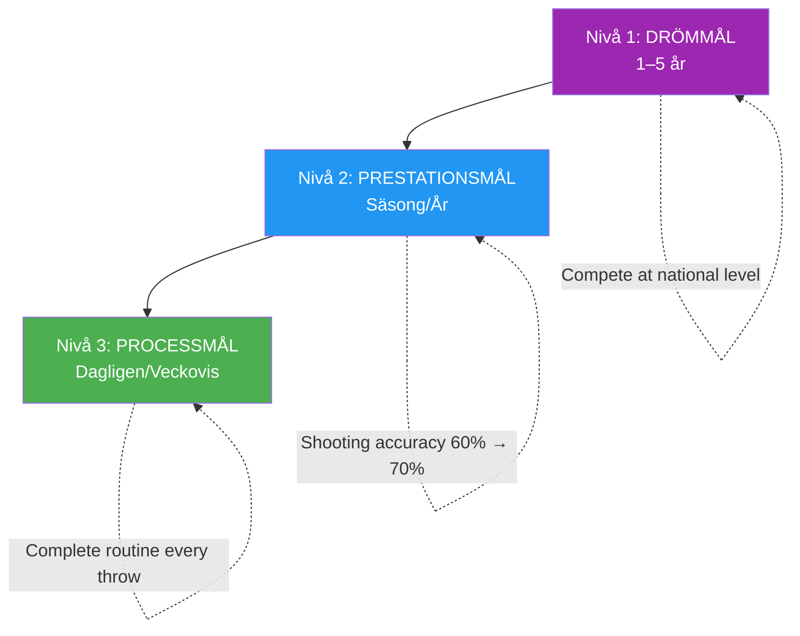

# Målsättning för elitidrottare

> &quot;Rätt mål påskyndar utvecklingen; fel mål skapar frustration och stagnation.&quot;

Målsättning verkar enkelt: bestäm vad du vill, arbeta mot det. Men målsättning på elitnivå är mer nyanserat.

::: warning Vanligt misstag
**De flesta spelare sätter bara upp resultatmål** (&quot;Vinn mästerskapet&quot;). Du kan inte kontrollera resultaten – bara processen som leder till dem.
:::

---

## Utöver grundläggande mål

| Problem med resultatmål | Varför det är ett problem |
|----------------------|-------------------|
| Kan inte helt kontrollera resultaten | Skapar hjälplöshet |
| Skapar tryck utan riktning | Ångest utan handling |
| Framgång eller misslyckande är binärt | Inga delvinster |
| Vägleder inte daglig övning | Vad gör du egentligen? |

Elitmålsättning går djupare.

---

## Målhierarkin

### Nivå 1: Drömmål (1–5 år)
Dina yttersta ambitioner:
- &quot;Tävla på nationell nivå&quot;
- &quot;Bli erkänd som en elitskytt&quot;
- &quot;Vinn ett stort mästerskap&quot;

::: info Riktning, inte handling
Dessa ger vägledning och motivation men är inte handlingsbara dagligen.
:::

### Nivå 2: Prestationsmål (säsong/år)
Mätbara förbättringar i ditt spel:
- &quot;Öka skjutnoggrannheten från 60 % till 70 %&quot;
- &quot;Minska otvingade fel med 25 %&quot;
- &quot;Utveckla en pålitlig plombé&quot;

Dessa är inom din kontroll och mätbara.

### Nivå 3: Processmål (dagligen/veckovis)
Åtgärder som driver förbättring:
- &quot;Komplett förskottsrutin vid varje kast&quot;
- &quot;Öva visualisering i 10 minuter dagligen&quot;
- &quot;Träna skjutteknik 3 gånger per vecka&quot;

::: tip Full kontroll
**Processmålen är 100 % kontrollerbara.** Fokusera här för maximal effekt.
:::

## SMART+-ramverket

Gå utöver grundläggande SMART-mål:

### Specifik
Inte &quot;förbättra min pekning&quot; utan &quot;utveckla en konsekvent demiportée som landar inom 30 cm från målet från 8 meter.&quot;

### Mätbar
Definiera hur du ska följa upp framsteg:
- Procentandelar för framgång
- Konsekvensmått
- Videoanalysmarkörer

### Uppnåeligt men utmanande
Målet bör kräva tillväxt men vara realistiskt. En 60%-skytt som siktar på 65% är uppnåeligt; att sikta på 90% är fantasi.

### Relevant
Mål måste kopplas till dina större ambitioner och adressera faktiska svagheter, inte bara det som är lätt att förbättra.

### Tidsbunden
Sätt tydliga deadlines:
- &quot;Vid slutet av säsongen&quot;
- &quot;Inom 3 månader&quot;
- &quot;Vid det nationella mästerskapet&quot;

### + Personligt meningsfull
Målet måste vara viktigt för DIG, inte bara för din tränare eller dina lagkamrater. Inre motivation upprätthåller ansträngning när framstegen är långsamma.

## Process kontra resultatfokus

### Problemet med resultatmål

&quot;Att vinna matchen&quot; skapar problem:
- Ångest över saker du inte kan kontrollera
- Distraktion från utförandet
- Allt-eller-inget-tänkande
- Tryck utan vägledning

### Kraften i processmål

&quot;Utför min rutinen för behandlingen perfekt&quot; erbjuder:
- Full kontroll
- Tydligt fokus
- Omedelbar återkoppling
- Bygger upp mot resultat naturligt

### Balansen

Använd resultatmål för motivation och riktning. Använd processmål för dagligt fokus och genomförande.

## Målsättning för olika faser

### Lågsäsong
Fokus på utvecklingsmål:
- Tekniska förbättringar
- Fysisk konditionering
- Mental färdighetsutveckling
- Utöka din palett av plädar

### Försäsong
Övergång till integration:
- Kombinera färdigheter i matchliknande förhållanden
- Testa förbättringar i vänskaplig tävling
- Förfina strategier

### Tävlingssäsong
Övergång till prestanda och process:
- Att genomföra det du har utvecklat
- Processmål för varje match
- Minimala tekniska förändringar

### Efter tävlingen
Reflektion och planering:
- Analysera vad som fungerade
- Identifiera områden för tillväxt
- Sätt upp mål för nästa cykel

## Vanliga misstag vid målsättning

### För många mål
Fokus är makt. 2–3 viktiga mål slår 10 spridda mål.

### Endast resultatmål
Utan processmål har du ingen färdplan.

### Ingen flexibilitet
Mål bör anpassas till ny information. Att strikt följa föråldrade mål är slöseri med ansträngning.

### Jämförelsebaserade mål
&quot;Att vara bättre än [spelaren]&quot; lägger din framgång i någon annans händer.

### Att försumma mentala mål
Tekniska och fysiska mål dominerar, men mentala färdigheter avgör ofta vem som vinner.

## Implementeringsstrategier

### Skriv ner dem
Skrivna mål har betydligt större chans att uppnås.

### Granska regelbundet
Veckovis uppföljning håller målen aktuella och möjliggör justeringar.

### Dela selektivt
Dela med dem som kommer att stödja, inte undergräva.

### Visualisera prestation
Föreställ dig regelbundet att uppnå dina mål – känslan, ögonblicket.

### Spåra framsteg
Det som mäts hanteras. För register.

## När målen inte uppnås

Ouppfyllda mål är inte misslyckanden – de är data:

1. **Analysera**: Varför uppnåddes det inte?
2. **Lär dig**: Vad lär du dig av detta?
3. **Justera**: Ändra målet eller tillvägagångssättet
4. **Fortsätt**: Uthållighet slår perfektion

## Det mentala spelet med mål

Mål påverkar psykologin:
- **För lätt**: Tristess, självbelåtenhet
- **För svårt**: Ångest, modfälldhet
- **Precis lagom**: Engagemang, flöde, tillväxt

Hitta den perfekta platsen där målen utmanar utan att bli överväldigande.

---

| *Relaterat: [Introduktion till målsättning](/sv/utbildning/motivation/) | [SMARTA Mål](/sv/utbildning/motivation/smarta-mål) | [Planera din utveckling](/sv/utbildning/motivation/planering)* |

