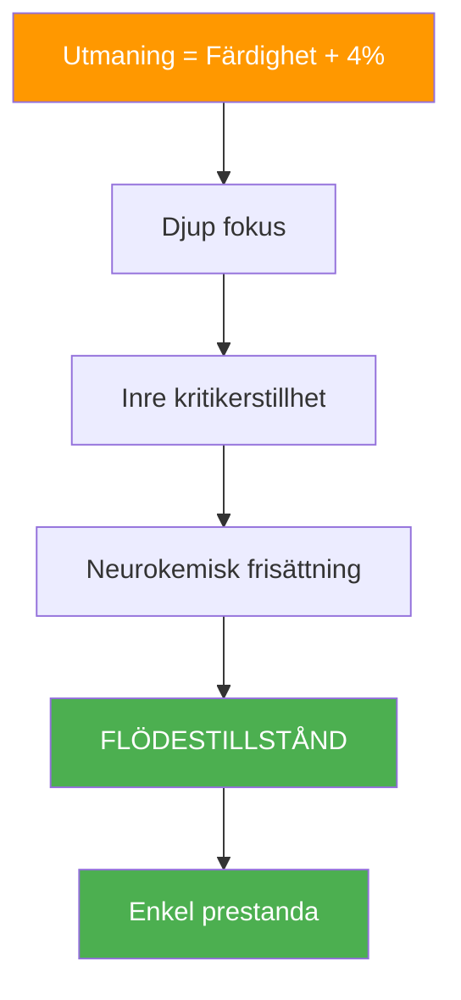
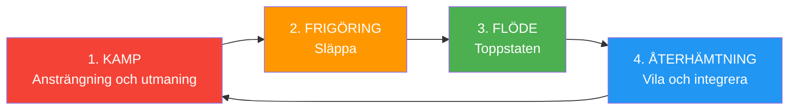

# Vetenskapen bakom flödestillstånd

> &quot;Flödestillstånd – den magiska zonen där allt klickar, tiden saktar ner och prestationen känns obehindrad.&quot;

Det är inte mystiskt; det är neurologiskt. Att förstå vetenskapen bakom flow kan hjälpa dig att få tillgång till det mer konsekvent.

::: tip Viktig insikt
Flöde är inte något du kan tvinga fram – men du kan skapa förutsättningar som gör det mer sannolikt att det uppstår.
:::

---

## Vad är flöde?

Psykologen Mihaly Csikszentmihalyi definierade flow som &quot;ett tillstånd av fullständig fördjupning i en aktivitet&quot;. I boule har du upplevt det: kast som känns automatiska, beslut som kommer omedelbart, en känsla av att du och spelet är ett.

### Flödesegenskaper

| Karakteristisk | Hur det känns |
|----------------|-------------------|
| **Fullständig absorption** | Spelet är allt som existerar |
| **Förlust av självmedvetenhet** | Ingen inre kritiker |
| **Förvrängd tid** | Timmar känns som minuter |
| **Inneboende motivation** | Spelar för glädjens skull |
| **Känsla av kontroll** | Självförtroende utan arrogans |
| **Omedelbar återkoppling** | Omedelbar justering |

## Flödets neurovetenskap

### Hjärnförändringar under flödet

När du går in i flow genomgår din hjärna mätbara förändringar:

**Tillfällig hypofrontalitet**
Den prefrontala cortexen – som ansvarar för självkritik, tvivel och övertänkande – blir mindre aktiv. Det är därför flödet känns enkelt: din inre kritiker tystnar.

**Neurokemisk cocktail**
Flödet utlöser en kraftfull blandning av neurokemikalier:
- **Dopamin**: Förbättrar fokus och mönsterigenkänning
- **Noradrenalin**: Ökar upphetsning och uppmärksamhet
- **Endorfiner**: Skapar känslor av välbefinnande
- **Anandamid**: Främjar lateralt tänkande
- **Serotonin**: Producerar efterglödget av flödet

**Hjärnvågsskiften**
Flöde korrelerar med skiften från betavågor (normalt vakenmedvetande) till alfa- och thetavågor (avslappnad vakenhet och kreativitet).

## Flödesutlösare

Forskning har identifierat förhållanden som gör flödet mer sannolikt:

### 1. Balans mellan utmaning och färdighet

Flöde uppstår när utmaningen något överstiger din nuvarande färdighetsnivå – cirka 4 % bortom din komfortzon. För lätt leder till tristess; för svårt leder till ångest.

**I boule:**
- Sök motståndare något bättre än du själv
- Ställ personliga utmaningar i matcher
- Variera dina vanor för att bibehålla engagemanget

### 2. Tydliga mål

Du behöver veta vad du försöker uppnå. Vaga avsikter skapar inte flow.

**I boule:**
- Definiera din avsikt för varje kast
- Ha tydliga matchmål
- Känn din roll i teamet

### 3. Omedelbar återkoppling

Flow kräver att man vet hur man presterar i realtid.

**I boule:**
- Resultatet av varje kast är omedelbart synligt
- Läs terrängresponsen
- Lägg märke till din kropps feedback

### 4. Djup koncentration

Flöde kräver fokuserad uppmärksamhet utan distraktion.

**I boule:**
- Utveckla din rutin före behandlingen
- Öva mindfulness
- Eliminera externa distraktioner

### 5. Känsla av kontroll

Känslan av att dina handlingar spelar roll och att du kan påverka resultatet.

**I boule:**
- Lita på din träning
- Fokusera på vad du kan kontrollera
- Acceptera osäkerhet i utfall

---

## Varför du inte kan tvinga fram flöde

::: warning Flödesparadoxen
**Att försöka komma in i flödet förhindrar det.** Flöde uppstår när du slutar försöka uppnå det och helt enkelt engagerar dig fullt ut i aktiviteten.
:::

Detta beror på att:
- Att försöka aktiverar prefrontala cortex (motsatsen till flow)
- Självövervakning stör fördjupningen
- Målfokus ersätter processfokus

## Skapa förutsättningar för flöde

Även om du inte kan tvinga fram flöde, kan du skapa förutsättningar som gör det mer troligt:

### Före tävlingen
- Tillräcklig sömn och näring
- Korrekt uppvärmning
- Positivt mentalt tillstånd
- Tydliga avsikter

### Under tävlingen
- Håll fokus på nuet
- Använd din rutin för behandling före injektion
- Släpp taget om resultaten
- Lita på din kropp

### Miljöfaktorer
- Minimera distraktioner
- Bekvämt fysiskt tillstånd
- Lämplig utmaningsnivå
- Stödjande teamdynamik

---

## Flödescykeln

Flödet är inte konstant – det följer en cykel:

Att förstå den här cykeln hjälper dig att:
- Inte tvingande flöde under kampfasen
- Inse när man ska släppa taget
- Tillåt korrekt återhämtning mellan flödestillstånd

## Flöde i Team Petanque

Flöde kan vara smittsamt. När en spelare hamnar i flöde kan det spridas till lagkamrater genom:
- Positiv energi och kroppsspråk
- Minskad press på andra
- Ökat kollektivt förtroende
- Synkroniserad lagirytm

## Byggnadsflödeskapacitet

Precis som med alla färdigheter förbättras flödet med övning:

### Dagliga övningar
- Mindfulnessmeditation (bygger uppmärksamhetskontroll)
- Visualisering (primar nervbanor)
- Fysisk träning (bygger grunden för färdigheter)

### I utbildning
- Öva på gränsen till din förmåga
- Bibehåll fullt engagemang även under övningar
- Lägg märke till när flödet inträffar och vad som föregick det

### Långsiktig utveckling
- Öka gradvis utmaningsnivåerna
- Utveckla robusta rutiner för fotografering
- Bygg mental motståndskraft inför den svåra fasen

---

| *Relaterat: [Zonen](/sv/utbildning/mentalt spel/zonen/) | [Att gå in i zonen](/sv/utbildning/mentalt spel/zonen/att gå in i zonen) | [Mindfulnesstekniker](/sv/utbildning/mentalt spel/mindfulness/tekniker)* |

