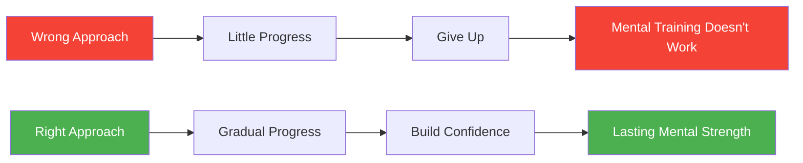

# 5 Mental Training Mistakes

> "Many players invest time in mental skills only to see little improvement. Here's why."

Mental training can transform your pétanque performance — but only if done correctly.

::: danger Common Pattern
**Most mental training fails not because the techniques don't work**, but because of how they're applied.
:::

---

## Mistake #1: Treating Mental Skills as Optional

::: warning The Problem
Many players view mental training as a nice-to-have, something to work on "when there's time."
:::

### Why It Fails

Mental skills are skills — they require the same consistent practice as throwing technique. Occasional attention produces occasional results.

### The Fix

| Action | Implementation |
|--------|---------------|
| Schedule it | Like physical training |
| Start small | Just 10 minutes daily |
| Make it non-negotiable | No excuses |
| Track it | Alongside physical practice |

**Remember:** At elite levels, mental skills often determine who wins.

## Mistake #2: Only Training When Things Go Wrong

### The Problem

Players often turn to mental training only after a bad performance or during a slump. They see it as remedial rather than developmental.

### Why It Fails

Mental skills built in crisis are fragile. You can't develop deep capabilities when you're already struggling. It's like trying to learn to swim while drowning.

### The Fix

- Build mental skills during good times
- Practice when you're performing well
- Create a foundation before you need it
- Maintain practice consistently, regardless of results

**Remember:** The best time to build mental strength is when you don't desperately need it.

## Mistake #3: Expecting Instant Results

### The Problem

Players try visualization for a week, don't see immediate improvement, and conclude "it doesn't work for me."

### Why It Fails

Mental skills develop slowly, often invisibly at first. The neural pathways that support mental strength take time to build. Expecting quick results leads to abandonment before benefits appear.

### The Fix

- Commit to at least 8-12 weeks of consistent practice
- Look for subtle improvements, not dramatic changes
- Trust the process even when progress isn't visible
- Keep a journal to track gradual changes

**Remember:** You wouldn't expect to master a new throw in a week. Mental skills deserve the same patience.

## Mistake #4: Generic Practice Without Personalization

### The Problem

Players follow generic mental training programs without adapting them to their specific needs, personality, and playing style.

### Why It Fails

Mental training isn't one-size-fits-all. What works for one player may not work for another. A visualization technique that helps a visual thinker may frustrate someone who thinks in feelings.

### The Fix

- Identify YOUR specific mental challenges
- Experiment with different techniques
- Adapt methods to your learning style
- Focus on what actually helps you

**Questions to ask:**
- What mental challenges do I face most often?
- How do I naturally process information?
- What has worked for me in the past?
- What feels authentic to me?

## Mistake #5: Separating Mental and Physical Training

### The Problem

Players do mental training in isolation — meditation at home, visualization before bed — but don't integrate it with physical practice.

### Why It Fails

Mental skills need to be connected to physical performance. Practicing mindfulness on a cushion is different from practicing it while throwing. The transfer isn't automatic.

### The Fix

- Use mental skills during every practice session
- Practice your pre-shot routine with full mental engagement
- Apply pressure management techniques in training
- Create practice situations that require mental skills

**Integration examples:**
- Visualize each throw before executing
- Use breathing techniques between throws
- Practice your focus routine in training
- Simulate pressure situations regularly

## Bonus Mistakes

### Mistake #6: All Theory, No Practice

Reading about mental skills isn't the same as practicing them. Knowledge without application changes nothing.

### Mistake #7: Ignoring the Basics

Advanced techniques built on weak foundations crumble. Master basic breathing, focus, and routine before complex methods.

### Mistake #8: Going It Alone

Mental training benefits from guidance. Consider working with a sports psychologist or experienced mentor.

## The Right Approach

Effective mental training:

1. **Is consistent** — Regular practice, not occasional attention
2. **Is proactive** — Built before needed, not in crisis
3. **Is patient** — Allows time for development
4. **Is personalized** — Adapted to your needs
5. **Is integrated** — Connected to physical practice

## Getting Started Right

If you're beginning mental training:

1. **Assess** your current mental game honestly
2. **Identify** 1-2 specific areas to improve
3. **Choose** techniques that fit your style
4. **Schedule** regular practice time
5. **Integrate** with physical training
6. **Track** progress over time
7. **Adjust** based on what works

## The Payoff

Players who avoid these mistakes and train their minds consistently report:
- Greater consistency under pressure
- Faster recovery from mistakes
- More enjoyment in competition
- Better focus and concentration
- Increased confidence

The mental game is trainable. Train it right.

---

*Related: [Mental Strength](/sv/education/mental-game/mental-strength/) | [Training Methods](/sv/education/technique/training/) | [Mindfulness](/sv/education/mental-game/mindfulness/)*

