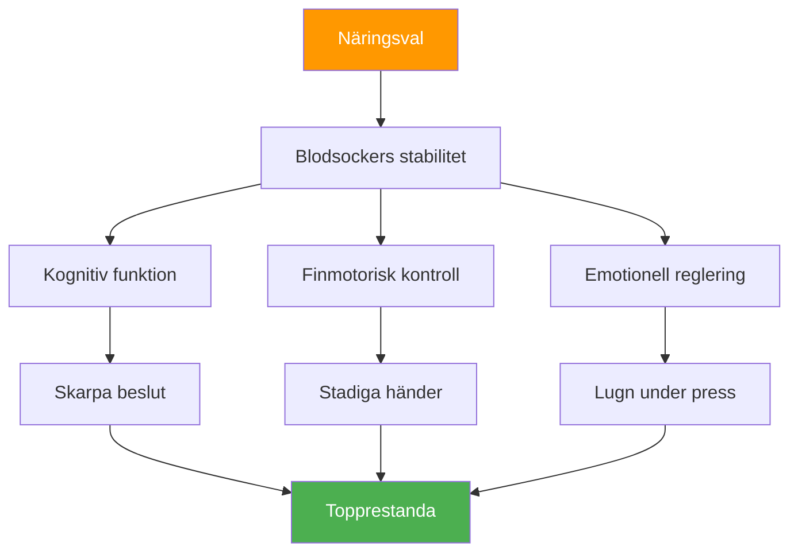

# Näring för tävling: Drivkraft för precisionsprestanda

> &quot;Din hjärna är ditt viktigaste verktyg i boule. Ge den stabil bränsle, inte berg-och-dalbaneenergi.&quot;

Bouletävlingar kan vara i 6–10 timmar. Din konsumtion påverkar direkt din kognitiva funktion, finmotorik och förmåga att hålla fokus under flera matcher.

::: tip Den gyllene regeln
**Stabilt blodsocker = stadiga händer.** Varje kostval bör stödja en jämn energinivå, inte toppar och krascher.
:::

---

## Varför näring är viktigt för boule

Till skillnad från högintensiva sporter kräver boule:

Felaktiga kostval skapar prestationsproblem som spelarna tillskriver &quot;mental svaghet&quot; eller &quot;otur&quot;.

---

## Blodsockerkopplingen

Din hjärna drivs av glukos. Blodsockersvängningar påverkar direkt:

| Blodsockertillstånd | Mental effekt | Fysisk effekt |
|-------------------|---------------|-----------------|
| **Stabil** | Klar tanke, bra beslut | Stadiga händer, konsekvent |
| **Spik (för hög)** | Initial energi, sedan krasch | Skakig, överaktiv |
| **Krasch (för låg)** | Dålig koncentration, irritabilitet | Darrande, svagt grepp |
| **Berg-och-dalbana** | Oförutsägbart humör/fokus | Inkonsekvent prestanda |

**Mål:** Bibehålla stabilt blodsocker under hela tävlingen.

## Näringslära på tävlingsdagen

### Förtävling (3-4 timmar innan)

**Ät en rejäl måltid:**
- Komplexa kolhydrater (havregryn, fullkornsbröd, ris)
- Protein (ägg, yoghurt, magert kött)
- Hälsosamma fetter (avokado, nötter, olivolja)
- Undvik: Enkla sockerarter, tung/fet mat

**Exempelmåltider:**
- Havregryn med nötter och banan
- Ägg på fullkornsbröd med avokado
- Ris med kyckling och grönsaker

### Före match (1-2 timmar innan)

**Lätt, välbekant mellanmål:**
- Banan
- Liten näve nötter
- En halv smörgås
- Undvik: Allt nytt eller experimentellt

### Under tävlingen

**Mellan matcher:**
- Små, täta mellanmål var 60-90 minut
- Nötter, frön, torkad frukt
- Fullkornskex
- Färsk frukt (banan, äpple)

**Under matcher:**
- Vatten sipprar mellan ändarna
- Snabba kolhydrater om det behövs (torkad frukt)
- Undvik att äta under aktiv lek

### Återhämtning (efter tävling)

**Inom 30–60 minuter:**
- Protein för muskelåterhämtning
- Kolhydrater för att fylla på
- Vätskor att rehydrera

## Hydreringsprotokoll

### Grunderna
- Börja med att dricka vätska (kontrollera färgen på morgonurinen)
- Drick stadigt under hela tiden, vänta inte tills du är törstig
- Målet är 150–250 ml per tävlingstimme
- Justera för värme och fuktighet

### Varningstecken på uttorkning
- Törst (du är redan uttorkad)
- Mörk urin
- Huvudvärk
- Minskad koncentration
- Trötthet

### Övervätskefällan
För mycket vatten, särskilt utan elektrolyter:
- Täta toalettpauser (stör rytmen)
- Utspädda elektrolyter (kan orsaka darrningar)
- Obehag och distraktion

**Balans:** Stabilt intag, inkludera elektrolyter vid varma förhållanden.

## Livsmedel att undvika

### På tävlingsdagen
- **Tunga måltider** — Omleder blodet till matsmältningen
- **Högt socker** — Orsakar energiförluster
- **Alkohol (kvällen innan)** — Stör sömnen, uttorkar
- **Överdrivet koffeinintag** — Kan orsaka skakningar
- **Nya livsmedel** — Risk för matsmältningsproblem
- **Fet/friterad mat** — Långsam matsmältning, slöhet

### Livsmedel som orsakar problem
- **Kolsyrade drycker** — Uppblåsthet, obehag
- **Fiberrik mat** — Kan orsaka obehag
- **Mejeriprodukter (för vissa)** — Matsmältningskänslighet
- **Konstgjorda sötningsmedel** — Kan orsaka magproblem

## Koffeinstrategi

Koffein kan förbättra fokus och reaktionstid, men kräver noggrann hantering:

### Effektiv användning
- Känn din tolerans
- Konsekvent timing (ändra inte för tävling)
- Måttlig dos (100-200 mg)
- Tillräckligt tidigt för att undvika störningar i kvällsmatcher
- Kombinera med mat för att minska nervositet

### Ineffektiv användning
- Mer än vanligt (orsakar ångest, darrningar)
- Sent på dagen (stör sömnen)
- På tom mage (nervositet, krasch)
- Att förlita sig på koffein för att kompensera för dålig sömn

## Bygga din tävlingsnäringsplan

### Steg 1: Testa i praktiken
Testa din tävlingsmatsplan under träningen:
- Samma tidpunkt
- Samma mat
- Samma hydrering
- Lägg märke till hur du känner och presterar

### Steg 2: Förbered logistiken
- Vet vilken mat som finns tillgänglig på platsen
- Ta med egna beprövade snacks
- Har alternativ för säkerhetskopiering
- Packa mer än du tror att du behöver

### Steg 3: Skapa ett schema
Skriv ner din kosttid:
- Måltid före tävling (tid, mat)
- Mellanmål före match (tid, mat)
- Under tävlingen (schema, mat)
- Påminnelseintervall för vätskebalans

### Steg 4: Spåra och justera
Efter tävlingarna, observera:
- Vad du åt och när
- Hur du kände dig fysiskt
- Prestandakvalitet
- Eventuella problem (hunger, krasch, mage)

## Värme- och fuktighetsöverväganden

Krav för förändringar i varmt väder:

- **Öka vätskeintaget** — Kan behöva 50–100 % mer
- **Tillsätt elektrolyter** — Svettning förlorar mineraler
- **Lättare måltider** — Tung mat som är svårare att bearbeta
- **Skuggbrytningar** — Underskatta inte värmestress
- **Förkylning** — Anländ sval och återfuktad till lokalen

## Vanliga misstag

::: warning Undvik dessa
- **Hoppa över frukosten** — Förbränner morgonglykogen
- **Energidrycker** — För mycket koffein och socker
- **Väntar tills jag är hungrig** — Påverkar redan prestationen
- **Alkoholkvällen innan** — Uttorkning och dålig sömn
- **Prova nya maträtter** — Risk för matsmältningsproblem
:::

## Åtgärdssteg

1. **Planera din tävlingskost** i förväg
2. **Testa din plan** i praktikförhållanden
3. **Förbered dina mellanmål** kvällen innan
4. **Följ ditt schema** oavsett matchpress
5. **Granska och finslipa** efter varje tävling

---

## Relaterat innehåll

- [Nutrition Module](/sv/utbildning/nutrition/) — Komplett näringsutbildning
- [Tävlingsnäring](/sv/utbildning/näring/tävling) — Detaljerade protokoll
- [Sömn för prestation](/sv/artiklar/sömnprestanda) — Återhämtningsoptimering

