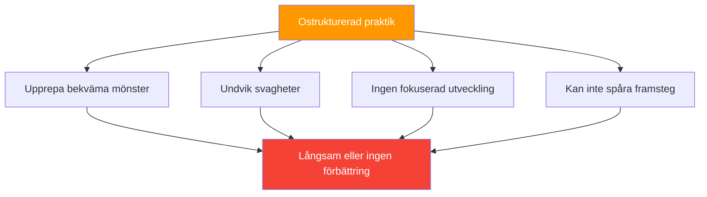

# Strukturera din praktik

> &quot;Två spelare kan spendera samma timmar på terrängen och se väldigt olika förbättringar.&quot;

Skillnaden ligger ofta i hur praktiken är strukturerad.

::: tip Myten om 10 000 timmar
**Det handlar inte om timmar – det handlar om hur du använder dem.** Medveten övning slår tanklös repetition varje gång.
:::

---

## Problemet med ostrukturerad praktik

De flesta fritidsaktiviteter ser ut så här:
- Kom och kasta lite boule
- Spela några vardagsspel
- Chatta med vänner
- Gå hem

Detta är trevligt men ineffektivt för förbättring.

---

## Principer för effektiv praxis

| Princip | Fråga att ställa |
|-----------|----------------|
| **Målmedveten** | Vad jobbar jag med idag? |
| **Överväga** | Utmanar detta mig? |
| **Rik på feedback** | Hur vet jag om jag förbättrar mig? |
| **Fokuserad** | Är jag helt närvarande? |

### 1. Målmedveten övning

Varje session bör ha ett tydligt syfte:
- Vad jobbar jag med idag?
- Hur ser framgång ut?
- Hur vet jag om jag har förbättrats?

### 2. Avsiktlig svårighet

::: info Förmågans gräns
**Övning ska utmana dig.** Om det är bekvämt växer du inte.
:::

- Arbeta på gränsen till din förmåga
- Inkludera element som är svåra
- Undvik ren upprepning i komfortzonen

### 3. Omedelbar återkoppling

Du behöver veta hur du gör:
- Spåra resultat av övningar
- Använd video när det är möjligt
- Få input från utbildningspartners

### 4. Fokuserad uppmärksamhet

Kvalitet framför kvantitet:
- Full koncentration under träningen
- Kortare, fokuserade sessioner slår långa, distraherade
- Mentalt engagemang är viktigt

## Sessionsstruktur

### Uppvärmning (10–15 minuter)

**Fysisk:**
- Lätt rörelse
- Förberedelse av arm och axel
- Gradvis ökning av intensitet

**Mental:**
- Övergång från vardagen
- Sätt avsikt för sessionen
- Börja fokusera uppmärksamheten

### Tekniskt arbete (20–30 minuter)

Fokusera på specifika färdigheter:
- Isolerad teknikövning
- Övningar som riktar sig mot svagheter
- Upprepning med uppmärksamhet

**Exempel på fokusområden:**
- Pekningsnoggrannhet på specifika avstånd
- Fotografering från olika vinklar
- Specifika kasttyper (plombée, portée, etc.)

### Tillämpad praktik (20–30 minuter)

Använd färdigheter i realistiska sammanhang:
- Simulerade spelsituationer
- Tryckborrar
- Beslutsfattandepraxis

### Nedvarvning (10 minuter)

**Fysisk:**
- Ljuskastning
- Stretching

**Mental:**
- Gå igenom vad du lärde dig
- Notera områden för framtida arbete
- Övergång från träningsläge

## Typer av övningssessioner

### Kompetensutvecklingssession

Fokus: Att bygga eller förfina specifika tekniker

- 70 % tekniska övningar
- 20 % tillämpad praktik
- 10 % uppvärmning/nedvarvning

### Tävlingssimulering

Fokus: Förberedelser inför matchförhållandena

- 20 % uppvärmning med syfte
- 60 % matchliknande spel med press
- 20 % avrapportering och justering

### Underhållssession

Fokus: Att hålla färdigheterna skarpa

- Balanserat arbete inom alla områden
- Inget intensivt fokus på någon enskild sak
- Trevligt men målmedvetet

### Återhämtningssession

Fokus: Lätt träning efter tävling

- Låg intensitet
- Trevligt kastande
- Mental återställning

## Utformning av borrar

Effektiva övningar har:

### Tydliga mål
Vad specifikt övar du på?

### Mätbara resultat
Hur spårar du framgång?

### Lämplig utmaning
Tillräckligt svårt att sträcka ut, inte så hårt att du inte kan lyckas

### Relevans
Kopplat till verkliga spelsituationer

### Progression
Sätt att öka svårighetsgraden allt eftersom du förbättrar dig

## Exempelborrar

### Pekningsnoggrannhet

**Uppställning:** Mål på 8 meters avstånd
**Mål:** Landa inom 30 cm från målet
**Spår:** Framgångsgrad över 20 kast
**Framsteg:** Minska målstorleken, öka avståndet

### Konsekvens i skytte

**Uppställning:** Stationärt målklot
**Mål:** Träffa målet
**Spår:** Träffar per 10 försök
**Framsteg:** Variera vinklar, lägg till rörelse

### Trycksimulering

**Upplägg:** Måste göra 3 i rad för att &quot;vinna&quot;
**Mål:** Slutför sekvensen
**Spår:** Nödvändiga försök
**Förlopp:** Öka den erforderliga sekvensen

## Veckoplanering

### Exempel på balanserad vecka

**Måndag:** Färdighetsutveckling (pekande fokus)
**Onsdag:** Tävlingssimulering
**Fredag:** Färdighetsutveckling (fokus på skytte)
**Helg:** Matchspel

### Periodisering

Variera intensiteten över säsongen:

**Lågsäsong:** Tung kompetensutveckling
**Försäsong:** Integration och simulering
**Tävlingssäsong:** Underhåll och slipning
**Efter säsong:** Återhämtning och reflektion

## Vanliga misstag

### För mycket spelande

Att spela spel är roligt men det riktar sig inte effektivt mot svagheter.

### Ingen spårning

Utan mätning kan du inte veta om du förbättrar dig.

### Undvika svagheter

Vi övar naturligtvis på det vi är bra på. Tvinga dig själv att arbeta med svagheter.

### Inkonsekvent schema

Sporadisk övning ger sporadiska resultat.

### Ingen mental övning

Fysisk repetition utan mentalt engagemang begränsar förbättring.

## Att få övningen att hålla

### Före träning
- Sätt tydliga avsikter
- Förbered dig mentalt
- Granska anteckningar från tidigare sessioner

### Under övningen
- Håll fokus
- Spåra resultat
- Justera efter behov

### Efter träningen
- Notera vad du lärde dig
- Identifiera nästa steg
- Fira framsteg

## Myten om 10 000 timmar

Det handlar inte bara om timmar – det handlar om kvalitet. 1 000 timmar av medveten övning slår 10 000 timmar av tanklös repetition.

Strukturera din träning med ett syfte, och varje timme räknas mer.

---

| *Relaterat: [Utbildningsmetoder](/sv/utbildning/teknik/utbildning/) | [Träningsövningar](/sv/utbildning/teknik/träning/övningar) | [Målsättning](/sv/utbildning/motivation/)* |

