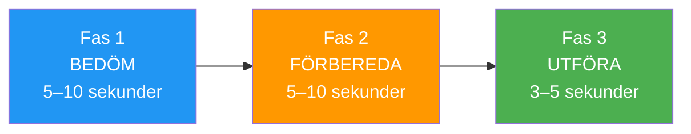

# Bygga rutiner före tagning

> &quot;Skillnaden mellan ett bra kast och ett fantastiskt kast sker ofta innan klotet lämnar din hand.&quot;

En väl utformad träningsrutin före träningen är ditt ankare i tävlingsstormen – en pålitlig sekvens som förbereder ditt sinne och din kropp för optimal prestation.

::: tip Din konkurrensfördel
**En konsekvent rutin skapar konsekventa resultat.** Det är det enda du kan kontrollera helt och hållet, oavsett press eller omständigheter.
:::

---

## Varför rutiner före skotttagning är viktiga

Elitidrottare inom alla sporter använder rutiner före skottet. I boule, där varje kast är diskret och tryck kan byggas upp mellan slagen, tjänar rutinerna flera syften:

| Ändamål | Hur det hjälper |
|---------|--------------|
| **Konsistens** | Samma förberedelse → mer konsekvent utförande |
| **Fokus** | Konstruktiv uppgift istället för oro |
| **Övergång** | Skift från tänkande till handling |
| **Tryckhantering** | Välbekanta handlingar lugnar nervsystemet |
| **Återställa** | Tar bort föregående skott från minnet |

---

## Anatomin av en effektiv rutin

### Fas 1: Bedömning (5–10 sekunder)
- Läs terrängen
- Visualisera det avsedda resultatet
- Välj din kasttyp
- Håll fast vid beslutet

### Fas 2: Förberedelse (5–10 sekunder)
- Ta din position
- Hitta ditt grepp
- Få lugn i din andning
- Känn boulens tyngd

### Fas 3: Utförande (3–5 sekunder)
- Slutfokus på målet
- Lita på din kropp
- Släpp lös utan tanke
- Följ upp naturligt

## Bygga din personliga rutin

### Steg 1: Observera dina nuvarande mönster

Innan du skapar en ny rutin, lägg märke till vad du redan gör:
- Vad gör man innan man lyckar kastar?
- Vad förändras när man är under press?
- Vad känns naturligt för dig?

### Steg 2: Designa din sekvens

Skapa en rutin som inkluderar:

**Fysiska element:**
- Hur du närmar dig cirkeln
- Hur du plockar upp och håller klotet
- Din hållning och positionering
- Ett specifikt andningsmönster

**Mentala element:**
- En visualisering av resultatet
- Ett fokusord eller en fokusfras
- En bindningspunkt (det ögonblick du bestämmer dig för att &quot;detta är kastet&quot;)

### Steg 3: Håll det enkelt

Din rutin bör vara:
- **Tillräckligt kort** för att bibehålla trycket (totalt 15–25 sekunder)
- **Tillräckligt enkelt** att komma ihåg när man är stressad
- **Flexibel nog** för att anpassa sig till olika situationer

## Exempelrutiner

### Pekarens rutin
1. Stå bakom cirkeln och bedöm terrängen
2. Visualisera boulens bana och landningsplats
3. Gå in i cirkeln, hitta din ställning
4. Tre långsamma andetag medan du känner på boule
5. Ögonen på målet, släpp

### Skyttens rutin
1. Identifiera målklotet, välj vinkel
2. Visualisera effekten och resultatet
3. Gå in i cirkeln med ett syfte
4. Ett djupt andetag, känn tyngden
5. Håll blicken fäst vid målet, utför

## Vanliga misstag att undvika

### För lång
Om din rutin tar mer än 30 sekunder övertänker du. Långa rutiner ger ångesten mer tid att byggas upp.

### För stel
Om något avbrott förstör din rutin är den för skör. Bygg in flexibilitet – om något bryter din koncentration, ha en återställningsfunktion.

### Hoppa över under press
Rutinen är viktigast när pressen är som högst. Om du överger den när du är stressad förlorar du dess skyddande fördelar.

### Fokus på mekanik
Din rutin bör avslutas med fokus på resultatet, inte på tekniken. &quot;Träffa målet&quot; inte &quot;håll armbågen rak&quot;.

## Öva din rutin

### I utbildning
- Använd din fulla rutin för varje kast, även tillfälliga
- Ta tid på dig själv för att säkerställa konsekvens
- Öva med distraktioner för att bygga motståndskraft

### Byggnadsautomatik
Målet är att din rutin ska bli automatisk – något du gör utan att tänka. Detta kräver upprepning:
- 100+ kast med samma rutin
- Konsekvent användning i olika situationer
- Gradvis exponering för tryck samtidigt som rutinen bibehålls

## Anpassning till konkurrens

I matcher kan din rutin behöva små justeringar:

- **Tidspress**: Ha en förkortad version redo
- **Väderförhållanden**: Justera fysiska element efter behov
- **Högtrycksögonblick**: Sakta ner något, öka inte farten

## Återställningsrutinen

Lika viktigt är vad du gör efter ett kast:

1. **Acceptera resultatet** — bra eller dåligt, det är klart
2. **Fysisk återställning** — ta ett steg tillbaka, skaka ut spänningar
3. **Mental återställning** — rensa kastet från ditt sinne
4. **Förbered dig för nästa** — flytta fokus till vad som komma skall

---

| *Relaterat: [Guide till rutiner före skott](/sv/utbildning/mentalt spel/mental styrka/rutin-före-skott) | [Hantera press](/sv/utbildning/mentalt-spel/mental-styrka/hantera-press) | [Mindfulnesstekniker](/sv/utbildning/mentalt spel/mindfulness/tekniker)* |

