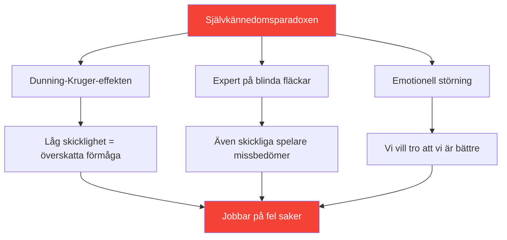

# Att utveckla självkännedom: Grunden för förbättring

> &quot;Du kan inte förbättra det du inte uppfattar korrekt.&quot;

Självkännedom – att känna till sina faktiska styrkor och svagheter – är grunden för effektiv utveckling.

::: danger Den obekväma sanningen
**De flesta spelare jobbar med fel saker** eftersom de inte ser sig själva tydligt.
:::

---

## Självkännedomsparadoxen

---

## Varför boulespelare kämpar

Boule gör självbedömning särskilt svår:

| Utmaning | Varför det är svårt |
|-----------|--------------|
| **Resultatvarians** | Bra beslut kan leda till dåliga resultat (och vice versa) |
| **Jämförelsebias** | Vi minns bästa prestationer, bortförklarar sämsta |
| **Identitetsskydd** | Att erkänna svaghet känns hotfullt |

::: warning Minne är inte data
**Vi konstruerar berättelser som skyddar vår självbild.** Objektiv uppföljning är avgörande.
:::

---

## Komponenterna i självkännedom

Sann självkännedom kräver insikt i flera domäner:

| Domän | Viktiga frågor |
|--------|---------------|
| **Teknisk** | Vilka kast är faktiskt tillförlitliga? Vilka är inkonsekventa? |
| **Mental** | Hur reagerar jag på press? Vad triggar min inre kritiker? |
| **Fysisk** | När är min energi som högst? Hur påverkar trötthet mig? |
| **Taktisk** | Överattackerar jag? Underattackerar jag? Hur tolkar jag situationer? |
| **Emotionell** | Vad frustrerar mig? När spelar jag tight? |
| **Interpersonell** | Hur uppfattar lagkamraterna min kommunikation? |

## Extern feedback: Spegeln du behöver

Du kan inte se dina egna blinda fläckar. Du behöver externa perspektiv.

### Strukturerade feedbackmetoder

**Videoanalys**
- Spela in matcher och träning
- Titta med specifika fokusområden
- Lägg märke till mönster du missar i stunden

**Kamratbedömning**
- Be betrodda lagkamrater om ärlig feedback
- Använd [Bedömningsverktyget](/sv/bedömning/) för kamratvalidering
- Jämför din egen bedömning med deras bedömning

**Coachobservation**
- Friska ögon ser vad bekanta ögon missar
- Begär specifik feedback, inte allmänna intryck
- Spåra feedbackteman över tid

### Feedbackgapet

När din självbedömning skiljer sig avsevärt från extern feedback, var uppmärksam på:

| Typ av mellanrum | Menande | Handling |
|----------|---------|--------|
| Du betygsätter högre | Möjlig blind fläck | Undersök med video/data |
| Du betygsätter lägre | Möjlig förtroendeproblem | Fokusera på bevis på kompetens |
| Konsekvent gap | Systematiskt uppfattningsfel | Omkalibrera din mentala modell |

## Att bygga självkännedomsvanor

### Daglig reflektion (5 minuter)

Efter varje session, fråga dig själv:

1. **Vad gick bra?** (Var specifik)
2. **Vad gick inte bra?** (Var ärlig)
3. **Vad skulle jag göra annorlunda?** (Var konstruktiv)
4. **Vad överraskade mig?** (Var nyfiken)

### Veckoöversikt (15 minuter)

Leta efter mönster:

- Vilka situationer utmanar mig ständigt?
- Var förbättrar jag mig?
- Vilken feedback har jag fått?
- Vad undviker jag att titta på?

### Månadsbedömning

Använd verktyget [Spelarbedömning](/sv/bedömning/):

- Betygsätt dig själv på alla 8 faktorer
- Begär validering av andra
- Jämför med föregående månad
- Identifiera de största luckorna

## Datafördelen

Subjektiv uppfattning är opålitlig. Data ger objektivitet:

### Vad man ska spåra

**Prestandadata**
- Lyckandefrekvens per kasttyp
- Prestanda under press kontra ingen press
- Första set kontra senare set
- Med olika partners

**Processdata**
- Sömnkvalitet före matcher
- Efterlevnad av rutiner före match
- Mentalt tillstånd under viktiga ögonblick
- Återhämtningstid efter misstag

### Hur man använder data

1. **Identifiera mönster** — Vad korrelerar med bra/dålig prestation?
2. **Utmana antaganden** — Stämmer data överens med dina övertygelser?
3. **Guideutbildning** — Fokusera på faktiska svagheter, inte upplevda
4. **Spåra framsteg** — Förbättring är ofta osynlig utan mätning

## Vanliga självkännedomsblock

::: warning Se upp för dessa
- **Defensivitet** vid mottagande av feedback
- **Borförklarar** dåliga prestationer
- **Söker bekräftelse** snarare än sanning
- **Undviker mätning** av svaga områden
- **Skyller konsekvent på externa faktorer**
:::

## Kopplingen mellan tillväxttänkande

Självkännedom kräver att man accepterar att:

- Nuvarande förmåga är inte fast
- Svaghet är information, inte identitet
- Feedback är en gåva, inte en attack
- Förbättring kräver ärlig bedömning

## Åtgärdssteg

1. **Idag:** Slutför [Självbedömningen](/sv/bedömning/)
2. **Denna vecka:** Begär kamratfeedback från två betrodda lagkamrater
3. **Pågående:** Etablera daglig reflektionsvana
4. **Månadsvis:** Följ upp framsteg med upprepade bedömningar

---

## Relaterat innehåll

- [Modul för självkännedom](/sv/utbildning/självkännedom/) — Fullständig utbildning
- [Spelarbedömning](/sv/bedömning/) — Utvärdera dina 8 faktorer
- [Den inre kritikern](/sv/artiklar/inre-kritiker) — Att hantera självkritik

