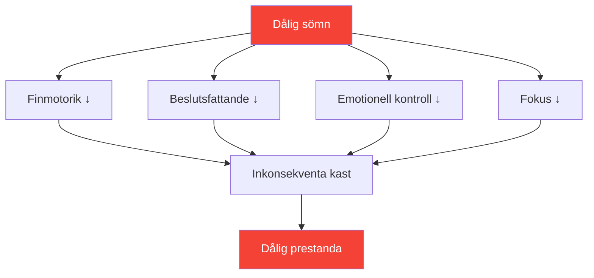

# Sömn: Den mest underskattade prestationsfaktorn

> &quot;Spelaren som sov bättre vinner ofta.&quot;

De flesta spelare fokuserar på teknik och mental träning. Få optimerar sin sömn. Detta är ett misstag – sömn kan vara den förbättring som ger högst ROI och som är tillgänglig för de flesta tävlingsspelare.

::: tip Förbättring av hög ROI
**Sömnoptimering kräver noll talang och ger massiv avkastning.** Det är det närmaste man kommer en laglig prestationshöjare.
:::

---

## Forskningen

Sömnvetenskap avslöjar slående effekter på precisionsidrottsprestationer:

### Reaktionstid
- **24 timmar utan sömn** = reaktionstid motsvarande 0,1 % alkohol i blodet
- **6 timmar/natt i 2 veckor** = motsvarande att vara vaken i 48 timmar
- Elitidrottare ägnar i genomsnitt **8,5+ timmar** jämfört med 7 timmar för den allmänna befolkningen

### Beslutsfattande
- Sömnbrist försämrar först prefrontala cortex
- Taktiska beslut försämras innan uppenbar trötthet visar sig
- Du märker inte din funktionsnedsättning (metakognition misslyckas också)

### Motorstyrning
- Finmotorik (grepp, släpp) kräver konsoliderat minne
- Minneskonsolidering sker under djupsömn
- Färdighetsinlärning utan tillräcklig sömn = bortkastad övning

## Precisionskopplingen

Boule kräver precis det som sömnbrist förstör:

| Nödvändig färdighet | Sömnbristeffekt |
|----------------|--------------------------|
| Finmotorisk kontroll | Grepptrycket blir inkonsekvent |
| Visuell bearbetning | nedsatt avståndsbedömning |
| Beslutsfattande | Taktiska fel ökar |
| Emotionell reglering | Frustrationen efter misstag ökar |
| Ihållande uppmärksamhet | Fokus försämras i längre matcher |

## Tecken på att du sover för lite

Du har anpassat dig till kronisk sömnbrist om:

- Du behöver ett alarm för att vakna
- Du är dåsig tidigt på eftermiddagen
- Du somnar inom 5 minuter efter att du lagt dig ner
- Du &quot;kommer ikapp&quot; på helgerna
- Kaffe är nödvändigt, inte valfritt

**Verklighetskontroll:** Om du behöver koffein för att fungera normalt har du sömnbrist.

## Protokoll för tävlingsveckan

### 7 dagar innan
- Börja sova 30 minuter mer per natt
- Stabilisera vakningstiden (samma tid varje dag)

### 3 dagar innan
- Ingen alkohol (stör sömnstrukturen)
- Inga tunga måltider efter 19:00
- Minska skärmtiden efter solnedgången

### Natten innan
- Normal läggdags (gå inte och lägg dig tidigt – du kommer bara att ligga vaken)
- Bekant miljö om möjligt
- Avslappningsrutin

### Tävlingsmorgon
- Vakna vid normal tid
- Ljusexponering omedelbart
- Vanlig frukostrutin

## Optimera sömnkvaliteten

Det handlar inte bara om varaktighet – kvaliteten är viktigare.

### Sömnmiljö
- **Temperatur:** 18–20 °C (65–68 °F) är optimalt
- **Mörker:** Fullständigt mörker eller sömnmask
- **Ljud:** Konsekvent (vitt brus) eller tyst
- **Sängkläder:** Bekväma, inte för varma

### Rutin före sömn
- Skärmfri 60+ minuter före sänggåendet
- Dämpade ljus på kvällen
- Regelbundna avslappningsaktiviteter
- En kall dusch kan utlösa insomning

### Tidpunkt
- Konsekvent vakentid (viktigare än sänggåendet)
- Undvik att sova mer än 30 minuter på helgerna
- Tupplurar: före 15:00, under 20 minuter

## Tupplursstrategin

Strategisk tupplur för tävlingsdagar:

### Power Nap (10–20 min)
- Minskar trötthet utan att bli omtöcknad
- Bäst för mellan morgon- och eftermiddagspass
- Ställ in alarm – sov inte för länge

### Hela cykeln (90 min)
- Komplett sömncykel
- Endast om du har 2+ timmar innan tävlingen
- Risk för omtöcknad vid avbrott

### Sov aldrig middagslur om:
- Du har insomnia
- Tävlingen är inom 90 minuter
- Klockan är efter 15:00 och du måste sova den natten.

## Reseöverväganden

För bortamatcher:

### Före resan
- Ta med bekanta sovsaker (kudde, sovmask)
- Sök hotellrum (begär tyst rum)
- Anpassa schemat om du korsar tidszoner

### Vid destinationen
- Håll dig till ditt sovschema hemma om möjligt
- Ljusexponering styr dygnsrytmen
- Undvik tunga måltider nära sänggåendet

### Tidszonövergång
- 1 dag per timme för att helt anpassa sig
- Morgonljusexponering påskyndar anpassningen österut
- Kvällsljusexponering påskyndar justeringen västerut

## Spåra din sömn

Det som mäts hanteras:

### Enkel spårning
- Uppvaknandetid och läggdags
- Subjektiv kvalitet (1-10)
- Anteckningar om prestandakorrelation

### Avancerad spårning
- Sömnspårare eller bärbar enhet
- HRV-trender (hjärtfrekvensvariabilitet)
- Data om sömnstadier

### Vad man ska leta efter
- Samband mellan sömn och prestation
- Mönster (helgupptäckt, sömnlöshet före tävling)
- Trender över tid

## Vanliga misstag

::: warning Undvik dessa
- **Alkohol som sömnmedel** — Hjälper till att börja med, förstör sömnkvaliteten
- **Kommer ikapp på helgerna** — Kan inte &quot;betala tillbaka&quot; sömnskulden
- **Skärmar i sängen** — Tränar hjärnan att säng ≠ sömn
- **Inkonsekvent schema** — Dygnsrytmen behöver konsekvens
- **Ignorera sömn mot träning** — Byt kvalitet mot kvantitet
:::

## Åtgärdssteg

1. **Denna vecka:** Spåra din faktiska sömn (längd + kvalitet)
2. **Nästa vecka:** Upprätta en regelbunden vakentid
3. **Följande veckor:** Optimera miljö och rutiner
4. **Före tävling:** Implementera tävlingsveckans protokoll

---

## Relaterat innehåll

- [Sömn- och återhämtningsmodul](/sv/utbildning/sömn/) — Komplett sömnutbildning
- [Sömnvanor](/sv/utbildning/sömn/vanor) — Att bygga hållbara rutiner
- [Tävlingssömn](/sv/utbildning/sömn/tävling) — Evenemangsspecifika protokoll

