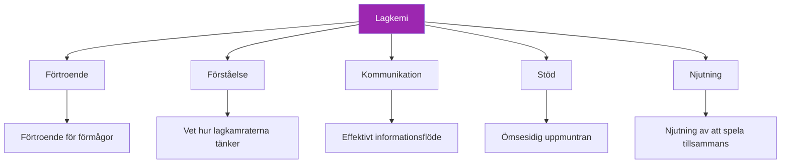

# Bygga lagkemi

> &quot;Du har sett det: lag där helheten överstiger summan av delarna.&quot;

Spelare som förutser varandra, stöttar varandra och presterar bättre tillsammans än ensamma. Det är lagkemin – och det är ingen slump.

::: tip Kemi byggs, inte hittas
**Bra team sätts inte ihop – de utvecklas.** Kemi kräver avsiktlig ansträngning över tid.
:::

---

## Vad är lagkemi?

---

## Varför kemi är viktigt

| Med kemi ✅ | Utan kemi ❌ |
|-------------------|----------------------|
| Fatta bättre kollektiva beslut | Skyll på varandra för misslyckanden |
| Återhämta sig snabbare från motgångar | Kommunicera dåligt under stress |
| Prestera konsekvent under press | Underpresterar i förhållande till talang |
| Njut mer av tävlingen | Upplev konflikt och frustration |
| Hålla tillsammans längre | Teamet upplöses |

## Byggstenarna

### 1. Gemensamma mål

Kemi börjar med anpassning:
- Vad försöker vi uppnå?
- Hur ser framgång ut?
- Vad är vi villiga att offra?

Lag med motstridiga mål (ett vill ha kul, ett annat vill vinna till varje pris) kämpar med att bygga kemi.

### 2. Rollklarhet

Varje spelare behöver veta:
- Vad som förväntas av dem
- Hur de bidrar till lagets framgång
- När man ska leda och när man ska följa

Otydliga roller skapar friktion och agg.

### 3. Ömsesidig respekt

Respekt betyder:
- Att värdesätta varje lagkamrats bidrag
- Att acceptera olika stilar och tillvägagångssätt
- Att behandla varandra med värdighet, särskilt under press

### 4. Psykologisk säkerhet

Spelare behöver känna sig trygga med att:
- Gör misstag utan hårda dömanden
- Uttryck åsikter och farhågor
- Vara sig själva utan anspråk

## Byggkemi: Praktiska steg

### Tid tillsammans

Kemi kräver investeringar:
- Öva tillsammans regelbundet
- Tillbringa tid tillsammans utanför terrängen
- Dela erfarenheter bortom petanque

### Strukturerad teambuilding

Avsiktliga aktiviteter hjälper till:
- Målsättningssessioner för teamet
- Avrapportering efter matchen (konstruktiv)
- Diskussioner om spelstilar och preferenser

### Konfliktlösning

Ta itu med problemen innan de blir alltmer allvarliga:
- Skapa utrymme för ärliga samtal
- Fokusera på beteenden, inte personligheter
- Sök lösningar, inte skyll

### Fira tillsammans

Delad glädje bygger band:
- Erkänna bra prestationer
- Fira lagets prestationer
- Markera milstolpar tillsammans

## Kemi-mördare

### Skuldbeläggande kultur

När misstag leder till kritik snarare än stöd, urholkas förtroendet snabbt.

### Ojämlikt engagemang

Om vissa spelare investerar mer än andra, byggs förbittring upp.

### Dålig kommunikation

Missförstånd och antaganden skapar distans.

### Egokonflikter

När individuellt erkännande är viktigare än lagets framgång, blir kemin lidande.

### Olöst konflikt

Problem som inte åtgärdas försvinner inte – de växer.

## Kemi i tävling

### Före matcher

- Kom tillsammans, värm upp tillsammans
- Kort gruppdiskussion om tillvägagångssätt
- Positiv energi och ömsesidig uppmuntran

### Under matcher

- Synligt stöd för varandra
- Endast konstruktiv kommunikation
- Gemensamt firande av bra pjäser
- Kollektiv respons på motgångar

### Efter matcher

- Vinn eller förlora, håll ihop
- Kortfattad genomgång (vad fungerade, vad kan förbättras)
- Behåll positiva relationer oavsett resultat

## Olika personligheter

Starka team inkluderar ofta olika personlighetstyper:

- **Den stadiga**: Lugn under press, konsekvent
- **Energikällan**: Ger entusiasm och motivation
- **Strategen**: Tänker framåt, ser mönster
- **Tävlaren**: Drivkraften att vinna

Kemi handlar inte om att alla är likadana – det handlar om att olikheter fungerar tillsammans.

## När kemin saknas

### Tecken på dålig kemi

- Synlig frustration med lagkamraterna
- Skuld efter misstag
- Brist på kommunikation
- Spelar som individer, inte som ett lag
- Att hellre bäva än att njuta av matcher

### Återuppbyggnad av kemi

1. **Erkänn problemet**: Namnge det öppet
2. **Identifiera orsaker**: Vad skapar friktionen?
3. **Åtgärda förändring**: Alla parter måste investera
4. **Vidta åtgärder**: Specifika steg för att förbättra
5. **Ha tålamod**: Kemi tar tid att återuppbygga

### När man ska gå vidare

Ibland går det inte att lösa kemin:
- Grundläggande värdeskillnader
- Upprepade brustna förtroenden
- Ovilja att förändras

Det är okej att inse när ett team inte fungerar.

## Kaptenens roll

Om du är teamledare:
- Modellera beteendet du vill se
- Ta itu med problem tidigt och direkt
- Skapa möjligheter för kontakt
- Skydda lagkulturen
- Balansera individuella behov med teamets behov

## Långsiktig kemi

Kemi är inte statisk – den kräver underhåll:

### Regelbundna incheckningar

- Hur fungerar vi som ett team?
- Vad fungerar? Vad fungerar inte?
- Några problem att åtgärda?

### Kontinuerliga investeringar

- Fortsätt att umgås tillsammans
- Fortsätt kommunicera öppet
- Fortsätt stötta varandra

### Anpassning

- I takt med att spelarna växer och förändras, måste även laget göra det.
- Var beredd att utveckla roller och dynamik
- Var nyfikna på varandra

---

| *Relaterat: [Teamdynamik](/sv/utbildning/teamdynamik/) | [Kommunikation](/sv/utbildning/teamdynamik/kommunikation) | [Ledarskap i boule](/sv/artiklar/lagledarskap)* |

