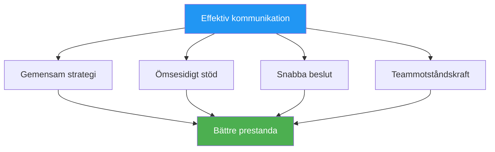

# Kommunikation under press

> &quot;Rätt ord i rätt ögonblick bygger självförtroende. Fel ord kan förstöra även skickliga lag.&quot;

::: tip Kommunikationssanningen
**Under press är mindre mer.** Tydlig och koncis kommunikation överträffar långa diskussioner varje gång.
:::

---

## Varför kommunikation är viktigt

Petanque-lag står inför unika utmaningar:
- Beslut måste fattas snabbt
- Press påverkar hur vi talar och lyssnar
- Icke-verbala signaler är synliga för motståndare
- Individuell prestation påverkar lagdynamiken

---

## Kommunikationsprinciperna

### 1. Klarhet framför kvantitet

| ❌ Säg inte | ✅ Säg istället |
|-------------|---------------|
| &quot;Jag tror att vi kanske borde försöka peka här, men jag är inte säker...&quot; | &quot;Jag pekar åt vänster. Marken är bättre där.&quot; |

### 2. Positiv inramning

| ❌ Negativ | ✅ Positiv |
|------------|------------|
| &quot;Missa inte den här&quot; | &quot;Du klarar det här – lita på ditt kast&quot; |
| &quot;Det var hemskt&quot; | &quot;Skaka av dig det, nästa&quot; |

### 3. Nuvarande fokus

::: warning Dåtid kontra nutid
**Istället för:** &quot;Varför kastade du den där?&quot;
**Säg:** &quot;Okej, vad är vårt bästa alternativ nu?&quot;
:::

### 4. Ägarspråk

Använd &quot;jag&quot;-uttryck för dina egna handlingar, &quot;vi&quot; för lagsituationer:

- &quot;Jag tar den här bilden&quot;
- &quot;Vi måste skydda poängen&quot;
- &quot;Jag tycker att vi borde...&quot;

## Vad man ska kommunicera

### Före varje slut

- **Strategidiskussion**: Kortfattad överenskommelse om tillvägagångssätt
- **Tydlighet i rollerna**: Vem gör vad
- **Terrängobservationer**: Relevanta förhållanden

### Under uppspelning

- **Beslut**: Tydlig redogörelse för avsedda åtgärder
- **Stöd**: Uppmuntran före kast
- **Information**: Relevanta observationer om terräng eller motståndare

### Efter kast

- **Bekräftelse**: Kort erkännande (bra eller dåligt)
- **Justering**: Eventuella strategiska förändringar som behövs
- **Återställ**: Hjälp lagkamraterna att fokusera igen

## Vad man INTE ska kommunicera

### Undvik under tryckmoment

- Tekniska instruktioner (&quot;Håll armbågen in&quot;)
- Kritik av tidigare kast
- Uttryck av frustration
- Tvivlar på lagkamratens förmåga
- Överdriven analys

### Undvik i allmänhet

- Skuldbeläggande språk
- Sarkasm eller passiv aggression
- Jämförelser med andra spelare
- Förutsägelser om misslyckande

## Icke-verbal kommunikation

Ditt kroppsspråk talar högt:

### Positiva signaler
- Ögonkontakt med lagkamrater
- Öppen, avslappnad hållning
- Nickning och bekräftelse
- Lugna, stadiga rörelser

### Negativa signaler (undvik)
- Ögonrullning eller suckande
- Att vända sig bort från lagkamraterna
- Korsade armar eller stängd hållning
- Synlig frustration

### Läsande lagkamrater

Lär dig att känna igen när lagkamrater behöver:
- **Mellanslag**: De bearbetar, avbryt inte
- **Stöd**: De kämpar, erbjud uppmuntran
- **Information**: De är osäkra, ge klarhet
- **Energi**: De är platta, väcker entusiasm

## Kommunikationsroller

### Pekaren
- Kommunicera din tolkning av terrängen
- Ange tydligt din avsedda placering
- Be om input när du är osäker

### Skytten
- Bekräfta val av mål
- Kommunicera konfidensnivå
- Begär information om vinklar

### Miljön/Kaptenen
- Underlätta teamdiskussioner
- Fatta slutgiltiga beslut när det behövs
- Hantera teamets energi och fokus

## Presssituationer

### När du är bakom

- Håll dig lösningsfokuserad
- Behåll positiv energi
- Undvik skuldbeläggande eller frustration
- Fira små vinster

### När framåt

- Håll fokus, undvik självbelåtenhet
- Håll kommunikationen konsekvent
- Ändra inte det som fungerar

### Matchboll (deras)

- Bekräfta pressen kort
- Fokusera på processen
- Stöd varandra synligt

### Matchboll (vår)

- Håll dig lugn och fokuserad
- Undvik för tidigt firande
- Kör som vanligt

## Bygga kommunikationsfärdigheter

### I praktiken

- Öva på kommunikation under träningen
- Ge och ta emot feedback på kommunikation
- Experimentera med olika tillvägagångssätt

### Teamavtal

Fastställ teamnormer:
- Hur vi hanterar oenigheter
- Hur stödet ser ut
- När man ska tala och när man ska vara tyst

### Recension efter matchen

Diskutera kommunikation:
- Vad fungerade bra?
- Vad skulle kunna förbättras?
- Några missförstånd att åtgärda?

## När kommunikationen bryter samman

### I nuet

1. Ta ett andetag
2. Återställ med ett enkelt uttalande: &quot;Låt oss fokusera på det här kastet&quot;
3. Återgå till grunderna: tydlig, positiv, närvarande

### Efter matchen

- Ta itu med problemen lugnt
- Fokusera på beteenden, inte personligheter
- Överens om förbättringar
- Gå framåt tillsammans

## Det tysta stödet

Ibland är den bästa kommunikationen närvaro:
- Står med en kämpande lagkamrat
- En hand på axeln
- En nick av självförtroende
- Att helt enkelt vara där

Ord är inte alltid nödvändiga. Samband är det.

---

| *Relaterat: [Teamdynamik](/sv/utbildning/teamdynamik/) | [Kommunikation](/sv/utbildning/teamdynamik/kommunikation) | [Hantera press](/sv/utbildning/mentalt-spel/mental-styrka/hantera-press)* |

