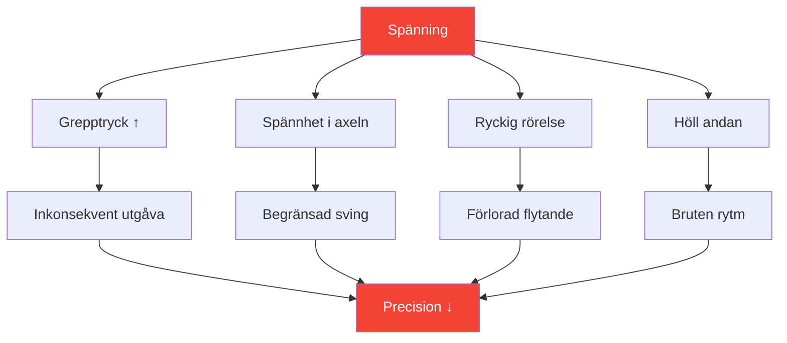
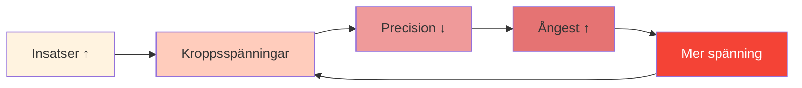

# Spänning och precision: Den dolda kopplingen

> &quot;Man kan inte vara både spänd och precis. Det är fysiskt omöjligt.&quot;

Du har känt det: det avgörande kastet där din kropp spänns, ditt grepp ökar och bollen går precis dit du inte ville ha den. Spänningen är precisionens tysta mördare.

::: danger Den dolda fienden
**Det mesta av spänningen är osynlig för spelaren som upplever den.** Du vet inte att du är spänd förrän det är för sent.
:::

---

## Spänningens biomekanik

---

## Där spänningen gömmer sig

De flesta spelare är medvetna om grov spänning (spända axlar före ett stort kast). Få märker subtil spänning som konsekvent försämrar prestationen:

| Plats | Effekt på kast | Hur man märker |
|----------|-----------------|---------------|
| **Grepp** | Inkonsekvent utgivningstidpunkt | Bollmärken på handflatan |
| **Underarm** | Minskad fluiditet i handleden | Brännande känsla |
| **Axel** | Begränsad svängbåge | Kasten känns &quot;kort&quot; |
| **Hals** | Förändrad huvudposition | Stelhet efter matcher |
| **Käke** | Helkroppsspänningskaskad | Sammanbitna tänder |
| **Andetag** | Störd rytm | Håller andan |

---

## Tryck-spänningsspiralen

Under tryck börjar en destruktiv cykel:

::: tip Bryt cykeln
**Avbryt vid steg 2** — innan spänningen påverkar prestandan. Det är därför rutiner med spänningskontroller före skottet är viktiga.
:::

## Upptäcka dina spänningsmönster

### Kroppsskanningsmetoden

Innan du övar, slut ögonen och skanna:

1. Börja vid fötterna — Har du tag i tårna?
2. Rör dig uppåt genom benen — Har du låsta knän?
3. Lägg märke till höfter och bål — Någon stödjande ställning?
4. Kontrollera axlarna — Finns det någon höjning?
5. Skanna armar och händer — Något för tidigt grepp?
6. Lägg märke till nacke och ansikte — Någon knytning?

Spänningsmätning 0–10 vid varje plats. **Din baslinje bör vara 2 eller lägre.**

### Videometoden

Spela in dig själv när du kastar:
- Lågriskövning
- Övning med måttliga insatser
- Tävling med höga insatser

Jämför ditt kroppsspråk. Var spänner du dig när insatserna ökar?

### Partnermetoden

Be en lagkamrat att observera:
- Ditt ansikte före viktiga kast
- Din hållning förändras under press
- Dina andningsmönster
- Ditt greppbeteende

Externa observatörer ser det vi inte kan känna.

## Släpptekniker

### Snabbkopplingar (använd under tävling)

**Utskakningen**
- Korta, kraftfulla hand- och armskakningar
- Släpper ut hållmönster
- Tar 2–3 sekunder

**Utandningsdroppen**
- Djupt andetag
- Sänk medvetet axlarna vid utandning
- Släpp käkspänningen samtidigt

**Greppets återställning**
- Öppna handen helt
- Sprid ut fingrarna
- Greppa om med minimal nödvändig kraft

### Djupa frisättningar (användning under träning/före tävling)

**Progressiv muskelavslappning**
- Spänn varje muskelgrupp medvetet (5 sekunder)
- Släpp helt (15 sekunder)
- Lägg märke till skillnaden
- Arbeta genom hela kroppen

**Andnings-kropps-koppling**
- Långsam andning (4 räkningar in, 6 räkningar ut)
- Släpp loss ett kroppsområde vid varje utandning
- Fortsätt tills du har uppnått fullständig kroppsavslappning

## Förbehandlingsintegrationen

Bygg in spänningsmedvetenhet i din rutin före skotttagningen:

### Innan man går till cirkeln
- Snabb kroppsskanning (2 sekunder)
- En utsläppande utandning
- Bekräfta ett avslappnat grepp

### I cirkeln
- Sista andetag för att lugna ner sig
- Mjukt fokus på målet
- Initiera kast från avslappnat tillstånd

### Efter kastet
- Lägg märke till var spänningen ackumulerades
- Skaka ut om det behövs
- Återställ för nästa kast

## Träning av spänningsmedvetenhet

### Övning 1: Minimalt grepp

Hitta det minsta grepptrycket som bibehåller kontrollen:
- Börja med ett fast grepp — kasta 5 bollar
- Minska greppet med 20 % — kasta 5 bollar
- Fortsätt minska tills du förlorar kontrollen
- Backa en nivå – detta är ditt optimala grepp

De flesta spelare greppar 40–60 % hårdare än nödvändigt.

### Övning 2: Trycksimulering

Öva under artificiellt tryck medan du övervakar spänningen:
- Skapa konsekvenser för övningskast
- Lägg märke till var spänningen uppstår
- Öva på att släppa taget samtidigt som du bibehåller fokus
- Öka gradvis trycktoleransen

### Övning 3: Den avslappnade pekaren

Betygsätt dig själv på två dimensioner:
- Tekniskt resultat (var landade bollen?)
- Spänningsnivå (hur avslappnad var du?)

**Mål:** Maximera båda samtidigt. Många spelare måste acceptera något sämre resultat inledningsvis när de lär sig att kasta avslappnat.

## Protokoll för tävlingsdagen

### Före matchen
- 10 minuters progressiv avslappning
- Kroppsskanning för att identifiera hållningsmönster
- Skakningsrutin

### Mellan ändarna
- Kort omrörning
- Ett släppande andetag
- Spänningskontroll före kritiska kast

### Under kast
- Lita på din rutin före behandlingen
- Utlösningstekniken är förprogrammerad
- Kontrollera inte medvetet under utförandet

## Vanliga misstag

::: warning Undvik dessa
- **Överavslappning** — Viss aktivering är nödvändig
- **Medveten kontroll under kast** — Stör flödet
- **Endast avslappnande vid stora kast** — Bör vara konsekvent
- **Ignorera andningen** — Andning och spänning är sammankopplade
- **Att rusa iväg med rutinen** — Att släppa spänningar tar tid
:::

## Den långsiktiga fördelen

Spelare som behärskar spänningshantering:
- Prestera mer konsekvent under press
- Upplev mindre fysisk trötthet
- Återhämta sig snabbare från misstag
- Njut mer av tävlingen

---

## Relaterat innehåll

- [Modul i spänningshantering](/sv/utbildning/spänning/) — Fullständig utbildning
- [Fysisk förberedelse](/sv/utbildning/spänning/fysisk) — Kroppsberedskap
- [Presshantering](/sv/artiklar/presshantering) — Mentala aspekter

