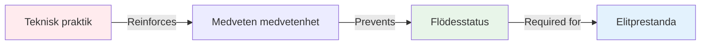

# Varför elitspelare behöver mental träning mer än teknisk träning

*Lästid: 8 minuter*

Om du har spelat boule i flera år och har en gedigen teknik, kommer den här artikeln att utmana allt du tror att du vet om träning. Den obekväma sanningen är: **mer teknisk övning kan hålla dig tillbaka.**

## Paradoxen med elitutveckling

Här är något som förvånar de flesta spelare:

::: warning Inversionsprincipen
Allt eftersom din tekniska skicklighet ökar, bör förhållandet mellan teknisk och mental träning **inverteras**.

- **Nybörjare:** 90 % teknisk, 10 % mental
- **Medel:** 70 % teknisk, 30 % mental
- **Avancerad:** 50 % teknisk, 50 % mental
- **Elit:** 20 % teknisk, 80 % mental
:::

Detta är inte intuitivt. De flesta spelare antar att de behöver öva mer på sin teknik för att bli bättre. Men på elitnivå orsakar detta tillvägagångssätt faktiskt problem.

## Varför teknisk träning kan skada elitprestationer

### Problemet med övertänkande

När du övar teknik flitigt förstärker du **medveten medvetenhet** om dina rörelser. Detta är perfekt för nybörjare som bygger nervbanor. Men för elitspelare skapar det en farlig vana: att tänka på teknik under utförandet.

**Exempel från terrängen:**

*Nybörjare:* Behöver tänka &quot;böj knäna, släpp smidigt, följ upp&quot; för att utföra korrekt.

*Elitspelare:* Har redan 10 000+ timmars träning. Rörelsen är automatisk. Att tänka på att &quot;böja knäna&quot; stör faktiskt det tränade mönstret.

### Flödestillståndsbarriären

Flödestillstånd (att vara &quot;i zonen&quot;) kräver **övergående hypofrontalitet** – en tillfällig minskning av aktiviteten i prefrontala cortex (den analytiska delen av din hjärna).

Ju mer du övar teknik medvetet, desto svårare blir det att &quot;stänga av&quot; under tävling.

## Vad elitspelare faktiskt behöver

### 1. Möjligheten att byta läge

Elitprestationer kräver att man bemästrar övergången mellan två hjärnlägen:

**Planeringsläge (utanför cirkeln)**
- Analytiskt tänkande
- Strategibedömning
- Beslutsfattande
- Riskbedömning

**Utförandeläge (inuti cirkeln)**
- Automatiskt urverk
- Endast målfokus
- Lita på träning
- Åtkomst till flödesstatus

De flesta elitspelare sitter fast i planeringsläge under utförandet. De behöver träna på **växlingen**, inte tekniken.

### 2. Tryckhantering

Teknisk träning under bekväma förhållanden förbereder dig inte för den psykologiska pressen som tävlingen medför.

**Vad händer under press:**
- Hjärtfrekvensen ökar
- Andningen blir ytlig
- Musklerna spänns
- Uppmärksamheten minskar
- Inre kritiker aktiveras

Du kan ha perfekt teknik på träning och tappa den helt under press. Det här är inte ett tekniskt problem – det är ett mentalt.

### 3. Återställning av misstag

Elitspelare gör inte färre misstag än bra spelare. De **återhämtar sig snabbare**.

**Bra spelare efter ett dåligt kast:**
- Uppehåller sig vid misstaget
- Analyserar vad som gick fel
- Oro för nästa kast
- Prestandan försämras

**Elitspelare efter ett dåligt kast:**
- Neutral observation
- Snabb inlärning
- Omedelbar återställning
- Bibehållen prestanda

Detta är en tränad färdighet, inte ett personlighetsdrag.

## Vetenskapen: Varför mental träning fungerar

### Neurovetenskaplig expertis

Forskning om experters prestationer visar att elitidrottare har:

1. **Automatiserade motoriska mönster** - Rörelser sker utan medveten kontroll
2. **Överlägsen mönsterigenkänning** - Se situationer snabbare
3. **Bättre känsloreglering** - Hantera press effektivt
4. **Snabbare återhämtning** - Återställer snabbt efter misstag

Observera: Endast punkt 1 är teknisk. De andra tre är mentala.

### 10 000-timmarsgränsen

När du har investerat ungefär 10 000 timmar i avsiktlig övning (ungefär 8–10 års seriöst spelande) är dina tekniska mönster i stort sett etablerade. Ytterligare teknisk förbättring visar avtagande avkastning.

Men mental spelutveckling? Det är där massiva vinster fortfarande är möjliga.

## Hur du omstrukturerar din träning

### För elitspelare (8+ års erfarenhet)

**Nuvarande typisk uppdelning:**
- 80 % teknisk praktik
- 20 % spelande/tävling

**Rekommenderad uppdelning:**
- 20 % tekniskt underhåll
- 40 % mental spelträning
- 40 % tävlings-/presssituationer

### Hur mental spelträning ser ut

**Inte detta:**
- &quot;Bara slappna av&quot;
- &quot;Tänk inte på det&quot;
- &quot;Var självsäker&quot;

**Men det här:**
- Strukturerad mindfulnessövning (10 min dagligen)
- Utveckling och övning av rutiner före skotttagning
- Trycksimulering i träning
- Protokoll för felåterställning
- Identifiering av utlösare för flödestillstånd
- Inre coach kontra inre kritikerarbete

Se vårt avsnitt [Utbildning](/sv/utbildning/) för specifika tekniker.

## Den obekväma sanningen

Om du är en elitspelare som fortfarande lägger 80 % av din träningstid på tekniska övningar, tränar du som en nybörjare. Din teknik är redan tillräckligt bra. Begränsningen är inte din arm – det är ditt sinne.

::: tip Den verkliga frågan
Det är inte &quot;Hur kan jag förbättra min pekteknik?&quot;

Det är &quot;Hur kan jag konsekvent använda min bästa teknik under press?&quot;
:::

## Praktiska nästa steg

### 1. Bedöm din nuvarande kvot

Följ din träning i en vecka:
- Timmar på teknisk övning
- Timmar av mentalt spelarbete
- Timmar i tävlings-/pressade situationer

### 2. Börja smått

Ändra inte förhållandet över en natt. Lägg till:
- 10 minuter daglig mindfulness
- Ett mentalt spelfokus per träningspass
- Rutinövning före skott

### 3. Mät mental prestation

Spåra:
- Återhämtningstid efter misstag
- Konsekvens under press
- Flödestillståndsfrekvens
- Efterlevnad av rutinen före sprutan

### 4. Använd utbildningsmodulerna

Börja med:
1. [Zonen](/sv/utbildning/zonen/) - Förstå flödestillstånd
2. [Mental styrka](/sv/utbildning/mental-styrka/) - Bygg upp pressförmåga
3. [Mindfulness](/sv/utbildning/mindfulness/) - Utveckla fokus i nuet

## Slutsats

Vägen till elitprestationer är inte mer teknisk övning – det är smartare mental träning. Din teknik är redan tillräckligt bra. Frågan är: kan du använda den när det gäller?

De spelare som gör denna förändring – som anammar mental träning som sitt primära utvecklingsfokus – är de som bryter igenom prestationsplatåer och uppnår konsekvent excellens.

**Valet är ditt:** Fortsätt träna som en nybörjare eller börja träna som en elitspelare.

---

## Relaterade resurser

- [Zonen: Att förstå flödestillstånd](/sv/utbildning/zonen/)
- [Fallstudier: Elitspelare i aktion](/sv/fallstudier)
- [Målmall](/sv/målmall) - Planera din mentala spelutveckling

**Frågor eller kommentarer?** Mejla [patrik.wiik@gmail.com](mailto:patrik.wiik@gmail.com)

