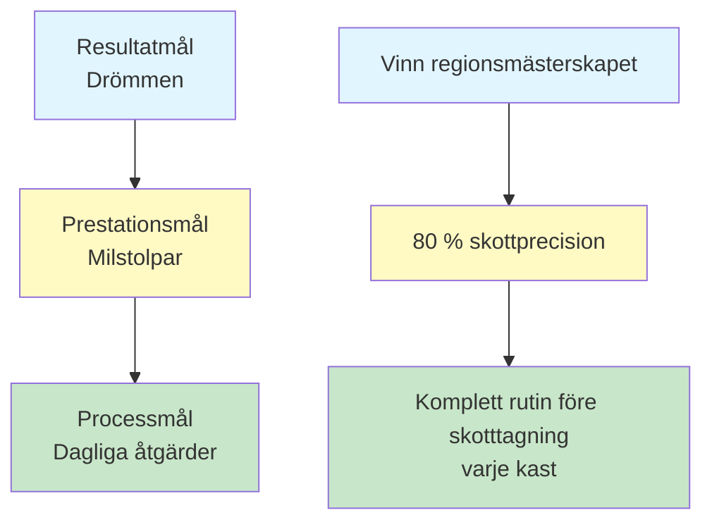

# Målsättning för boulespelare
<AdBanner />

Tydliga mål är din kompass. De ger riktning till din träning, motivation när det blir svårt och ett sätt att mäta framsteg. Utan mål kastar du bara boule. Med mål bygger du mot något.

::: tip Kärnprincipen
**Ett mål utan en plan är bara en önskan.** Sätt tydliga mål, bryt ner dem, fokusera på det du kontrollerar och följ dina framsteg.
:::

## Varför mål är viktiga

Mål tjänar flera syften:
- **Riktning:** Veta vad du ska arbeta med
- **Motivation:** Ha något att sträva efter
- **Mätning:** Följ dina framsteg
- **Fokus:** Prioritera din begränsade tid

För den självstyrda spelaren är målsättningar särskilt viktiga. Utan en tränare som pushar dig blir dina mål din vägledning.

## De tre typerna av mål

Alla mål är inte likadana. Att förstå de olika typerna hjälper dig att sätta bättre mål.

### 1. Resultatmål
**Vad:** Slutresultatet du vill ha
**Exempel:** &quot;Vinn regionsmästerskapet&quot;
**Kontrollnivå:** Låg – beror på motståndare, förhållanden och tur

### 2. Prestationsmål
**Vad:** Specifika prestationsstandarder
**Exempel:** &quot;Uppnå 80 % noggrannhet på skjutövningar&quot;
**Kontrollnivå:** Medel – beror mest på dig

### 3. Processmål
**Vad:** Handlingar och beteenden du kontrollerar
**Exempel:** &quot;Slutför min rutinen före skottet vid varje kast&quot;
**Kontrollnivå:** Hög – helt upp till dig

### Målhierarkin

::: warning Viktig insikt
**Fokusera mestadels på processmål.** Det är de du kontrollerar, och de leder till de resultat du vill ha.

- **Resultatmål:** Låg kontroll, hög motivation
- **Prestationsmål:** Medelhög kontroll, mätbara framsteg
- **Processmål:** Hög kontroll, dagligt fokus ← **Fokus här**
:::

## SMART-ramverket

::: info Checklista för SMART-mål
Varje mål bör vara:
- ✅ **Specifik** - Tydlig och väldefinierad
- ✅ **Mätbar** - Du kan följa framstegen
- ✅ **Uppnåeligt - Utmanande men möjligt
- ✅ **R**elevant - I linje med din större bild
- ✅ **Tidsbunden - Har en deadline
:::

<AdInArticle />

### S - Specifik
❌ &quot;Bli bättre på att skjuta&quot;
✅ &quot;Förbättra min precision i direktträff från 8 meter&quot;

### M - Mätbar
❌ &quot;Skjuta mer exakt&quot;
✅ &quot;Gör minst 24/30 poäng på övningen med skjutstegen&quot;

### A - Uppnåelig
❌ &quot;Missa aldrig ett skott&quot; (omöjligt)
✅ &quot;Förbättra noggrannheten med 10 % under 8 veckor&quot; (utmanande men realistiskt)

### R - Relevant
❌ &quot;Spring ett maraton&quot; (inte direkt relaterat)
✅ &quot;Förbättra balans och stabilitet för bättre kastförmåga&quot; (stödjer ditt spel)

### T - Tidsbunden
❌ &quot;En dag kommer jag att bli bättre&quot;
✅ &quot;Senast den 15 mars kommer jag att uppnå...&quot;

## Målexempel för boule

| Typ | Dåligt mål | SMART-mål |
|------|-----------|------------|
| Resultat | &quot;Vinn mer&quot; | &quot;Nå semifinal i vårturneringen&quot; |
| Prestanda | &quot;Peka bättre&quot; | &quot;Uppnå 70 % av poängen inom 50 cm på 8 m avstånd&quot; |
| Behandla | &quot;Öva mer&quot; | &quot;Slutför 3 fokuserade träningspass per vecka&quot; |

## Att bryta ner stora mål

Stora mål kan kännas överväldigande. Bryt ner dem i mindre bitar:

### Exempel: &quot;Vinn klubbmästerskapet (om 12 månader)&quot;

**Årsmål:** Vinna klubbmästerskapet

**Kvartalsmål:**
- Q1: Förbättra skottnoggrannheten till 75 %
- Q2: Utveckla en konsekvent rutin före sprutning
- Q3: Situationer med överlägsen press
- Q4: Topprestation och tävlingsförberedelser

**Månadsmål (Q1):**
- Månad 1: Etablera baslinje, identifiera svagheter
- Månad 2: Fokus på skjutteknik
- Månad 3: Öka press på skytteträningen

**Veckovisa mål (Månad 2):**
- Vecka 1: 3 fotograferingstillfällen, videoanalys
- Vecka 2: Arbeta med identifierat teknikproblem
- Vecka 3: Öka avståndet gradvis
- Vecka 4: Testa framsteg, justera planen

## Koppla mål till ditt &quot;varför&quot;

Mål fungerar bättre när de är kopplade till djupare motivation.

Fråga dig själv:
- Varför vill jag uppnå detta?
- Vad kommer det att betyda för mig?
- Hur kommer jag att känna mig när jag lyckas?
- Vad driver mig att förbättra mig?

Skriv ner dina svar. Återvänd till dem när motivationen avtar.

## I detta avsnitt

- **[SMARTA Mål i Detaljer](/sv/utbildning/mål/smarta-mål)** - Djupdykning i att skapa effektiva mål
- **[Skapa din träningsplan](/sv/utbildning/mål/planering)** - Förvandla mål till handling

## Sammanfattning: Regler för målsättning

::: tip Regel nr 1: Kontrollregeln
**Fokusera på processmål (vad du kontrollerar) framför resultatmål.**
Processmål leder till prestationsmål, vilket leder till resultatmål.
:::

::: tip Regel #2: SMART-regeln
**Mål måste vara specifika, mätbara, uppnåeliga, relevanta och tidsbundna.**
Vaga mål ger vaga resultat. SMARTA mål ger framsteg.
:::

::: tip Regel nr 3: Uppdelningsregeln
**Stora mål behöver delmål kvartalsvis, månatligen och veckovis.**
Bryt ner stora mål i små, konkreta steg som du kan genomföra den här veckan.
:::

::: tip Regel nr 4: Kopplingsregeln
**Koppla mål till ditt djupare &quot;varför&quot;.**
När motivationen avtar är det ditt &quot;varför&quot; som håller dig igång.
:::

## Viktig slutsats

> Ett mål utan en plan är bara en önskan.

Sätt tydliga mål. Bryt ner dem. Fokusera på det du kontrollerar. Följ dina framsteg.

<AdBanner />
