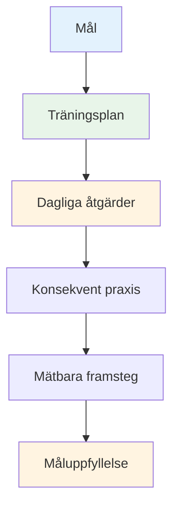

# Skapa din träningsplan
<AdBanner />

Mål utan en plan är bara önskningar. Den här guiden hjälper dig att förvandla dina mål till en strukturerad träningsplan som faktiskt fungerar.

::: tip Den stora idén
**Mål utan plan är bara önskningar.** En strukturerad träningsplan omvandlar dina mål till dagliga handlingar som leder till verkliga framsteg.
:::

## De 8 faserna av självstyrd utveckling

### Fas 1: Sätt din kompass (mål)
Du har redan lärt dig om SMART-mål. Sätt nu in dem i en hierarki:

1. **Långsiktigt mål** (1–2 år): Din dröm
2. **Årligt mål**: Årets mål
3. **Kvartalsmål**: 3-månaders milstolpar
4. **Månadsmål**: Specifika fokusområden
5. **Veckovisa mål**: Träningsmål

### Fas 2: Utvärdera dina resurser

Innan du planerar, utvärdera ärligt vad du har:

| Resurs | Frågor att ställa |
|----------|-----------------|
| **Tid** | Hur många timmar per vecka kan du realistiskt träna? |
| **Plats** | Har du tillgång till en ordentlig pist? Hur är underlagets kvalitet? |
| **Utrustning** | Har du lämpliga bouleplattor? Mätverktyg? Videofunktion? |
| **Kunskap** | Vilka är dina tekniska styrkor och svagheter? |
| **Fysiskt tillstånd** | Några begränsningar? Områden som behöver åtgärdas? |

Var ärlig. En realistisk plan slår en ambitiös fantasi.

### Fas 3: Välj dina övningar

Välj övningar som direkt stöder dina mål:

**För förbättring av poängsättning:**
- Precisionspekning av markerade zoner
- Övningar för avståndsvariation
- Olika ytövningar

**För förbättring av skyttet:**
- Skjutstege (progressiva distanser)
- Hinderskjutning (tvungen hög båge)
- Rörligt målövning

**För mental utveckling:**
- Rutinövning före skott
- Visualiseringssessioner
- Trycksimulering

**Balansera ditt program:**
- Tekniskt arbete (peka, skjuta)
- Mental träning (mindfulness, visualisering)
- Fysisk konditionering (balans, flexibilitet)
- Matchspel (tillämpa färdigheter)

### Fas 4: Skapa ditt schema

Skapa ett realistiskt veckoschema:

<AdInArticle />

| Dag | Morgon | Eftermiddag | Kväll | Fokus |
|-----|---------|-----------|---------|-------|
| mån | - | Teknisk: Pekning | Lätt rörlighet | Precision |
| Tis | - | Teknisk: Skytte | - | Effekt/noggrannhet |
| ons | - | Mental träning | - | Mindfulness |
| tors | - | Blandat: Spelscenarier | Lätt rörlighet | Ansökan |
| fre | - | Teknisk: Svaghet | - | Förbättring |
| lör | Matchspel eller tävling | - | - | Prestanda |
| Solen | Vila | Veckoöversikt | Planering | Återhämtning |

**Viktiga principer:**
- Prioritera mental träning (den försummas ofta)
- Inkludera vilodagar
- Balansera olika färdigheter
- Lämna flexibilitet för livet

### Fas 5: Förbered dig för hinder

Saker kommer att gå fel. Planera för det.

| Risk | Sannolikhet | Inverkan | Reservplan |
|------|------------|--------|-------------|
| Tidsbrist | Hög | Medium | Ha en &quot;minimumsession&quot; redo (20 min) |
| Dåligt väder | Medium | Medium | Inomhusvisualisering, videostudie |
| Låg motivation | Hög | Medium | Återgå till &quot;varför&quot;, mindre mål, ta en paus |
| Mindre skada | Medium | Hög | Fokus på mental träning, icke-påverkade färdigheter |
| Ingen övningspartner | Medium | Låg | Soloövningar, videosjälvanalys |

### Fas 6: Följ dina framsteg

Det som mäts blir hanterat.

**För en träningsdagbok:**
- Datum och varaktighet
- Övningar slutförda
- Poäng/resultat
- Hur du kände dig (energi, fokus, flöde)
- Tekniska anmärkningar
- Väder/förhållanden

**Veckovisa repetitionsfrågor:**
- Har jag genomfört mina planerade sessioner?
- Vilka poäng uppnådde jag?
- Vad kändes bra? Vad var svårt?
- Några flödeserfarenheter?
- Vad ska jag justera?

### Fas 7: Håll motivationen uppe

Motivationen fluktuerar. Bygg system för att upprätthålla den:

**Inre motivation:**
- Anslut till ditt &quot;varför&quot;
- Fira små vinster
- Märker förbättring över tid
- Hitta glädje i processen

**Extern support:**
- Träningspartners (även ibland)
- Dela mål med någon
- Gå med i onlinegrupper
- Spårränder och konsistens

**När motivationen sjunker:**
- Gör ett minimumpass (något slår ingenting)
- Ändra din miljö
- Granska dina framsteg
- Kom ihåg tidigare framgångar
- Ta en planerad paus om det behövs

### Fas 8: Granska och anpassa

Din plan bör utvecklas:

**Veckovis:** Snabb genomgång, mindre justeringar
**Månadsvis:** Utvärdera framsteg mot månatliga mål, justera fokus
**Kvartalsvis:** Stor översyn, sätt mål för nästa kvartal
**Årligen:** Fullständig bedömning, ny årsplan

**Frågor för granskning:**
- Gör jag framsteg mot mina mål?
- Är min träning effektiv?
- Behöver jag olika övningar?
- Är mina mål fortfarande relevanta?
- Vad har jag lärt mig?

## Exempel på 8-veckorsplan

**Mål:** Förbättra skottprecisionen med 15 %

| Vecka | Fokus | Viktiga sessioner |
|------|-------|--------------|
| 1 | Baslinje | Testa strömnivå, videoanalys |
| 2 | Teknik | Identifiera och arbeta med nyckelproblemet |
| 3 | Upprepning | Högvolymsskjutningsövningar |
| 4 | Testa | Mellanbedömning, justera |
| 5 | Variation | Olika avstånd och vinklar |
| 6 | Tryck | Lägg till konsekvenser för övningar |
| 7 | Integration | Spelliknande scenarier |
| 8 | Slutprov | Mät förbättring |

## Viktig slutsats

> Planera ditt arbete, och arbeta sedan med din plan. Men var beredd att anpassa dig.

Den bästa planen är en du faktiskt kommer att följa. Börja enkelt, var konsekvent och justera allt eftersom du lär dig.

<AdBanner />
