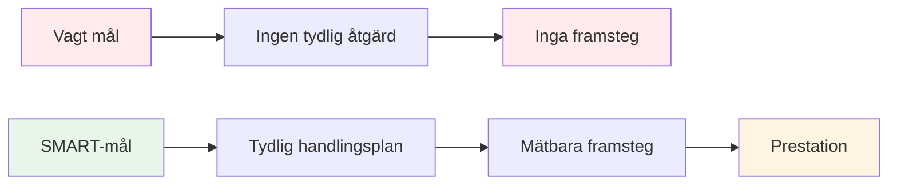

# SMARTA mål för boule

SMART-ramverket omvandlar vaga önskningar till handlingsbara mål. Låt oss titta på varje element i detalj, med specifika exempel för boule.

::: tip Den stora idén
**Vaga mål leder till vaga resultat.** SMARTA mål skapar tydlighet, handling och mätbara framsteg. Förvandla &quot;Jag vill bli bättre&quot; till specifika mål som du faktiskt kan uppnå.
:::

## S - Specifik

Ett specifikt mål besvarar dessa frågor:
- **Vad** exakt vill jag uppnå?
- **Var** kommer detta att hända?
- **Vilka** aspekter är inblandade?

### Gör mål specifika

| Vag | Specifik |
|-------|----------|
| &quot;Förbättra min pekning&quot; | &quot;Förbättra min peknoggrannhet på grusytor på 7–9 meters avstånd&quot; |
| &quot;Bli mentalt starkare&quot; | &quot;Utveckla en konsekvent rutine före skottet som jag använder för varje kast&quot; |
| &quot;Vinn fler matcher&quot; | &quot;Vinn minst 60 % av mina tävlingsmatcher den här säsongen&quot; |

### Specificitetschecklista
- [ ] Kan någon annan förstå exakt vad jag försöker göra?
- [ ] Har jag definierat förutsättningarna (avstånd, yta, situation)?
- [ ] Finns det bara en tolkning av detta mål?

## M - Mätbar

Om du inte kan mäta det, kan du inte hantera det. Mätbara mål låter dig följa framsteg och veta när du har lyckats.

### Sätt att mäta boulemål

**Kvantitativa mått:**
- Poäng gjorda i övningar (t.ex. 24/30)
- Procentuell noggrannhet (t.ex. 75 % träfffrekvens)
- Avstånd från målet (t.ex. i genomsnitt 30 cm från domkraften)
- Konsekvens (t.ex. 3 lyckade sessioner i rad)

**Använda träningsövningar som mått:**

| Borra | Vad den mäter | Målexempel |
|-------|-----------------|----------------|
| Skjutstege | Skjutprecision under press | Nå 10m inom 30 boules |
| Pekprecision | Pekningsnoggrannhet mot zon | 24/30 poäng |
| Avståndsvariation | Djupkontroll | 80 % inom 50 cm |

### Spåra dina mätningar
För en enkel logg:
- Datum
- Övning/träning
- Poäng/resultat
- Förhållanden (yta, väder)
- Anteckningar

## A - Uppnåeligt (men utmanande)

Mål ska utmana dig utan att vara omöjliga.

### Att hitta rätt nivå

**För lätt:** &quot;Öva en gång den här månaden&quot;
- Ingen tillväxt, ingen motivation

**För svårt:** &quot;Missa aldrig ett skott&quot;
- Omöjligt, leder till frustration

**Precis lagom:** &quot;Förbättra skottnoggrannheten med 15 % på 8 veckor&quot;
- Utmanande men realistisk med ansträngning

### Frågor för att testa uppnåbarhet
- Har andra på min nivå uppnått detta?
- Har jag den tid och de resurser som behövs?
- Ligger detta inom min kontroll (mestadels)?
- Är jag villig att göra vad som krävs?

### Sträckmål
Det är okej att ha ambitiösa långsiktiga mål. Se bara till att dina kortsiktiga mål är uppnåeliga steg mot dem.

## R - Relevant

Dina mål bör stämma överens med din större bild.

### Relevansfrågor
- Stödjer detta mål min övergripande utveckling?
- Är detta rätt prioritering just nu?
- Passar detta med min tillgängliga tid och resurser?
- Är jag verkligen motiverad av detta mål?

### Exempel: Kontroll av relevans

**Situation:** Du vill tävla på nationell nivå

**Relevanta mål:**
- Förbättra skottprecisionen (påverkar direkt resultaten)
- Utveckla mentala rutiner (hjälper i pressade situationer)
- Öka träningsfrekvensen (bygg upp färdigheter snabbare)

**Mindre relevanta mål:**
- Lär dig trickslag (kul men inte tävlingsinriktat)
- Köp dyra nya boulebollar (utrustning är inte din begränsande faktor)

## T - Tidsbunden

Deadlines skapar brådska och möjliggör planering.

### Ställa in tidsramar

| Måltyp | Typisk tidsram |
|-----------|------------------|
| Långsiktig | 1–3 år |
| Årlig | 12 månader |
| Kvartalsvis | 3 månader |
| Månatlig | 4 veckor |
| Varje vecka | 7 dagar |
| Session | Enskild praktik |

### Exempel på tidslinje

**Långsiktig (2 år):** Kvalificera sig för landslagsuttagning

**Årlig:** Kom bland de 10 bästa i regionala rankningar

**Kvartalsvis (Q1):**
- Upprätta en konsekvent träningsrutin
- Förbättra skyttenoggrannheten till 70 %

**Månadsvis (januari):**
- Vecka 1: Bedöm nuvarande nivå, sätt baslinjer
- Vecka 2-3: Fokus på skjutteknik
- Vecka 4: Testa och mät framsteg

**Varje vecka:**
- Måndag: Tekniskt skjutpass
- Onsdag: Poängsättning och spelsituationer
- Fredag: Mental träning och visualisering
- Helg: Tävling eller matchträning

## Att sätta ihop allt

### Arbetsblad för målsättning

**Mitt mål (första utkastet):**
_________________________________

**Specifikt - Vad exakt?**
_________________________________

**Mätbar - Hur vet jag det?**
_________________________________

**Uppnåeligt - Är det realistiskt?**
_________________________________

**Relevant - Varför är detta viktigt?**
_________________________________

**Tidsbunden - När?**
_________________________________

**Mitt SMART-mål (slutgiltig version):**
_________________________________

### Exempel slutfört

**Första utkastet:** &quot;Bli bättre på att skjuta&quot;

**SMART-version:** &quot;Senast den 30 april ska jag uppnå en poäng på 24/30 eller högre på Shooting Ladder-övningen (6–10 m med hinder) under tre träningspass i rad, mätt med min träningslogg.&quot;

## Viktig slutsats

> SMARTA mål förvandlar drömmar till planer och planer till resultat.

Ta dig tid att formulera dina mål ordentligt. Ett väldefinierat mål är halva resan.

