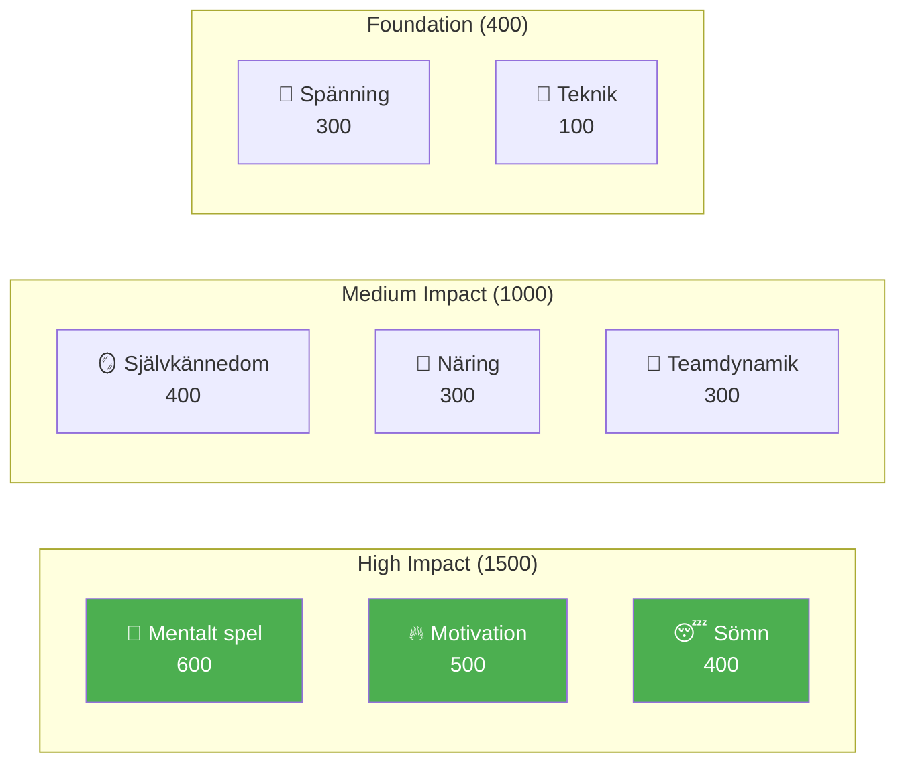

# Utveckling av elitspelare

Välkommen till Pétanque Academys utbildningsprogram — det kompletta systemet för spelarutveckling baserat på 8 prestationsfaktorer.

::: tip Kärnprincip
På elitnivå blir **mental träning viktigare än teknisk träning**. Observera att teknik har den lägsta vikten – inte för att det inte spelar någon roll, utan för att alla på elitnivå har bra teknik. Det som skiljer dem åt är mentala.
:::

---

## 8-faktorers prestationsmodell

Vår läroplan är uppbyggd kring 8 nyckelfaktorer, viktade efter deras inverkan på elitprestationer:

| Faktor | Vikt | Beskrivning |
|--------|--------|-------------|
| 🧠 [**Mentalt spel**](/sv/utbildning/mentalt spel/) | **600** | Tankemönster, fokus, flödestillstånd, självprat |
| 🔥 [**Motivation**](/sv/utbildning/motivation/) | **500** | Drivkraft, syfte, målinriktning, uthållighet |
| 😴 [**Sömn och återhämtning**](/sv/utbildning/sömn/) | **400** | Sömnkvalitet, återhämtning, vila före tävling |
| 🪞 [**Självkännedom**](/sv/utbildning/självkännedom/) | **400** | Noggrann självuppfattning, igenkänning av döda fläckar |
| 🥗 [**Näring**](/sv/utbildning/näring/) | **300** | Blodsockerstabilitet, hydrering, bränsle för tävlingar |
| 🤝 [**Teamdynamik**](/sv/utbildning/teamdynamik/) | **300** | Kommunikation, förtroende, tydlig roll |
| 💆 [**Spänningshantering**](/sv/utbildning/spänning/) | **300** | Fysisk spänning, avslappning, andningskontroll |
| 🎯 [**Teknik**](/sv/education/technique/) | **100** | Fysisk mekanik, kastarpertoar |

**Totalt: 2 900 poäng**

---

## Varför dessa vikter?

Vikterna återspeglar **påverkan på elitnivå**:

> &quot;Vid regionmästerskapet skiljer tekniken de bästa 50 % åt. Vid riksmästerskapet har alla i rummet elitteknik. Det som skiljer dem åt är allt annat.&quot;

---

## Utforska varje faktor

### 🧠 Mentalt spel (600 poäng)

**Den mest betydelsefulla faktorn för elitprestationer.**

Din förmåga att hantera tankar, bibehålla fokus och få tillgång till flödestillstånd.

- [Zonen](/sv/utbildning/mentalt-spel/zonen/) — Att förstå och få tillgång till flödestillstånd
- [Mental styrka](/sv/utbildning/mentalt-spel/mental-styrka/) — Hantering av press, rutiner före skott
- [Mindfulness](/sv/utbildning/mentalt-spel/mindfulness/) — Fokus i nuet, återhämtning från misstag

### 🔥 Motivation (500 poäng)

**Vad driver dig att förbättra dig dag efter dag, år efter år.**

- [Målsättning](/sv/utbildning/motivation/) — SMARTA mål, process kontra resultatfokus
- [Motivationspsykologi](/sv/utbildning/motivation/motivation) — Intrinsisk vs. yttre, Självbestämmande teori
- [Att bibehålla motivation](/sv/utbildning/motivation/bibehålla) — Förebyggande av utbrändhet, platånavigering

### 😴 Sömn och återhämtning (400 poäng)

**Ofta förbisedd, men enormt betydelsefull.**

Sömnkvalitet påverkar direkt reaktionstid, beslutsfattande och emotionell reglering.

- [Sömnvetenskap för idrottare](/sv/utbildning/sömn/) — Varför sömn är viktig för precisionsidrott
- [Att bygga sömnvanor](/sv/utbildning/sömn/vanor) — Praktisk sömnhygien
- [Sömn och tävling](/sv/utbildning/sömn/tävling) — Protokoll före evenemang, resehantering

### 🪞 Självkännedom (400 poäng)

**Du kan inte förbättra det du inte kan se.**

Korrekt självuppfattning möjliggör riktad förbättring.

- [Fördelen med självkännedom](/sv/utbildning/självkännedom/) — Varför självkännedom är viktig
- [Få feedback](/sv/utbildning/självkännedom/feedback) — Externa perspektiv
- [Videoanalys](/sv/utbildning/självkännedom/video) — Använda video för självupptäckt

### 🥗 Näringsinformation (300 poäng)

**Stabil energi = stabil prestanda.**

Din hjärna är ett precisionsinstrument – ge den bränsle därefter.

- [Bränsleprestanda](/sv/utbildning/näring/) — Blodsocker, vätskebalans, tävlingsnäring

### 🤝 Teamdynamik (300 poäng)

**De bästa lagen är inte alltid de skickligaste.**

Kommunikation och förtroende väger ofta tyngre än individuell talang.

- [Att vara en bra lagkamrat](/sv/utbildning/lagdynamik/) — Lagkultur och stöd
- [Teamkommunikation](/sv/utbildning/teamdynamik/kommunikation) — Tydlig, positiv kommunikation

### 💆 Spänningshantering (300 poäng)

**Spänning är precisionens fiende.**

Man kan inte vara både spänd och noggrann.

- [Att förstå spänning](/sv/utbildning/spänning/) — Fysisk vs. mental spänning
- [Släpptekniker](/sv/utbildning/spänning/tekniker) — PMR, andning, snabba återställningar
- [Tävlingshantering](/sv/utbildning/spänning/tävling) — Protokoll före och under match

### 🎯 Teknik (100 poäng)

**Grundläggandet — nödvändigt men inte tillräckligt.**

På elitnivå är tekniken en självklarhet. Fördelarna ligger ovanför.

- [Teknisk översikt](/sv/utbildning/teknik/) — Fysikalisk mekanik
- [Utbildningsmetoder](/sv/utbildning/teknik/utbildning/) — Medveten övning
- [Taktik](/sv/utbildning/teknik/taktik/) — Strategiskt beslutsfattande

---

## Utvecklingsresan

Allt eftersom du utvecklas som spelare inverteras din träningskvot:

| Nivå | Förhållande (teknik:mental) | Fokus |
|-------|---------------------|-------|
| **Nybörjare** | 90 : 10 | Bygg maskinen |
| **Mellanliggande** | 70:30 | Stabilisera färdigheten |
| **Avancerad** | 50:50 | Lita på maskinen |
| **Expert** | 20:80 | Frihet att prestera |

Du kan inte träna en nybörjare som en expert (de saknar nervbanorna), och du kan inte träna en expert som en nybörjare (hög teknisk volym orsakar övertänkande).

---

## Snabbreferens: Kärnprinciper

::: details Klicka för att expandera: Komplett lista över principer

### Mentala spelregler
1. **Switchregeln:** Analysera före cirkeln, utför i cirkeln, observera efter
2. **Förtroenderegeln:** Ditt medvetna sinne planerar, ditt undermedvetna utför
3. **Nuvarande regel:** Du kan bara kontrollera detta ögonblick, detta kast

### Motiveringsregler
1. **Kontrollregeln:** Fokusera på processmål framför resultatmål
2. **SMART-regeln:** Mål måste vara specifika, mätbara, uppnåeliga, relevanta och tidsbundna
3. **Den inneboende regeln:** Intern motivation överlever externa belöningar

### Sömnregler
1. **Konsekvensregeln:** Samma vakentid varje dag, även på helger
2. **Buffertregeln:** Varva ner rutinen 60+ minuter före sänggåendet
3. **Tävlingsregeln:** Extra sömn veckan innan, inte bara natten innan

### Regler för självkännedom
1. **Feedbackregeln:** Sök aktivt externa perspektiv
2. **Videoregeln:** Vad du känner ≠ vad som är verkligt — spela in och granska
3. **Blindvinkelregeln:** Låg självkännedom påverkar alla andra bedömningar

### Näringsregler
1. **Stabilitetsregeln:** Undvik blodsockertoppar och krascher
2. **Vätskeregeln:** Även 2 % uttorkning försämrar prestationsförmågan
3. **Tidregeln:** Ät 2–3 timmar före tävling

### Regler för lagdynamik
1. **Kommunikationsregeln:** Tydlig, positiv kommunikation bygger förtroende
2. **Stödregeln:** Hur du reagerar på misstag är viktigare än skicklighet
3. **Rollregeln:** Känn din roll och utför den fullt ut

### Spänningsregler
1. **Utlösningsregeln:** Du kan inte vara både spänd och precis
2. **Yerkes-Dodson-regeln:** Hitta din optimala upphetsningszon
3. **Återställningsregeln:** 10 sekunders återställning före varje kast

### Teknikregler
1. **Specificitetsregeln:** Träna det du vill förbättra
2. **Variationsregeln:** Slumpmässig övning slår blockerad övning
3. **Återhämtningsregeln:** Vila är när anpassning sker
:::

---

## Börja din resa

::: tip Rekommenderad startpunkt
Börja med [Mental Game](/sv/utbildning/mental-game/) för att förstå grunden för elitprestationer. Utforska sedan [Sömn](/sv/utbildning/sömn/) – det är ofta den förbättring som ger högst ROI för spelare under utveckling.
:::

