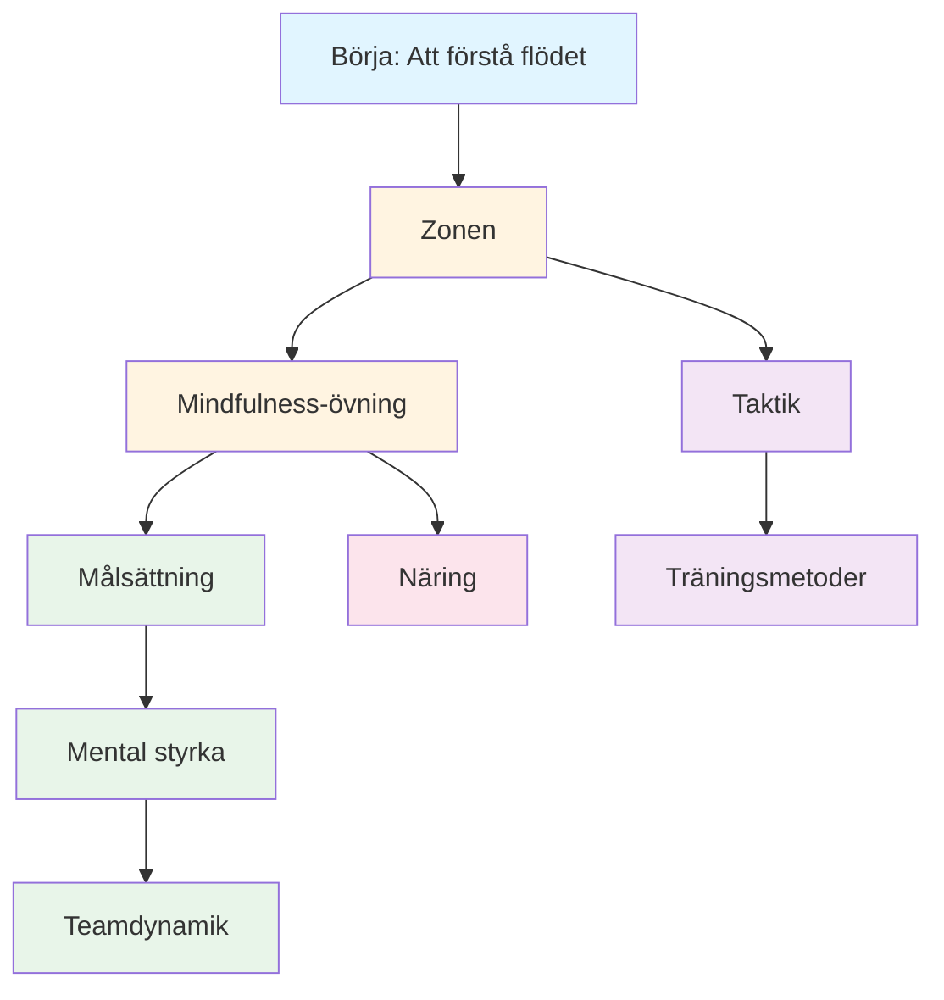

# Utbildning

Välkommen till Pétanque Academys utbildningsprogram. Det är här elitspelare lär sig att bemästra det mentala spelet.

::: tip Kärnprincip
På elitnivå blir **mental träning viktigare än teknisk träning**. Förhållandet inverteras allt eftersom man utvecklas: nybörjare behöver 90 % tekniskt arbete, experter behöver 80 % mentalt arbete.
:::

## Varför mental träning är viktig

På elitnivå är teknisk skicklighet bara början. Forskning visar att mental inställning kan vara lika viktig som fysisk skicklighet i precisionssporter som boule. Skillnaden mellan bra spelare och fantastiska spelare sitter ofta i deras medvetande.

> &quot;Sport är 100 % mentalt. Sinnet är drivkraften bakom alla fysiska förmågor.&quot;

## Din läranderesa

Här är den rekommenderade vägen genom vårt utbildningsprogram:

**Rekommenderad sekvens:**
1. **Grundläggande:** Börja med Zonen och Mindfulness
2. **Struktur:** Lägg till målsättning och träningsmetoder
3. **Tävling:** Bygg mental styrka och taktik
4. **Lagspel:** Bemästra lagdynamiken
5. **Optimering:** Finjustera med näring

## Våra lärvägar

### 🎯 [Zonen (Flödestillstånd)](/sv/utbildning/zonen/)
Lär dig vad &quot;zonen&quot; egentligen är och hur du når den. Förstå vetenskapen bakom flödestillstånd och upptäck praktiska tekniker för att prestera ditt bästa när det gäller som mest.

### 🧘 [Mindfulness](/sv/utbildning/mindfulness/)
Bemästra konsten att vara närvarande. Lär dig vetenskapligt bevisade tekniker för att lugna ditt sinne, förbättra fokus och återhämta dig snabbt från misstag.

### 📊 [Målsättning](/sv/utbildning/mål/)
Skapa en färdplan för din utveckling. Lär dig SMART-ramverket anpassat för boule och bygg en träningsplan som faktiskt fungerar.

### 💪 [Mental styrka](/sv/utbildning/mental-styrka/)
Bygg upp den mentala styrka som behövs för tävling. Lär dig att hantera press, övervinna ångest och utveckla rutiner som utlöser topprestationer.

### 🤝 [Lagdynamik](/sv/utbildning/lagspelare/)
Bli lagkamraten som alla vill spela med. Lär dig om kommunikation, förtroende och hur du bidrar till en vinnande lagkultur.

### ♟️ [Taktik](/sv/utbildning/taktik/)
Tänk strategiskt i varje situation. Lär dig sannolikhetsbaserat beslutsfattande och när du ska ta risker.

### 🏋️ [Träningsmetoder](/sv/utbildning/träning/)
Träna smartare, inte bara hårdare. Lär dig hur du strukturerar din träning för maximal förbättring.

### 🥗 [Näring](/sv/utbildning/näring/)
Ge din hjärna bränsle för precisionsprestationer. Lär dig hur du bibehåller stabil energi och fokus under hela tävlingen.

## Resan från teknik till flöde

Allt eftersom du utvecklas som spelare inverteras din träningskvot – mental träning blir viktigare, inte mindre:

| Nivå | Förhållande (teknik:mental) | Primärt mål |
|-------|---------------------|-------------------|
| **Nybörjare** | 90 : 10 | Bygg maskinen |
| **Mellanliggande** | 70:30 | Stabilisera färdigheten |
| **Avancerad** | 50:50 | Lita på maskinen |
| **Expert** | 20:80 | Frihet att prestera |

Du kan inte träna en nybörjare som en expert (de saknar nervbanorna), och du kan inte träna en expert som en nybörjare (hög teknisk volym orsakar övertänkande).

## Snabbreferens: Viktiga principer från varje avsnitt

| Avsnitt | Kärnprincip | Viktig slutsats |
|---------|---------------|--------------|
| **Zonen** | Växla från analysläge till automatiskt läge | *&quot;Det finns inga tekniker som alltid producerar ett perfekt klot. Men det finns ett mentalt tillstånd där perfekta klot blir naturliga.&quot;* |
| **Mindfulness** | Välj var du vill rikta din uppmärksamhet | *&quot;Mindfulness handlar inte om att tömma sinnet. Det handlar om att välja vart man ska rikta sin uppmärksamhet.&quot;* |
| **Målsättning** | Fokusera på det du kontrollerar | *&quot;Ett mål utan en plan är bara en önskan.&quot;* |
| **Mental styrka** | Presterar bra trots nervositeten | *&quot;Mental styrka handlar inte om att bli av med nerverna eller att aldrig göra misstag. Det handlar om att prestera bra trots dem.&quot;* |
| **Teamdynamik** | Förtroende och kommunikation vinner matcher | *&quot;De bästa lagen är inte alltid de skickligaste – det är de som spelar bäst tillsammans.&quot;* |
| **Taktik** | Beslutsfattande takter teknik | *&quot;På elitnivå är skillnaden sällan tekniken – det är beslutsfattandet.&quot;* |
| **Utbildning** | Kvalitet framför kvantitet | *&quot;Träna smartare, inte bara hårdare.&quot;* |
| **Näring** | Stabil energi = stabil prestanda | *&quot;Din hjärna är ett precisionsinstrument. Ge den bränsle därefter.&quot;* |

## Alla viktiga regler och slutsatser

::: details Klicka för att expandera: Komplett lista över principer
Detta är din snabbreferensguide. Bokmärk det här avsnittet och återvänd till det regelbundet.

### Zonreglerna
1. **Switchregeln:** Analysera före cirkeln, utför i cirkeln, observera efter
2. **Inversionsregeln:** När skickligheten ökar blir mental träning viktigare än teknisk träning
3. **Förtroenderegeln:** Ditt medvetna sinne planerar, ditt undermedvetna utför

### Mindfulnessregler
1. **Medvetenhetsregeln:** Observera utan att döma
2. **SOAS-regeln:** Stanna, observera, acceptera, glida (släppa taget)
3. **Nuvarande regel:** Du kan bara kontrollera detta ögonblick, detta kast

### Regler för målsättning
1. **Kontrollregeln:** Fokusera på processmål (vad du kontrollerar) framför resultatmål
2. **SMART-regeln:** Mål måste vara specifika, mätbara, uppnåeliga, relevanta och tidsbundna
3. **Uppdelningsregeln:** Stora mål behöver kvartalsvisa, månatliga och veckovisa milstolpar

### Regler för mental styrka
1. **Rutinregeln:** Regelbundna rutiner före sprutan utlöser topprestationer
2. **Återställningsregeln:** Utveckla en 10-sekunders återställningsrutin efter misstag
3. **Självförtroendeslingan:** Bättre förberedelse → Mer självförtroende → Bättre prestation

### Taktiska regler
1. **Sannolikhetsregeln:** Välj kast där sannolikheten för framgång motiverar risken
2. **Regeln för knektkontroll:** Det lag som kontrollerar knektpositionen har fördelen
3. **Avståndsregeln:** Kort avstånd gynnar skott, långt avstånd gynnar pekande
4. **Stilregeln:** Tvinga spelet till ditt lags starkaste stil
5. **Boulehanteringsregeln:** Ibland är det bättre att släppa in 1 poäng än att riskera 3

### Regler för lagdynamik
1. **Kommunikationsregeln:** Tydlig, positiv kommunikation bygger förtroende
2. **Stödregeln:** Hur du reagerar på lagkamraters misstag är viktigare än din skicklighet
3. **Rollregeln:** Känn din roll och utför den fullt ut

### Träningsregler
1. **Specificitetsregeln:** Träna det du vill förbättra
2. **Variationsregeln:** Slumpmässig träning slår blockerad träning vid tävlingsöverföring
3. **Återhämtningsregeln:** Vila är när anpassning sker

### Näringsregler
1. **Stabilitetsregeln:** Undvik blodsockertoppar och krascher
2. **Vätskeregeln:** Även 2 % uttorkning försämrar prestationsförmågan
3. **Tidregeln:** Ät 2–3 timmar före tävling
:::

## Börja din resa

::: tip Rekommenderad startpunkt
Börja med [Zonen](/sv/utbildning/zonen/) för att förstå grunden för elitprestationer, utforska sedan [Mindfulness](/sv/utbildning/mindfulness/) för praktiska tekniker som du kan använda omedelbart.
:::
