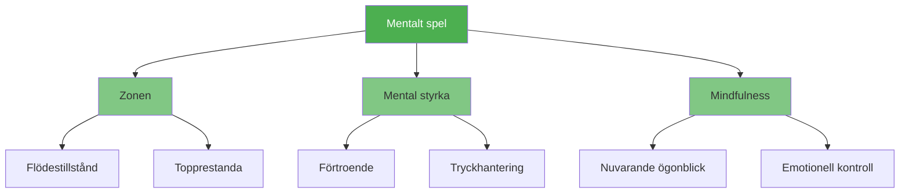

# Mentalt spel

::: tip Den viktigaste faktorn
**Vikt: 600 poäng** — Det mentala spelet har störst inverkan på din prestation. Bemästra ditt sinne, så följer allt annat.
:::

Det mentala spelet omfattar allt som händer mellan dina öron: dina tankar, fokus, självförtroende och självprat. Elitspelare har inte bara bättre teknik – de har bättre kontroll över sitt mentala tillstånd.

## De tre pelarna

### 🎯 [Zonen](/sv/utbildning/mentalt spel/zonen/)
Få tillgång till flödet där prestation känns obehindrad. Lär dig vad som utlöser flöde och hur du konsekvent når det.

- [Introduktion till Zonen](/sv/utbildning/mentalt spel/zonen/)
- [Teknisk vs Flow-träning](/sv/utbildning/mentalt-spel/zonen/teknisk-vs-flow)
- [Att gå in i zonen](/sv/utbildning/mentalt spel/zonen/att gå in i zonen)

### 💪 [Mental styrka](/sv/utbildning/mentalt-spel/mental-styrka/)
Bygg upp den psykologiska motståndskraften för att prestera under press. Utveckla självförtroende, hantera motgångar och behåll lugnet.

- [Bygg mental styrka](/sv/utbildning/mentalt-spel/mental-styrka/)
- [Hantera press](/sv/utbildning/mentalt-spel/mental-styrka/hantera-press)
- [Rutin före skott](/sv/utbildning/mentalt-spel/mental-styrka/rutin-före-skott)

### 🧘 [Mindfulness](/sv/utbildning/mentalt spel/mindfulness/)
Utveckla medvetenhet om nuet för att hålla fokus och snabbt återhämta sig från misstag.

- [Introduktion till Mindfulness](/sv/utbildning/mentalt spel/mindfulness/)
- [Mindfulnesstekniker](/sv/utbildning/mentalt spel/mindfulness/tekniker)
- [Daglig övning](/sv/utbildning/mentalt spel/mindfulness/daglig-övning)

## Varför mentalt spel är viktigast

| Aspekt | Teknisk utbildning | Mental träning |
|--------|-------------------|-----------------|
| **I praktiken** | Du kan ta skottet | Du kan ta skottet |
| **I tävling** | Tekniken kan misslyckas under tryck | Mentala färdigheter upprätthåller prestationsförmågan |
| **Skillnaden** | Fysisk skicklighet är nödvändig | Mental färdighet är multiplikatorn |

::: warning Det vanliga misstaget
De flesta spelare lägger 90 % av sin tid på teknik och 10 % på mentala färdigheter. Elitspelare vänder ofta på detta förhållande när de har solida grunder.
:::

## Var ska man börja?

**Nybörjare inom mental träning?** Börja med [Zonen](/sv/utbildning/mentalt-spel/zonen/) för att förstå hur det känns att prestera på topp.

**Kämpar du under press?** Gå till [Mental styrka](/sv/utbildning/mentalt-spel/mental-styrka/) för praktiska tekniker.

**Tankar vandrar iväg under matcher?** [Mindfulness](/sv/utbildning/mentalt-spel/mindfulness/) hjälper dig att hålla dig närvarande.

## Relaterade resurser

- [Självkännedom](/sv/utbildning/självkännedom/) — Lär känna dig själv för att förbättra dig snabbare
- [Spänningshantering](/sv/utbildning/spänning/) — Fysisk avslappning möjliggör mental klarhet
- [Bedömningsverktyg](/sv/utbildning/) — Utvärdera ditt mentala spel och få personliga rekommendationer

