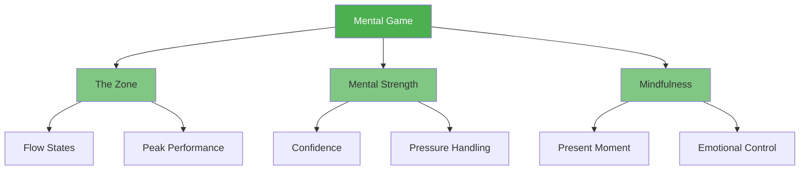

# Mental Game

::: tip The Most Important Factor
**Weight: 600 points** — The mental game has the highest impact on your performance. Master your mind, and everything else follows.
:::

The mental game encompasses everything that happens between your ears: your thoughts, focus, confidence, and self-talk. Elite players don't just have better technique—they have better control over their mental state.

## The Three Pillars

### 🎯 [The Zone](/sv/education/mental-game/the-zone/)
Access the flow state where performance feels effortless. Learn what triggers flow and how to enter it consistently.

- [Introduction to The Zone](/sv/education/mental-game/the-zone/)
- [Technical vs Flow Training](/sv/education/mental-game/the-zone/technical-vs-flow)
- [Entering the Zone](/sv/education/mental-game/the-zone/entering-the-zone)

### 💪 [Mental Strength](/sv/education/mental-game/mental-strength/)
Build the psychological resilience to perform under pressure. Develop confidence, handle setbacks, and maintain composure.

- [Building Mental Strength](/sv/education/mental-game/mental-strength/)
- [Handling Pressure](/sv/education/mental-game/mental-strength/handling-pressure)
- [Pre-Shot Routine](/sv/education/mental-game/mental-strength/pre-shot-routine)

### 🧘 [Mindfulness](/sv/education/mental-game/mindfulness/)
Develop present-moment awareness to stay focused and recover quickly from mistakes.

- [Introduction to Mindfulness](/sv/education/mental-game/mindfulness/)
- [Mindfulness Techniques](/sv/education/mental-game/mindfulness/techniques)
- [Daily Practice](/sv/education/mental-game/mindfulness/daily-practice)

## Why Mental Game Matters Most

| Aspect | Technical Training | Mental Training |
|--------|-------------------|-----------------|
| **In practice** | You can make the shot | You can make the shot |
| **In competition** | Technique may fail under pressure | Mental skills maintain performance |
| **The difference** | Physical skill is necessary | Mental skill is the multiplier |

::: warning The Common Mistake
Most players spend 90% of their time on technique and 10% on mental skills. Elite players often reverse this ratio once they have solid fundamentals.
:::

## Where to Start?

**New to mental training?** Start with [The Zone](/sv/education/mental-game/the-zone/) to understand what peak performance feels like.

**Struggling under pressure?** Go to [Mental Strength](/sv/education/mental-game/mental-strength/) for practical techniques.

**Mind wandering during matches?** [Mindfulness](/sv/education/mental-game/mindfulness/) will help you stay present.

## Related Resources

- [Self-Awareness](/sv/education/self-awareness/) — Know yourself to improve faster
- [Tension Management](/sv/education/tension/) — Physical relaxation enables mental clarity
- [Assessment Tool](/sv/education/) — Evaluate your mental game and get personalized recommendations

