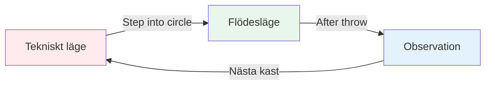
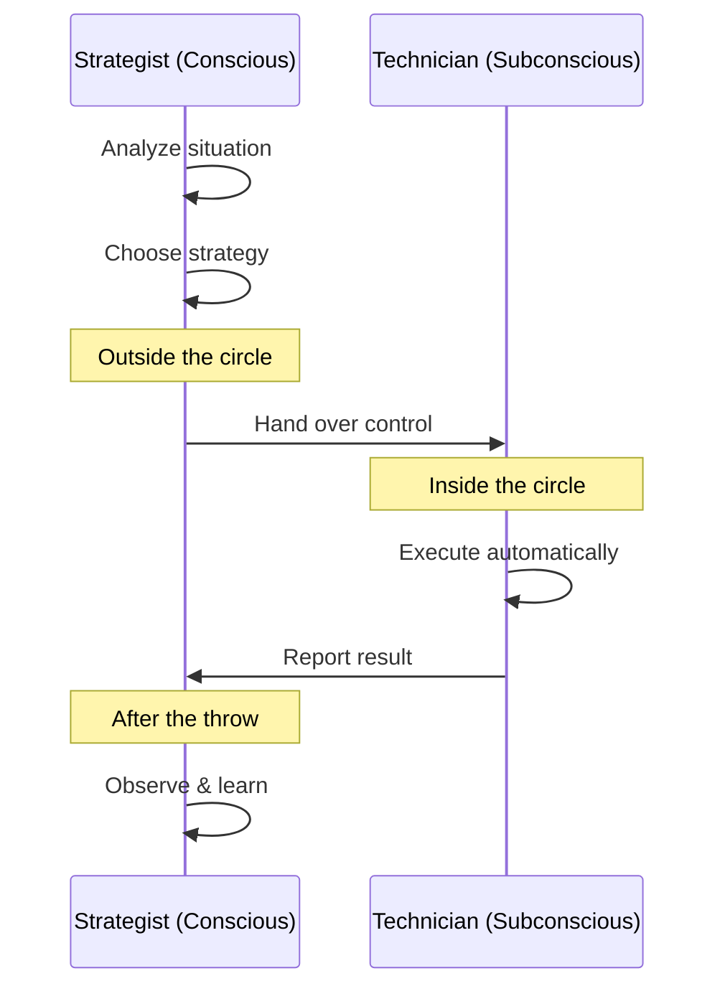

# Zonen: Att förstå flödestillståndet

Har du någonsin spelat ett spel där allt bara klickade? Där du inte tänkte på din teknik, och varje klot landade precis där du ville? Det är &quot;zonen&quot; – och att lära sig att använda den konsekvent är det som skiljer elitspelare från resten.

::: tip Den stora idén
**Flödestillstånd är när din analytiska hjärna tystnar ner och dina tränade instinkter tar över.** Du kan inte tänka dig in i zonen – du måste släppa taget.
:::

## Vad är zonen?

Zonen, även kallad &quot;flödestillstånd&quot;, är ett mentalt tillstånd där du blir helt absorberad av det du gör. Tiden verkar sakta ner. Dina rörelser känns ansträngningslösa. Du tänker inte på teknik - du bara *gör*.

Forskare kallar detta tillstånd **övergående hypofrontalitet**. Enkelt uttryckt tystnar den analytiska delen av din hjärna (prefrontala cortex) ner, vilket gör att dina tränade instinkter tar över.

### De två hjärnlägena

**Tekniskt läge (planering):**
- Analysera situationen
- Välj din strategi
- Bestäm vilket kast du ska göra

**Flödesläge (utförande):**
- Lita på din träning
- Fokusera bara på målet
- Låt din kropp fungera automatiskt

**Observation (inlärning):**
- Lägg märke till resultatet utan att döma
- Lär dig av det som hände
- Återställ för nästa kast

## Boulespelets paradox

Här är utmaningen: boule ger dig mycket tid att tänka mellan kasten. Till skillnad från snabba sporter där du reagerar direkt har du tid att gå till cirkeln, bedöma situationen och förbereda ditt kast.

Denna &quot;tid att tänka&quot; är både en gåva och en förbannelse:
- **Gåva:** Du kan planera strategier och fatta smarta beslut
- **Förbannelse:** Du kan övertänka och störa din naturliga förmåga

Elitspelaren lär sig att använda den här tiden klokt – tänka under planeringen, sedan &quot;stänga av&quot; under utförandet.

## Två spellägen

Din hjärna fungerar i två olika lägen:

| Särdrag | Tekniskt läge | Flödesläge |
|---------|---------------|-----------|
| **När ska man använda** | Träning, inlärning av nya färdigheter | Tävling, utförande |
| **Hjärnaktivitet** | Högt analytiskt tänkande | Tyst, automatisk |
| **Fokus** | Intern (kroppsmekanik) | Extern (mål) |
| **Känsla** | Ansträngande, medveten | Enkel, naturlig |

Den viktigaste färdigheten är att lära sig att **växla** mellan dessa lägen vid rätt tidpunkt.

## &quot;Byt&quot;-ögonblicket

::: warning Växlingsregeln
**Innan cirkeln:** Analysera, strategisera, bestäm vilket kast som ska göras
**I cirkeln:** Släpp analysen, lita på din träning, fokusera bara på målet
**Efter kastet:** Observera resultatet utan att döma
:::

Övergången sker när du kliver in i cirkeln. Detta är den viktigaste färdigheten i elitboule.

Tänk på det så här: ditt medvetna sinne är **strategen** som gör planen, och ditt undermedvetna sinne är **teknikern** som genomför den. Strategen behöver ta ett steg tillbaka och låta teknikern arbeta.

## Varför övertänkande dödar prestation

När du medvetet övervakar dina rörelser under utförandet stör du de automatiska processer du har tränat. Detta kallas &quot;kvävning&quot; – och det händer alla.

::: danger Tecken på att du övertänker
- ❌ Tänk på armposition mitt i kastet
- ❌ Oroa dig för resultatet innan du släpper
- ❌ Känsla av spändhet eller mekanisk
- ❌ Att ifrågasätta sig själv i cirkeln
:::

::: tip Lösningen
Lösningen är inte att tänka *mindre* - det är att tänka på **rätt saker** vid **rätt tidpunkt**.

✅ **Rätt tänkande:** &quot;Jag ser målet tydligt&quot;
❌ **Felaktigt tänkande:** &quot;Håller min armbåge rak&quot;
:::

## I detta avsnitt

Lär dig hur du bemästrar zonen:

- **[Teknisk vs Flow-träning](/sv/education/mental-game/the-zone/teknisk-vs-flow)** - Förstå när man ska fokusera på teknik och när man ska släppa taget
- **[Att komma in i zonen](/sv/education/mental-game/the-zone/att komma in i zonen)** - Praktiska tekniker för att komma åt flödestillstånd

## Sammanfattning: Zonreglerna

::: tip Regel nr 1: Växlingsregeln
**Analysera före cirkeln, utför i cirkeln, observera efteråt.**
Ditt medvetna sinne planerar, ditt undermedvetna utför.
:::

::: tip Regel nr 2: Inversionsregeln
**Allt eftersom skickligheten ökar blir mental träning viktigare än teknisk träning.**
Nybörjare: 90 % teknisk / 10 % mental
Experter: 20 % tekniska / 80 % mentala
:::

::: tip Regel nr 3: Förtroenderegeln
**Du kan inte tänka dig fram till perfekt utförande.**
Lita på din träning. Fokusera på målet, inte din teknik.
:::

## Viktig slutsats

> Det finns inga tekniker som alltid producerar ett perfekt klot. Men det finns ett mentalt tillstånd där perfekta klot blir naturliga.

Din teknik är grunden. Zonen är där grunden blir konst.

