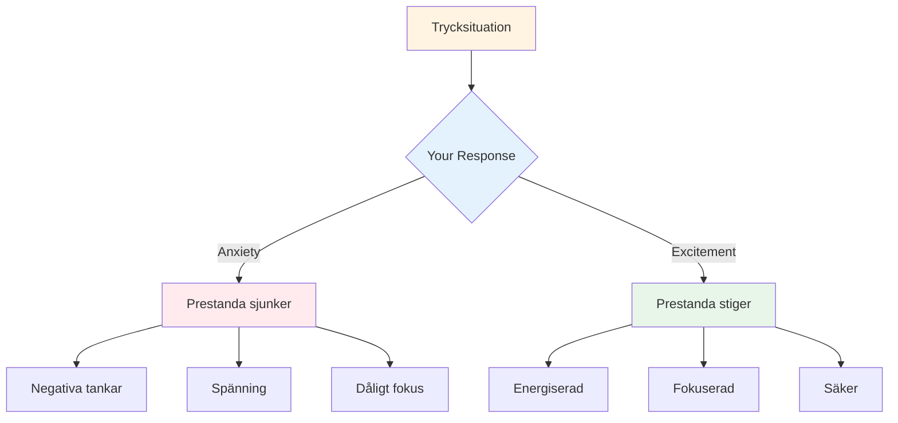

# Hantering av tryck
<AdBanner />

Press är en del av konkurrensen. Målet är inte att eliminera det - det är omöjligt. Målet är att prestera bra trots det, och till och med använda det till din fördel.

::: tips Den stora idén
**Tryck försvinner inte med erfarenhet - du blir bara bättre på att prestera med den.** De bästa spelarna är inte lugna; de är skickliga på att använda sin upphetsning produktivt.
:::

## Förstå trycket

### Vad skapar tryck?
- Höga insatser (viktigt spel, avgörande kast)
- Blir bevakad (publik, lagkamrater)
- Förväntningar (dina och andras)
- Osäkerhet (nära poäng, okända motståndare)
- Tiden (räknas ut, väntar för länge)

### Vad tryck gör med din kropp
När du känner press svarar din kropp:
- Pulsen ökar
- Andningen blir ytlig
- Musklerna spänns
- Händerna kan skaka
- Fokus minskar (ibland för mycket)

Det här är din kropp som förbereder sig för handling. Det är inte dåligt – det är energi du kan använda.

## Reframing Pressure

### Tryck som spänning

De fysiska förnimmelserna av ångest och spänning är nästan identiska. Skillnaden är hur du tolkar dem.

**Ångesttolkning:** "Jag är nervös, något dåligt kan hända"
**Spänningstolkning:** "Jag är pigg, det här är viktigt för mig"

**Prova detta:** När du känner press, säg till dig själv: "Jag är upphetsad" istället för "Jag är nervös."

### Tryck som privilegium

Endast viktiga ögonblick skapar press. Om du känner det är du i en situation som är viktig.

> "Tryck är ett privilegium - det kommer bara till dem som förtjänar det." - Billie Jean King

## Tekniker för högtrycksmoment

### 1. Andningskontroll

Ditt andetag är det snabbaste sättet att ändra ditt tillstånd.

**4-7-8-tekniken:**
1. Andas in i 4 omgångar
2. Håll i 7 räkningar
3. Andas ut i 8 punkter
4. Upprepa 2-3 gånger

**Snabb återställning (i cirkeln):**
- Ett långsamt, djupt andetag
- Känn dina fötter på marken
- Släpp axlarna vid utandningen

<AdInArticle />

### 2. Fysisk jordning

Anslut med fysiska förnimmelser för att komma ur huvudet:
- Känn tyngden av boulen
- Lägg märke till dina fötter på marken
- Kläm och släpp din icke-kastande hand
- Rulla axlarna bakåt

### 3. Fokusavsmalnande

I pressade ögonblick, fokusera bara på det som betyder något:
- Inte poängen
- Inte publiken
- Inte vad som kan hända
- Bara detta kast, detta mål, detta ögonblick

**Uppord:** "Här. Nu. Det här."

### 4. Processfokus

Skift från resultat till process:

**Resultatfokus (skapar tryck):**
- "Jag måste göra det här"
- "Om jag missar så förlorar vi"
- "Alla tittar"

**Processfokus (minskar trycket):**
- "Följ min rutin"
- "Se målet"
- "Lita på min träning"

### 5. Vänsterhandsklämningen

För högerhänta spelare, klämma din vänstra hand i 10-15 sekunder:
- Aktiverar den högra hjärnhalvan
- Tystar analytiskt övertänkande
- Hjälper åtkomst till automatisk exekvering

Använd detta när du märker att du tänker över.

## Förbereder sig för tryck

### Simulera tryck i praktiken

Du klarar inte av tävlingspress om du aldrig upplever det på träning.

**Sätt att skapa träningstryck:**
- Sätt konsekvenser (armhävningar för missar, köp kaffe till partner)
- Skapa "måste-göra"-scenarier
- Träna med publik
- Tidspress (skottklocka)
- Trötthet (träna när du är trött)

### Visualisering

Mentalt repetera högtryckssituationer:
1. Blunda
2. Föreställ dig ett tryckscenario i detalj
3. Känn tryckkänslan
4. Se dig själv hantera det väl
5. Kör framgångsrikt i ditt sinne

Gör detta regelbundet, inte bara före tävlingar.

### Bygg en presshistorik

Håll reda på tider du har hanterat press väl:
- Hur var läget?
- Hur kände du dig?
- Vad gjorde du?
- Vad blev resultatet?

Granska detta före tävlingar för att påminna dig själv: "Jag har gjort det här förut."

## Under tävling

### Innan tryckkastningen
1. Ta ett steg tillbaka, ta ett andetag
2. Påminn dig själv om din rutin
3. Fokusera på processen, inte resultatet
4. Använd ditt triggerord eller ledtråd

### I cirkeln
1. Slutför din rutin precis som du har övat
2. Fokusera externt (mål, inte kropp)
3. Lita på din träning
4. Släpp utan att tveka

### Efter Kasten
- Acceptera resultatet utan att döma
- Om bra: kort bekräftelse, gå vidare
- Om dåligt: ​​SOAS-metoden, återställ för nästa kast

## Vanliga tryckmisstag

|  | Misstag | Bättre tillvägagångssätt |  |
|--------|----------------|
|  | Rusar | Sakta ner, använd full rutin |  |
|  | Övertänkande | Yttre fokus, förtroendeträning |  |
|  | Ändra teknik | Håll dig till det du vet |  |
|  | Fokus på resultatet | Fokusera på processen |  |
|  | Kämpande nerver | Acceptera och använd energin |  |

## Key Takeaway

> Pressen försvinner inte med erfarenhet. Man blir bara bättre på att prestera med den.

De bästa spelarna är inte lugna – de är skickliga på att använda sin upphetsning produktivt.

<AdBanner />
