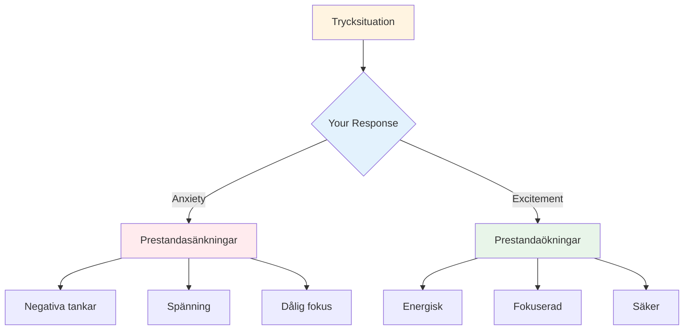

# Hantering av tryck
<AdBanner />

Press är en del av tävling. Målet är inte att eliminera den – det är omöjligt. Målet är att prestera bra trots den, och till och med använda den till din fördel.

::: tip Den stora idén
**Pressen försvinner inte med erfarenhet – man blir bara bättre på att prestera med den.** De bästa spelarna är inte lugna; de är skickliga på att använda sin upphetsning produktivt.
:::

## Att förstå tryck

### Vad skapar tryck?
- Höga insatser (viktig match, avgörande kast)
- Att bli iakttagen (publik, lagkamrater)
- Förväntningar (dina och andras)
- Osäkerhet (jämnt resultat, okända motståndare)
- Tid (rinner ut, väntar för länge)

### Vad tryck gör med din kropp
När du känner tryck reagerar din kropp:
- Hjärtfrekvensen ökar
- Andningen blir ytlig
- Musklerna spänns
- Händerna kan skaka
- Fokus snävare (ibland för mycket)

Det här är din kropp som förbereder sig för handling. Det är inte dåligt – det är energi du kan använda.

## Omramningstryck

### Tryck som spänning

De fysiska förnimmelserna av ångest och upphetsning är nästan identiska. Skillnaden ligger i hur du tolkar dem.

**Ångesttolkning:** &quot;Jag är nervös, något dåligt kan hända&quot;
**Tolkning av spänning:** &quot;Jag är pigg, det här är viktigt för mig&quot;

**Prova detta:** När du känner press, säg till dig själv: &quot;Jag är exalterad&quot; istället för &quot;Jag är nervös&quot;.

### Påtryckning som privilegium

Bara viktiga ögonblick skapar press. Om du känner det, är du i en situation som spelar roll.

> &quot;Press är ett privilegium – det kommer bara till dem som förtjänar det.&quot; – Billie Jean King

## Tekniker för högtrycksmoment

### 1. Andningskontroll

Din andning är det snabbaste sättet att förändra ditt tillstånd.

**4-7-8-tekniken:**
1. Andas in i 4 räkningar
2. Håll i 7 räkningar
3. Andas ut i 8 räkningar
4. Upprepa 2-3 gånger

**Snabb återställning (i cirkeln):**
- Ett långsamt, djupt andetag
- Känn dina fötter på marken
- Sänk axlarna på utandningen

<AdInArticle />

### 2. Fysisk jordning

Anslut till fysiska förnimmelser för att komma ur ditt huvud:
- Känn boulens tyngd
- Lägg märke till dina fötter på marken
- Krama och släpp din icke-kastande hand
- Rulla axlarna bakåt

### 3. Fokusförminskning

I pressade stunder, fokusera bara på det som är viktigt:
- Inte poängen
- Inte publiken
- Inte vad som kan hända
- Bara det här kastet, det här målet, det här ögonblicket

**Ledsord:** &quot;Här. Nu. Detta.&quot;

### 4. Processfokus

Övergång från resultat till process:

**Resultatfokus (skapar press):**
- &quot;Jag måste göra det här&quot;
- &quot;Om jag missar, förlorar vi&quot;
- &quot;Alla tittar&quot;

**Processfokus (minskar tryck):**
- &quot;Följ min rutin&quot;
- &quot;Se målet&quot;
- &quot;Lita på min träning&quot;

### 5. Vänsterhandstrycket

För högerhänta spelare, kläm vänster hand i 10–15 sekunder:
- Aktiverar höger hjärnhalva
- Tystar analytiskt övertänkande
- Hjälper till att få åtkomst till automatisk exekvering

Använd detta när du märker att du övertänker.

## Förberedelser inför tryck

### Simulera tryck i praktiken

Du klarar inte av tävlingspress om du aldrig upplever den på träning.

**Sätt att skapa träningspress:**
- Sätt konsekvenser (armhävningar för missar, bjud in partnern till kaffe)
- Skapa scenarier som du absolut måste göra
- Öva med publik
- Tidspress (skottklocka)
- Trötthet (träna när du är trött)

### Visualisering

Repetera mentalt situationer med hög press:
1. Slut dina ögon
2. Föreställ dig ett tryckscenario i detalj
3. Känn tryckförnimmelserna
4. Se dig själv hantera det bra
5. Utför framgångsrikt i ditt sinne

Gör detta regelbundet, inte bara före tävlingar.

### Bygg en tryckhistorik

Håll koll på gånger du har hanterat press väl:
- Hur var situationen?
- Hur kände du dig?
- Vad gjorde du?
- Vad blev resultatet?

Gå igenom detta före tävlingar för att påminna dig själv: &quot;Jag har gjort det här förut.&quot;

## Under tävlingen

### Före tryckkastet
1. Ta ett steg tillbaka, ta ett andetag
2. Påminn dig själv om din rutin
3. Fokusera på process, inte resultat
4. Använd ditt triggerord eller din ledtråd

### I cirkeln
1. Slutför din rutin exakt som den är van vid
2. Fokusera externt (målet, inte kroppen)
3. Lita på din träning
4. Släpp utan tvekan

### Efter kastet
- Acceptera resultatet utan att döma
- Om bra: kort tack, gå vidare
- Om felaktig: SOAS-metod, återställ för nästa kast

## Vanliga tryckmisstag

| Misstag | Bättre tillvägagångssätt |
|---------|----------------|
| Rusar | Sakta ner, använd full rutin |
| Övertänkande | Externt fokus, förtroendeträning |
| Byte av teknik | Håll dig till det du vet |
| Fokusera på resultat | Fokusera på processen |
| Bekämpa nerverna | Acceptera och använd energin |

## Viktig slutsats

> Pressen försvinner inte med erfarenhet. Man blir bara bättre på att prestera med den.

De bästa spelarna är inte lugna – de är skickliga på att använda sin upphetsning produktivt.

<AdBanner />
