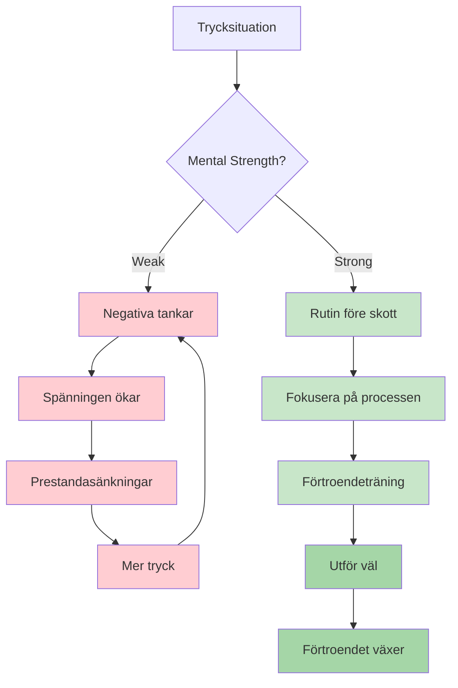
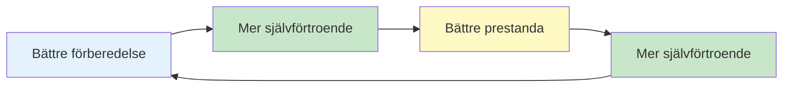

# Mental styrka

Mental styrka är det som skiljer spelare som presterar bra på träning från de som presterar bra när det gäller. Det är förmågan att hantera press, återhämta sig från motgångar och bibehålla fokus under långa tävlingar.

::: tip Kärnprincipen
**Mental styrka handlar inte om att bli av med nerverna eller att aldrig göra misstag. Det handlar om att prestera bra trots dem.** Du kan inte kontrollera vad som händer. Du kan kontrollera hur du reagerar.
:::

## Vad är mental styrka?

Mental styrka inkluderar:
- **Självförtroende:** Att tro på sin förmåga
- **Fokus:** Att hålla fokus på det som är viktigt
- **Motståndskraft:** Att studsa tillbaka från misstag
- **Lugnsinne:** Att behålla lugnet under press
- **Motivation:** Att fortsätta anstränga sig över tid

Det här är inga fasta egenskaper – det är färdigheter du kan utveckla.

## Boulespelets mentala krav

Petanque har unika mentala utmaningar:

| Utmaning | Varför det är svårt |
|-----------|--------------|
| Tid mellan kast | Möjlighet för negativa tankar |
| Synliga resultat | Alla ser dina misstag |
| Lagformat | Press att inte svika partners |
| Långa tävlingar | Mental trötthet under många timmar |
| Stänga spel | Höga insatser på enskilda kast |
| Momentumsvängningar | Känslomässig berg-och-dalbana |

## Bygga mental styrka

### 1. Utveckla självförtroende

Självförtroende kommer från:
- **Förberedelse:** Att veta att du har gjort jobbet
- **Tidigare framgångar:** Att minnas gånger du presterade bra
- **Positivt självprat:** Hur du pratar med dig själv
- **Kroppsspråk:** Stå rak, röra sig med syfte

**Förtroendeskapare:**
- För en framgångsdagbok
- Visualisera framgångsrika framträdanden
- Förbered dig noggrant inför tävlingar
- Använd självsäkert kroppsspråk (det påverkar ditt sinne)

### 2. Bemästra ditt självprat

Rösten i ditt huvud spelar oerhört stor roll.

**Destruktivt självprat:**
- &quot;Jag saknar alltid dessa&quot;
- &quot;Jag kommer att kvävas&quot;
- &quot;Mina lagkamrater räknar med mig&quot; (press)
- &quot;Det var hemskt&quot;

**Konstruktivt självprat:**
- &quot;Jag har gjort det här kastet förut&quot;
- &quot;Lita på min träning&quot;
- &quot;Ett kast i taget&quot;
- &quot;Nästa kast, nystart&quot;

**Ändra ditt självprat:**
1. Lägg märke till vad du säger till dig själv
2. Utmana negativa påståenden
3. Ersätt med realistiska, användbara alternativ
4. Öva tills det blir automatiskt

### 3. Bygg motståndskraft

Motståndskraft är förmågan att återhämta sig från motgångar.

**Den motståndskraftiga inställningen:**
- Misstag är information, inte misslyckanden
- Ett dåligt kast definierar dig inte
- Motgångar är tillfälliga
- Man kan alltid reagera bra på vad som händer

**Bygger motståndskraft:**
- Öva på att återhämta sig från misstag i träningen
- Använd SOAS-metoden (Stoppa, Observera, Acceptera, Slipa)
- Fokusera på responsen, inte händelsen
- Utveckla ett kort minne för dåliga kast

### 4. Hantera din energi

Mental styrka kräver energihantering:

**Fysisk energi:**
- Sov gott inför tävlingar
- Ät ordentligt (stabilt blodsocker)
- Håll dig hydrerad
- Flytta mellan spelen (sitt inte för länge)

**Mental energi:**
- Ta pauser när det är möjligt
- Överanalysera inte mellan kasten
- Spara intensivt fokus till när du behöver det
- Ha återhämtningsrutiner

## Förtroende-kompetens-loopen

::: info Den positiva cykeln

**Bygg det igenom:**
1. Kvalitetspraxis (bygger kompetens)
2. Följa upp framsteg (bygger självförtroende)
3. Framgångsrika prestationer (förstärker båda)
:::

## I detta avsnitt

- **[Hantera press](/sv/utbildning/mental-styrka/hantera-press)** - Tekniker för situationer med höga insatser
- **[Rutin före sprutning](/sv/utbildning/mental-styrka/rutin-före-sprutning)** - Bygg din prestationsfaktor

## Sammanfattning: Regler för mental styrka

::: tip Regel nr 1: Rutinregeln
**Konsekventa rutiner före behandlingen ger maximal prestanda.**
Samma rutin varje gång = pålitlig utlösare för flödestillstånd
:::

::: tip Regel nr 2: Återställningsregeln
**Utveckla en 10-sekunders återställningsrutin efter misstag.**
Fysisk återställning (djupa andetag, axelrullning) + mental återställning (SOAS-metoden)
:::

::: tip Regel nr 3: Regeln om självförtroendeloopen
**Bättre förberedelse → Mer självförtroende → Bättre prestation.**
Loopen fungerar åt båda hållen. Bygg upp den genom kvalitetsövningar och uppföljning av framsteg.
:::

::: tip Regel nr 4: Regeln om självprat
**Prata med dig själv som du skulle prata med en lagkamrat.**
Stödjande, konstruktiv, fokuserad på vad som ska göras (inte vad som gick fel)
:::

::: tip Regel #5: Energihanteringsregeln
**Spara intensivt fokus till när du behöver det.**
Överanalysera inte mellan kasten. Spara mental energi för utförandet.
:::

## Viktig slutsats

> Mental styrka handlar inte om att eliminera nerver eller att aldrig göra misstag. Det handlar om att prestera bra trots dem.

Du kan inte kontrollera vad som händer. Du kan kontrollera hur du reagerar.

