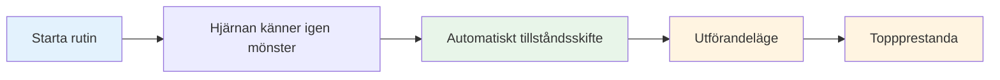

# Bygg din pre-shot rutin

Din pre-shot rutin är ett av de mest kraftfulla verktygen i ditt mentala spel. Det är en konsekvent sekvens av åtgärder som förbereder dig för varje kast och utlöser ditt bästa prestationsläge.

::: tips Den stora idén
**Din rutin är din inkörsport till zonen.** En konsekvent pre-shot rutin signalerar din hjärna: "Det är dags att utföra." Med upprepning blir det en automatisk trigger för toppprestanda.
:::

## Varför rutiner fungerar

### Konsekvens skapar förtroende
När du gör samma sak varje gång tar du bort variabler. Din kropp vet vad som kommer. Detta skapar en känsla av kontroll och förtrogenhet, även i okända situationer.

### Rutiner utlöser stater
Med upprepning blir din rutin kopplad till ditt prestationsläge. Att starta rutinen börjar automatiskt det mentala skiftet till exekveringsläge.

### Rutiner blockerar distraktioner
En rutin ger ditt sinne något att fokusera på. Det finns inget utrymme för oro för partituren, publiken eller vad som kan hända.

### Rutiner Hantera upphetsning
En väldesignad rutin hjälper till att reglera din energinivå - lugnar dig om du är för stark, fokuserar dig om du är platt.

## Delar av en effektiv rutin

### Fas 1: Bedömning (utanför cirkeln)

Innan du kliver in, samla information:
- Läs terrängen (backar, hinder, underlag)
- Bedöm situationen (resultat, boulepositioner)
- Välj ditt mål och landningsplats
- Bestäm kasttyp (peka, skjuta, lobba, kasta)

**Det är här man tänker.** Ta dig tid här.

### Fas 2: Övergång (att gå in i cirkeln)

Skiftet från att tänka till att göra:
- Fysisk handling (kliv in i cirkeln på ett konsekvent sätt)
- Mental signal (ett ord eller en fras som signalerar "exekveringsläge")
- Andning (ett medvetet andetag för att centrera dig själv)

**Detta är omkopplaren.** Analysen slutar här.

### Fas 3: Installation (In the Circle)

Förbered din kropp:
- Konsekvent hållning (samma varje gång)
- Greppkontroll (känn boulen)
- Inriktning mot målet
- Fysisk trigger (en liten rörelse som är din)

### Fas 4: Visualisering (kortfattad)

Se kast innan du gör det:
- Föreställ dig bollens väg (max 2-3 sekunder)
- Känn det lyckade kastet
- Anslut visuellt till ditt mål

### Fas 5: Utförande

Gör kast:
- Externt fokus (endast mål)
- Lita på din kropp
- Släpp utan att tveka
- Följ naturligt

## Bygg din personliga rutin

### Steg 1: Observera vad du redan gör

Du har förmodligen redan någon rutin. Varsel:
- Vad gör du innan bra kast?
- Vad känns naturligt för dig?
- Vad hjälper dig att fokusera?

### Steg 2: Designa din rutin

Skapa en sekvens som inkluderar:
- [ ] Bedömningsfas
- [ ] Tydligt övergångsmoment
- [ ] Konsekvent fysisk inställning
- [ ] Kort visualisering
- [ ] Utförande utlösare

### Steg 3: Skriv ner det

Var specifik. Exempel:

1. **Bedöm:** Läs terräng, välj landningsplats
2. **Övergång:** Gå in i cirkeln med vänster fot först, säg "lita"
3. **Inställning:** Fötter axelbredd, greppkontroll, justera axlarna
4. **Visualisera:** Se vägen, känn frigörelsen
5. **Utför:** Ögon mot målet, kasta

### Steg 4: Öva religiöst

Använd din rutin vid VARJE kast i träningen:
- Enkla kast
- Svåra kast
- När du är trött
- När du är fräsch

Rutinen måste bli automatisk.

### Steg 5: Förfina över tiden

Din rutin kommer att utvecklas. Lägg märke till vad som fungerar och justera. Men ändra det inte under tävling – bara mellan evenemang.

## Rutinmässig timing

Din rutin bör ta konsekvent tid:
- För snabbt: Du har bråttom, inte ordentligt förberedd
- För långsamt: Du övertänker, tappar flyt
- Helt rätt: Tillräckligt med tid att förbereda sig, inte så mycket att du tänker för mycket

**Typisk tidpunkt:**
- Bedömning: 5-10 sekunder
- Övergång + Inställning: 3-5 sekunder
- Visualisering + Utförande: 3-5 sekunder
- **Totalt: 10-20 sekunder**

## Vanliga rutinmässiga misstag

|  | Misstag | Problem | Lösning |  |
|--------|--------|--------|
|  | Hoppar i praktiken | Rutin är inte automatisk | Använd den varje kast |  |
|  | För komplicerat | Svårt att komma ihåg under press | Förenkla till väsentligheter |  |
|  | Tänker under utförandet | Stör automatisk prestanda | Tydlig övergångspunkt |  |
|  | Inkonsekvent timing | Skapar osäkerhet | Träna i jämn takt |  |
|  | Ändra mitt i tävlingen | Inför tvivel | Håll dig till det du vet |  |

## Rutinmässig felsökning

**Om du har bråttom:**
- Lägg till ett andetag vid övergången
- Sakta ner dina inställningsrörelser
- Pausa före visualisering

**Om du tänker för mycket:**
- Förkorta rutinen
- Använd en starkare övergångssignal
- Fokusera mer externt

**Om du är inkonsekvent:**
- Video själv att kontrollera
- Öva rutinen utan att kasta
- Få feedback från en partner

## Exempel på rutiner

### Enkel rutin
1. Välj mål
2. Kliv in, andas
3. Grip, rikta in
4. Se det, kasta det

### Detaljerad rutin
1. Läs terräng, välj landningsplats
2. Kliv in vänster fot först
3. Säg "smidig" internt
4. Ett andetag, axlarna faller
5. Fötter inställda, greppkontroll
6. Rikta in axlarna mot målet
7. Se vägen (2 sekunder)
8. Ögonen låser sig på målet
9. Kasta

## Key Takeaway

> Din rutin är ditt ankare. I kaos är det din konstant.

Bygg den noggrant. Öva det alltid. Lita helt på det.

