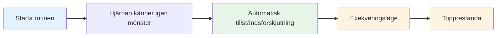

# Bygga din rutin före fotografering

Din rutiner före skottet är ett av de kraftfullaste verktygen i ditt mentala spel. Det är en konsekvent sekvens av handlingar som förbereder dig för varje kast och utlöser ditt bästa prestationstillstånd.

::: tip Den stora idén
**Din rutin är din inkörsport till zonen.** En konsekvent rutin före träning signalerar till din hjärna: &quot;Det är dags att prestera.&quot; Med upprepning blir det en automatisk utlösare för topprestationer.
:::

## Varför rutiner fungerar

### Konsekvens skapar förtroende
När du gör samma sak varje gång tar du bort variabler. Din kropp vet vad som kommer. Detta skapar en känsla av kontroll och förtrogenhet, även i okända situationer.

### Rutiners utlösande tillstånd
Med repetition kopplas din rutin till ditt prestationstillstånd. Att starta rutinen inleder automatiskt den mentala övergången till utförandeläge.

### Rutiner blockerar distraktioner
En rutin ger dig något att fokusera på. Det finns inget utrymme för oro för musiken, publiken eller vad som kan hända.

### Rutiner hanterar upphetsning
En väl utformad rutin hjälper till att reglera din energinivå – den lugnar dig om du är för upphetsad och fokuserar dig om du är trött.

## Element i en effektiv rutin

### Fas 1: Bedömning (utanför cirkeln)

Innan du går in, samla information:
- Läs terrängen (sluttningar, hinder, underlag)
- Bedöm situationen (resultat, klotpositioner)
- Välj ditt mål och landningsplats
- Bestäm kasttyp (peka, skjut, lobb, rulla)

**Det är här tänkandet sker.** Ta din tid här.

### Fas 2: Övergång (Att komma in i cirkeln)

Övergången från att tänka till att göra:
- Fysisk handling (gå in i cirkeln på ett konsekvent sätt)
- Mental signal (ett ord eller en fras som signalerar &quot;utförandeläge&quot;)
- Andning (ett medvetet andetag för att centrera dig)

**Detta är strömbrytaren.** Analysen slutar här.

### Fas 3: Uppställning (i cirkeln)

Förbered din kropp:
- Konsekvent hållning (samma varje gång)
- Greppkontroll (känn på klotet)
- Anpassning till målet
- Fysisk trigger (en liten rörelse som är din)

### Fas 4: Visualisering (kortfattad)

Se kastet innan du gör det:
- Föreställ dig bollens bana (max 2–3 sekunder)
- Känn det lyckade kastet
- Få visuell kontakt med din målgrupp

### Fas 5: Utförande

Gör kastet:
- Externt fokus (endast mål)
- Lita på din kropp
- Släpp utan tvekan
- Följ upp naturligt

## Bygga din personliga rutin

### Steg 1: Observera vad du redan gör

Du har förmodligen redan en viss rutin. Observera:
- Vad gör man innan man gör bra kast?
- Vad känns naturligt för dig?
- Vad hjälper dig att fokusera?

### Steg 2: Utforma din rutin

Skapa en sekvens som inkluderar:
- [ ] Bedömningsfas
- [ ] Tydligt övergångsmoment
- [ ] Konsekvent fysisk uppställning
- [ ] Kort visualisering
- [ ] Exekveringsutlösare

### Steg 3: Skriv ner det

Var specifik. Exempel:

1. **Bedöm:** Läs terrängen, välj landningsplats
2. **Övergång:** Gå in i cirkeln med vänster fot först, säg &quot;lita på&quot;
3. **Uppställning:** Fötterna axelbrett, greppkontroll, rikta axlarna
4. **Visualisera:** Se vägen, känn befrielsen
5. **Utför:** Blicken riktad mot målet, kast

### Steg 4: Utöva religiöst

Använd din rutin på VARJE kast under träningen:
- Enkla kast
- Svåra kast
- När du är trött
- När du är fräsch

Rutinen måste bli automatisk.

### Steg 5: Förfina över tid

Din rutin kommer att utvecklas. Lägg märke till vad som fungerar och justera. Men ändra den inte under tävling – bara mellan evenemang.

## Rutinmässig tidtagning

Din rutin bör ta en jämn tid:
- För fort: Du har bråttom, inte ordentligt förberedd
- För långsamt: Du övertänker och tappar flödet
- Precis lagom: Tillräckligt med tid att förbereda sig, inte så mycket att du tänker för mycket

**Typisk tidpunkt:**
- Bedömning: 5–10 sekunder
- Övergång + Uppställning: 3–5 sekunder
- Visualisering + Utförande: 3–5 sekunder
- **Totalt: 10–20 sekunder**

## Vanliga rutinmässiga misstag

| Misstag | Problem | Lösning |
|---------|---------|----------|
| Hoppning i praktiken | Rutin är inte automatisk | Använd den varje kast |
| För komplicerat | Svårt att komma ihåg under press | Förenkla till det väsentliga |
| Tänkande under utförandet | Stör automatisk prestanda | Tydlig övergångspunkt |
| Inkonsekvent timing | Skapar osäkerhet | Öva med jämn takt |
| Förändring mitt i tävlingen | Introducerar tvivel | Håll dig till det du vet |

## Rutinmässig felsökning

**Om du har bråttom:**
- Lägg till ett andetag vid övergången
- Sakta ner dina uppställningsrörelser
- Pausa före visualisering

**Om du övertänker:**
- Förkorta rutinen
- Använd en starkare övergångssignal
- Fokusera mer externt

**Om du är inkonsekvent:**
- Filma dig själv för att kontrollera
- Öva rutinen utan att kasta
- Få feedback från en partner

## Exempelrutiner

### Enkel rutin
1. Välj mål
2. Kliv in, andas
3. Greppa, rikta in
4. Se det, kasta det

### Detaljerad rutin
1. Läs terrängen, välj landningsplats
2. Steg först med vänster fot
3. Säg &quot;smidig&quot; internt
4. Ett andetag, axlarna sänks
5. Fötterna satta, greppkontroll
6. Rikta in axlarna mot målet
7. Se vägen (2 sekunder)
8. Ögonen låses på målet
9. Kasta

## Viktig slutsats

> Din rutin är ditt ankare. I kaos är den din konstant.

Bygg det noggrant. Öva alltid. Lita helt och hållet på det.

