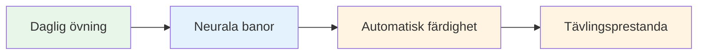
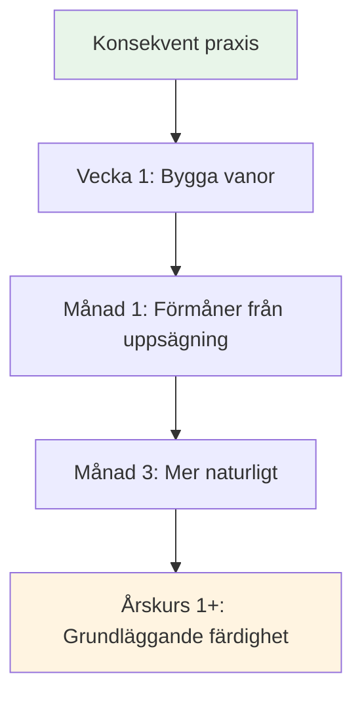

# Att bygga en daglig mindfulness-övning

Fördelarna med mindfulness kommer från regelbunden övning. Så här gör du det till en del av ditt liv.

::: tip Den stora idén
**Konsekvens är bättre än intensitet.** Fem minuter varje dag är bättre än en timme en gång i veckan. Börja smått, var konsekvent, och fördelarna ökar med tiden.
:::

## Varför daglig övning är viktig

::: info Mindfulness är som fysisk kondition
- ❌ Du kan inte bli i form från ett enda gympass
- ✅ Regelbunden övning skapar varaktig förändring
- ✅ Effekterna förstärks med tiden
- ✅ Det blir enklare med konsekvens
:::

::: tip Forskningsbaserad
Forskning visar att även **3 minuter dagligen** skapar mätbara fördelar. Men du måste göra det regelbundet.
:::

## Skapa din rutin

### Steg 1: Välj din tid

Välj en regelbunden tid som fungerar för ditt liv:

| Tid | Fördelar | Överväganden |
|------|------------|----------------|
| **Morgon** | Sätter tonen för dagen, färre avbrott | Behöver vakna tidigare |
| **Middag** | Bryter upp dagen, återställer fokus | Kan glömma, schemalägga konflikter |
| **Kväll** | Varva ner, reflektera över dagen | Kan vara trött, mindre alert |
| **Innan träning** | Direkt anslutning till boule | Beror på träningsschemat |

**Bästa tillvägagångssättet:** Koppla det till en befintlig vana (efter kaffe, före lunch, etc.)

### Steg 2: Börja smått

Sikta inte på 30 minuter på dag ett.

**Rekommenderad progression:**
- Vecka 1-2: 3-5 minuter
- Vecka 3-4: 5-10 minuter
- Månad 2: 10–15 minuter
- Månad 3+: 15–20 minuter

Det är bättre att göra 5 minuter varje dag än 30 minuter en gång i veckan.

### Steg 3: Skapa ditt utrymme

Du behöver inte ett meditationsrum, men att ha en fast plats hjälper:
- Någonstans tyst (eller använd hörlurar)
- Bekväma sittplatser
- Minimala distraktioner
- Samma plats varje gång om möjligt

### Steg 4: Ta bort hinder

Gör det enkelt att öva:
- Sätt telefonen på ljudlös
- Säg åt familjen/huskamraterna att inte avbryta
- Ha allt klart (kudde, timer)
- Vänta inte på &quot;perfekta&quot; förhållanden

## Exempel på dagliga scheman

### Minimal övning (5 minuter)
- Morgon: 3 minuter medveten andning
- Under dagen: 3 mindfulness-klockögonblick
- Kväll: 2 minuter kroppsmedvetenhet före sänggåendet

### Standardövning (15 minuter)
- Morgon: 10 minuter sittande meditation
- Middag: 2 minuter medveten andning
- Kväll: 3 minuters kroppsskanning

### Intensivträning (30 minuter)
- Morgon: 15 minuter sittande meditation
- Middag: 5 minuters promenadmeditation
- Kväll: 10 minuters kroppsskanning
- Plus: Medvetet ätande vid en måltid

## Integrering med bouleträning

### Före träning
- 5 minuter sittande meditation
- Sätt en intention för sessionen
- Kroppsskanning för att upptäcka eventuella spänningar

### Under övningen
- Använd rutinen för mindfulnessövningar
- Applicera SOAS efter misstag
- Var närvarande mellan kasten

### Efter träningen
- 3 minuters reflektion (utan bedömning)
- Notera eventuella flödesmoment
- Medveten andning för att övergå ut

## Spåra din praktik

Att hålla koll hjälper till att upprätthålla konsekvens:

### Enkel logg
| Datum | Varaktighet | Typ | Anteckningar |
|------|----------|------|-------|
| mån | 10 minuter | Sittande | Hjärnan är väldigt upptagen |
| Tis | 10 minuter | Sittande | Lugnare idag |
| ons | 5 minuter | Kroppsskanning | Hittade spänningar i axlarna |

### Vad man ska spåra
- Har du övat? (Ja/Nej)
- Hur länge?
- Vilken typ?
- Kortfattad anteckning om erfarenhet (valfritt)

### Appar som hjälper
- Huvudutrymme
- Lugna
- Insiktstimer
- Enkla vanespårare

## Att övervinna vanliga hinder

### &quot;Jag har inte tid&quot;
- Du har 3 minuter
- Det handlar om prioritering, inte tid
- Försök att länka till befintliga aktiviteter

### &quot;Jag fortsätter att glömma&quot;
- Ställ in ett dagligt alarm
- Länk till befintlig vana
- Sätt upp en visuell påminnelse någonstans där du ser den

### &quot;Jag gör det inte rätt&quot;
- Det finns inget &quot;rätt&quot; sätt
- Om du är uppmärksam, så gör du det
- Vandrande tankar är normalt och förväntat

### &quot;Jag ser inga resultat&quot;
- Fördelarna är subtila till en början
- För dagbok för att se förändringar över tid
- Lita på forskningen – den fungerar

### &quot;Det är tråkigt&quot;
- Tristess är bara ytterligare en upplevelse att observera
- Prova olika tekniker
- Kom ihåg varför du gör det

## Tecken på framsteg

Du kanske inte märker några dramatiska förändringar, men leta efter:
- Att fånga sig själv när tankarna vandrar iväg (snabbare)
- Återhämtar sig snabbare från frustration
- Att märka spänningar innan de byggs upp
- Känna sig mer närvarande under matcher
- Bättre sömn
- Mindre reaktiv på dåliga kast

## Det långa spelet

Mindfulness är en livslång övning. Elitidrottare säger ofta att det är den mest värdefulla färdigheten de har utvecklat.

**Månad 1:** Bygga vanan
**Månader 2–3:** Börjar märka fördelar
**Månad 4-6:** Att bli mer naturlig
**Årskurs 1+:** En grundläggande del av vem du är

## Viktig slutsats

> Konsekvens är bättre än intensitet. Fem minuter varje dag är bättre än en timme en gång i veckan.

Börja idag. Börja i liten skala. Fortsätt.

