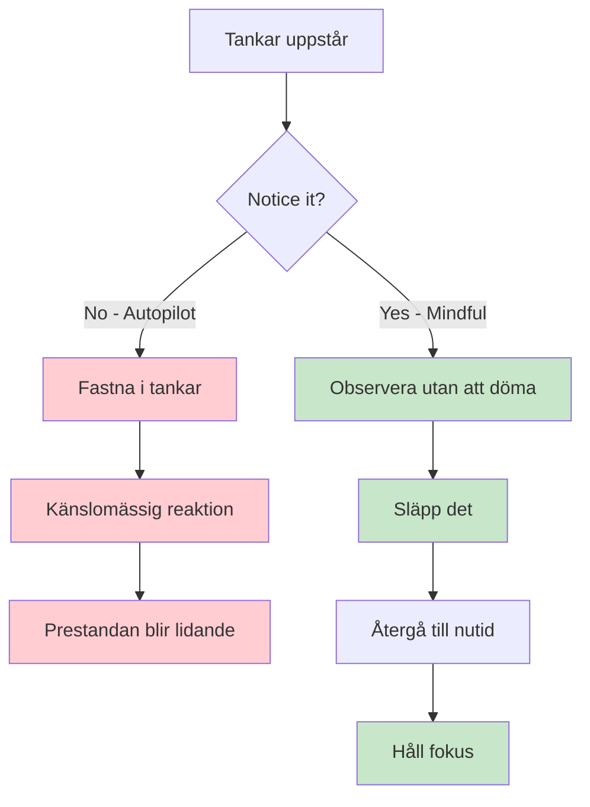
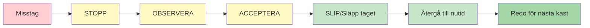

# Mindfulness för boulespelare
<AdBanner />

Mindfulness är ett av de kraftfullaste verktygen som finns tillgängliga för idrottare. Det är inte mystiskt eller komplicerat – det är helt enkelt övningen i att vara uppmärksam på nuet utan att döma.

::: tip Kärnprincipen
**Mindfulness handlar inte om att tömma sinnet. Det handlar om att välja vart du ska rikta din uppmärksamhet.** Du kan inte hindra tankar från att uppstå, men du kan välja att inte följa dem.
:::

## Vad är Mindfulness?

Mindfulness innebär att vara helt närvarande och medveten om:
- Var du är
- Vad du gör
- Hur du känner dig

...utan att bli överväldigad av vad som händer runt omkring dig eller reagera på det.

För boulespelare betyder detta:
- Att vara helt närvarande för varje kast
- Att lägga märke till tankar utan att fastna i dem
- Återhämtar sig snabbt från misstag
- Att hålla sig lugn under press

## Vetenskapen bakom det

Mindfulness är inte bara filosofi – det stöds av gedigen forskning:

### Effekter på din hjärna
- **Minskar aktiviteten i amygdalan** (hjärnans larmsystem)
- **Stärker prefrontala cortex** (beslutsfattande och fokus) – detta hjälper dig att tänka klart under planering
- **Förbättrar din förmåga att stilla sinnet** vid behov - avgörande för att komma åt flödestillstånd under utförande
- **Förbättrar kopplingarna** mellan hjärnregioner
- **Skapar varaktiga strukturella förändringar** med regelbunden övning

### Effekter på prestanda
| Förmån | Hur det hjälper ditt spel |
|---------|----------------------|
| Stressreducering | Lägre kortisol, stadigare händer |
| Bättre fokus | Färre distraktioner, tydligare beslut |
| Känslomässig kontroll | Låt inte dåliga kast växa i en spiral |
| Snabbare återhämtning | Återhämta sig snabbt från misstag |
| Förbättrad sömn | Bättre vila, bättre prestation |

## Varför boulespelare behöver vara medvetna

Petanque har unika mentala utmaningar:

1. **Tid mellan kasten** - Gott om möjligheter till negativa tankar
2. **Synliga misstag** - Alla ser när du missar
3. **Lagpress** - Ditt kast påverkar dina partners
4. **Långa tävlingar** - Mental trötthet under många timmar
5. **Jämna matcher** - Hög press i avgörande ögonblick

Mindfulness hjälper dig att hantera allt detta.

## Kärnfärdigheten: Icke-dömande medvetenhet

Nyckelordet är &quot;icke-dömande&quot;.

<AdInArticle />

::: danger Dömande tänkande (lägger till emotionell tyngd)
❌ &quot;Det var ett fruktansvärt kast&quot;
❌ &quot;Jag saknar alltid dessa&quot;
❌ &quot;Mina lagkamrater måste vara frustrerade&quot;

**Resultat:** Spiral av negativa känslor, spänning, sämre prestation
:::

::: tip Icke-dömande medvetenhet (bara observerar)
✅ &quot;Kastet gick åt vänster om målet&quot;
✅ &quot;Jag märker att jag känner mig spänd&quot;
✅ &quot;Mina tankar vandrar till partituret&quot;

**Resultat:** Tydlig observation, snabb återhämtning, bibehållen fokus
:::

**Skillnaden?** Omdöme ger känslomässig tyngd och utlöser reaktioner. Medvetenhet observerar bara och låter dig reagera skickligt.

## Komma igång

Du behöver inte timmar av meditation. Börja med dessa enkla övningar:

### 1. Medveten andning (2 minuter)
- Sitt bekvämt
- Fokusera på din andning
- När dina tankar vandrar iväg (det kommer att göra det), återvänd försiktigt till andetaget
- Ingen dom om vandring - bara återvänd

### 2. Kroppsskanning (5 minuter)
- Lägg märke till känslor i dina fötter
- Flytta långsamt uppmärksamheten uppåt genom kroppen
- Bara observera – försök inte ändra på något
- Lägg märke till spänningsområden utan att bekämpa dem

### 3. Medvetna stunder
- Välj en vardagsaktivitet (dricka kaffe, promenad)
- Gör det med full uppmärksamhet
- Lägg märke till alla inblandade förnimmelser
- När dina tankar vandrar, återvänd till aktiviteten

## Mindfulness i tävling

### Före matchen
- Ta 2-3 minuter för medveten andning
- Sätt en intention för hur du vill spela (inte resultatet, utan processen)
- Lägg märke till all nervositet utan att försöka eliminera den

### Under spelet
- Använd din pre-shot-rutin som ett ankare för mindfulness
- Mellan kasten, återvänd uppmärksamheten till nuet
- Lägg märke till tankar om poäng/resultat och släpp dem sedan

### Efter misstag

::: warning SOAS-metoden (ditt återställningsverktyg)
**S**top - Pausa innan du reagerar
**OBSERVERA - Vad hände? Vad känner jag?**
**A**acceptera - Det hände. Det är kört.
**S**lip (Släpp taget) - Släpp det, återgå till nuet

**Tid som behövs:** 10 sekunder
**Använd det:** Efter varje misstag, dålig studs eller frustrerande ögonblick
:::

## I detta avsnitt

- **[Tekniker](/sv/utbildning/mindfulness/tekniker)** - Praktiska övningar du kan använda
- **[Daglig övning](/sv/utbildning/mindfulness/daglig-övning)** - Bygg in mindfulness i ditt liv

## Sammanfattning: Mindfulnessregler

::: tip Regel nr 1: Medvetenhetsregeln
**Observera utan att döma.**
Lägg märke till tankar och känslor utan att kategorisera dem som bra eller dåliga.
:::

::: tip Regel #2: SOAS-regeln
**Stoppa, Observera, Acceptera, Halka (släppa taget).**
Din 10-sekunders återställning efter misstag. Använd den varje gång.
:::

::: tip Regel nr 3: Den nuvarande regeln
**Du kan bara kontrollera detta ögonblick, detta kast.**
Tidigare kast är avklarade. Framtida kast finns inte än. Var här nu.
:::

::: tip Regel #4: Övningsregeln
**Börja smått: 2–5 minuter dagligen.**
Konsekvens överträffar varaktighet. Daglig övning bygger upp färdigheten.
:::

## Viktig slutsats

> Mindfulness handlar inte om att tömma sinnet. Det handlar om att välja vart man ska rikta sin uppmärksamhet.

Du kan inte hindra tankar från att uppstå. Men du kan välja att inte följa dem ner i kaninhålet.

<AdBanner />
