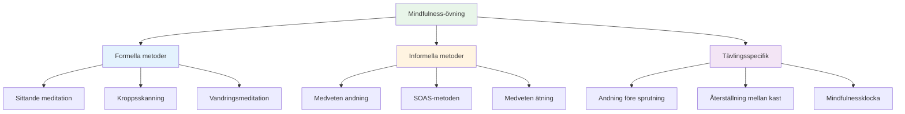

# Mindfulness-tekniker
<AdBanner />

Här är praktiska tekniker du kan använda för att utveckla mindfulness. Börja med en eller två och bygg vidare därifrån.

::: tip Den stora idén
**Mindfulness är en färdighet, inte en talang.** Precis som att sikta eller skjuta förbättras det med övning. Börja smått, var konsekvent, och fördelarna ökar med tiden.
:::

## Formella metoder

Det här är dedikerade mindfulness-pass – tid avsatt specifikt för övning.

### Sittande meditation

Grunden för mindfulness-praktik.

**Hur man gör det:**
1. Sitt bekvämt (stol eller golv)
2. Slut ögonen eller mjuka upp blicken
3. Fokusera på din andning – känslan av luft som kommer in och ut
4. När tankar uppstår, lägg märke till dem utan att döma
5. Återvänd försiktigt till andetaget
6. Börja med 5 minuter, öka till 15-20

**Tips:**
- Tankar kommer – det är normalt
- Varje gång du märker att du har vandrat och återvänder, bygger du upp färdigheten.
- Döm inte dig själv för att du vandrar
- Konsekvens är viktigare än varaktighet

### Kroppsskanning

Utvecklar medvetenhet om fysiska förnimmelser.

**Hur man gör det:**
1. Ligg ner eller sitt bekvämt
2. Börja vid dina fötter – lägg märke till eventuella förnimmelser
3. Flytta långsamt uppmärksamheten uppåt: vrister, vader, knän...
4. Lägg märke till utan att försöka ändra något
5. Om du känner spänning, andas in i det området
6. Fortsätt till toppen av ditt huvud
7. Tar 10–20 minuter

**För boule:** Hjälper dig att märka spänningar innan de påverkar ditt kast.

### Vandringsmeditation

Mindfulness i rörelse – bra förberedelse inför pisten.

**Hur man gör det:**
1. Gå långsamt och medvetet
2. Känn varje del av steget: lyft, flytta, placera
3. Lägg märke till känslorna i dina fötter och ben
4. När dina tankar vandrar, återvänd till de fysiska förnimmelserna
5. 5-10 minuter räcker

## Informella metoder

<AdInArticle />

Dessa integrerar mindfulness i dagliga aktiviteter.

### Medveten andning

Den enklaste tekniken – tillgänglig när som helst.

**Övningen:**
- Ta 3 långsamma, avsiktliga andetag
- Fokusera helt på känslan
- Använd den som en återställningsknapp under hela dagen

**När ska det användas:**
- Innan man kliver in i cirkeln
- När du märker att stressen ökar
- Mellan spelen
- Vilket övergångsmoment som helst

### SOAS-metoden

Ditt verktyg för att hantera svåra stunder.

| Steg | Handling | Exempel |
|------|--------|---------|
| **Stopp | Pausa, reagera inte | Räck inte upp händerna efter en miss |
| **Observera | Lägg märke till vad som händer | &quot;Jag känner mig frustrerad. Jag har spänt i käken.&quot; |
| **Acceptera | Erkänn utan att kämpa | &quot;Så här känner jag mig just nu.&quot; |
| **Glida | Släpp det, gå vidare | Släpp spänningen, återvänd till nuet |

**Öva på detta i vardagen** så att det sker automatiskt i tävling.

### Medveten ätning

En förvånansvärt kraftfull övning.

**Hur man gör det:**
- Ät en måltid utan distraktioner (ingen telefon, TV)
- Lägg märke till färgerna, dofterna, texturerna
- Tugga långsamt, smaka noggrant
- Märk ut när du är nöjd

**Varför det är viktigt:** Bygger upp den allmänna förmågan att vara uppmärksam.

### Sensorisk medvetenhet

Att engagera sig fullt ut i din omgivning.

**5-4-3-2-1-tekniken:**
- Lägg märke till 5 saker du kan se
- Lägg märke till 4 saker du kan höra
- Lägg märke till 3 saker du kan känna
- Lägg märke till 2 saker du kan känna lukten av
- Lägg märke till 1 sak du kan smaka

**Använd detta:** När dina tankar rusar inför en stor match.

## Tävlingsspecifika tekniker

### Andningen före sprutan

Integrera andningen i din rutin:

1. Innan du går in i cirkeln, ta ett medvetet andetag
2. Känn dina fötter på marken
3. Låt axlarna sänkas vid utandning
4. Börja sedan med din rutin

### Återställning mellan kast

Vad man ska göra medan man väntar:

- Lägg märke till vart din uppmärksamhet går
- Om det går till poäng/resultat, bekräfta och återgå till presentationen
- Fokusera på något neutralt (din andning, känslan av att spela boule)
- Håll dig fysiskt avslappnad

### &quot;Mindfulnessklockan&quot;

Använd triggers för att påminna dig om att vara närvarande:

- Varje gång du plockar upp ett klot
- När du hör att jacken kastas
- När du kliver in i cirkeln
- När ett spel slutar

Varje trigger = ett medvetet andetag.

## Bygga din praktik

### Vecka 1-2: Grunden
- 5 minuter sittande meditation dagligen
- 3 medvetna andetag före varje måltid
- Öva på SOAS en gång när något mindre går fel

### Vecka 3-4: Expansion
- Öka meditationen till 10 minuter
- Lägg till kroppsskanning två gånger per vecka
- Använd mindfulness-klockutlösare i praktiken

### Vecka 5+: Integration
- 15–20 minuters daglig träning
- Fullständig integration i rutinen för behandling före sprutning
- SOAS blir automatisk respons på misstag

## Vanliga utmaningar

| Utmaning | Lösning |
|-----------|----------|
| &quot;Jag kan inte sluta tänka&quot; | Det ska du inte. Lägg bara märke till och kom tillbaka. |
| &quot;Jag har inte tid&quot; | Börja med 3 minuter. Alla har 3 minuter. |
| &quot;Jag somnar&quot; | Försök att sitta istället för att ligga ner, eller öva tidigare på dagen. |
| &quot;Det känns meningslöst&quot; | Fördelar kommer med konsekvens. Lita på processen. |
| &quot;Jag glömmer att öva&quot; | Ställ in en daglig påminnelse. Koppla den till en befintlig vana. |

## Viktig slutsats

> Mindfulness är en färdighet. Liksom alla färdigheter förbättras den med övning.

Börja smått. Var konsekvent. Fördelarna ökar med tiden.

<AdBanner />
