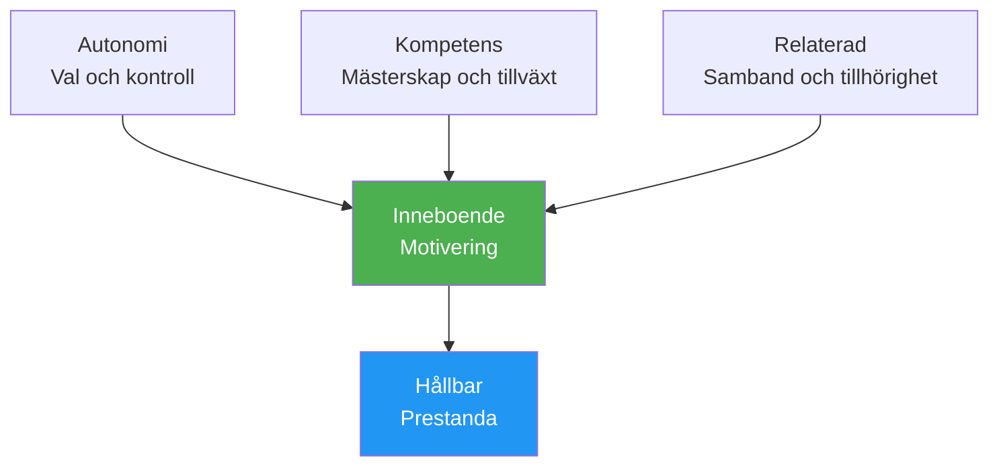

# Motivationens psykologi

Att förstå VARFÖR du är motiverad – inte bara att du är det – hjälper dig att bygga en hållbar drivkraft som inte är beroende av resultat.

---

## Intrinsisk vs. Extrinsisk Motivation

### Extrinsisk motivation

Motivation driven av externa belöningar eller påtryckningar:

| Källa | Exempel |
|--------|---------|
| **Troféer/medaljer** | &quot;Jag vill vinna mästerskapet&quot; |
| **Rankingar** | &quot;Jag vill vara topp 10 i min region&quot; |
| **Erkännande** | &quot;Jag vill att andra ska se mig som en bra spelare&quot; |
| **Undvik kritik** | &quot;Jag vill inte göra mitt lag besviken&quot; |
| **Finansiell** | &quot;Jag vill vinna prispengar&quot; |

**Egenskaper:**
- Kan ge stark initial motivation
- Ofta minskar med tiden
- Beroende på faktorer utanför din kontroll
- Kan undergräva njutningen

### Intrinsisk motivation

Motivation från själva aktiviteten:

| Källa | Exempel |
|--------|---------|
| **Herravälde** | &quot;Jag älskar känslan av att bli bättre&quot; |
| **Flöde** | &quot;Tiden försvinner när jag spelar&quot; |
| **Utmaning** | &quot;Jag tycker om att testa mig själv mot problem&quot; |
| **Uttryck** | &quot;Petanque låter mig uttrycka vem jag är&quot; |
| **Glädje** | &quot;Jag älskar helt enkelt att spela det här spelet&quot; |

**Egenskaper:**
- Mer hållbart över tid
- Oberoende av resultat
- Kopplad till djupare tillfredsställelse
- Förbättrar prestandan naturligt

::: tip Forskningen
Studier visar konsekvent att **inre motivation leder till bättre prestationer, mer uthållighet och större välbefinnande** än enbart yttre motivation.
:::

---

## Självbestämmande teori (SDT)

SDT, utvecklad av Deci &amp; Ryan, identifierar tre grundläggande psykologiska behov som driver inre motivation:

### 1. Autonomi

**Behovet av att känna att man har kontroll över sina val**

| Stöder autonomi | Undergräver autonomin |
|-------------------|---------------------|
| Att välja ditt träningsfokus | Att få veta exakt vad man ska göra |
| Att sätta dina egna mål | Extern press att prestera |
| Att bestämma hur man ska öva | Tvingat deltagande |
| Att ha inflytande över teamets beslut | Kontrollera tränare/lagkamrater |

**För boule:**
- Välj vilka aspekter du vill arbeta med
- Sätt din egen utvecklingsväg
- Fatta taktiska beslut själv
- Ta ansvar för ditt träningsschema

### 2. Kompetens

**Behovet av att känna sig effektiv och kapabel**

| Stödjer kompetens | Undergräver kompetens |
|---------------------|----------------------|
| Lämpliga utmaningar | Uppgifter för lätta eller för svåra |
| Tydlig feedback på framsteg | Ingen feedback eller bara negativ |
| Synlig förbättring | Stagnation utan förklaring |
| Färdighetsanpassad tävling | Konstant övermatchning |

**För boule:**
- Spåra dina förbättringsmått
- Sök lämpliga tävlingsnivåer
- Fira små vinster
- Få specifik feedback (inte bara resultat)

### 3. Relationalitet

**Behovet av kontakt med andra**

| Stödjer släktskap | Undergräver släktskap |
|----------------------|------------------------|
| Positiva teamrelationer | Isolering |
| Delade mål med lagkamrater | Rent individuellt fokus |
| Gemenskapstillhörighet | Uteslutning eller konflikt |
| Mentorskap (givande/mottagande) | Endast konkurrenskraftiga relationer |

**För boule:**
- Bygg genuina teamkontakter
- Hitta utbildningspartners
- Delta i klubbens gemensamma aktiviteter
- Dela kunskap med andra

---

## SDT-formeln

```
Autonomy + Competence + Relatedness = Intrinsic Motivation
```

När alla tre behoven är uppfyllda blomstrar den inre motivationen naturligt.



---

## Motivationstyper Spektrum

SDT beskriver motivation på ett spektrum från extern till intern:

| Typ | Beskrivning | Exempel | Kvalitet |
|------|-------------|---------|---------|
| **Motivation** | Ingen motivation | &quot;Varför bry sig?&quot; | ❌ |
| **Extern** | För belöningar/undvika straff | &quot;Jag ska få en trofé&quot; | ⭐ |
| **Introjekterad** | Inre press, skuld | &quot;Jag borde öva&quot; | ⭐⭐ |
| **Identifierad** | Värderat resultat | &quot;Detta hjälper mig att förbättra mig&quot; | ⭐⭐⭐ |
| **Integrerad** | I linje med värderingar | &quot;Det här är vem jag är&quot; | ⭐⭐⭐⭐⭐ |
| **Inneboende** | Ren njutning | &quot;Jag älskar det här&quot; | ⭐⭐⭐⭐⭐⭐ |

**Mål:** Flytta din motivation mot den inre änden av spektrumet.

---

## Självbedömning: Din motivationsprofil

Betygsätt varje påstående (1 = Inte alls, 5 = Helt):

**Extrinsiska indikatorer:**
| Påstående | Göra |
|-----------|-------|
| Jag spelar främst för att vinna turneringar | /5 |
| Erkännande från andra är viktigt för mig | /5 |
| Jag skulle tappa intresset utan framgång i tävlingen | /5 |
| **Extrinsisk total** | /15 |

**Intrinsiska indikatorer:**
| Påstående | Göra |
|-----------|-------|
| Jag skulle spela även om det inte fanns några tävlingar | /5 |
| Känslan av förbättring gör mig entusiastisk | /5 |
| Jag tappar tidsuppfattningen när jag spelar | /5 |
| **Intrinsisk total** | /15 |

**Tolkning:**
- Högre intrinsisk totalsumma = mer hållbar motivation
- Balansen är bra, men se till att det intrinsiska ≥ det yttre
- Om det är yttre &gt;&gt; inre, återknyt kontakten med din kärlek till spelet

---

## Att skifta mot inre motivation

### Återknyt kontakten med glädjen

- **Kommer du ihåg varför du började** — Vad lockade dig från början?
- **Spela utan insatser** — Enstaka sessioner &quot;bara för skojs skull&quot;
- **Uppskatta stunder** — Lägg märke till när du njuter av spelet

### Fokusera på mästerskap

- **Sätt upp lärandemål** inte bara resultatmål
- **Fira förbättringar** oavsett resultat
- **Omfamna utmaningar** som tillväxtmöjligheter

### Bygg autonomi

- **Gör dina egna val** gällande träning
- **Ta ägarskap över din utvecklingsväg**
- **Motstå yttre tryck** för att träna på vissa sätt

### Odla kontakt

- **Investera i relationer** bortom konkurrensen
- **Dela kunskap** med spelare som utvecklas
- **Hitta din gemenskap** inom sporten

---

## Relaterat innehåll

- [Målsättning](/sv/utbildning/motivation/) — Att sätta effektiva mål
- [Att bibehålla motivationen](/sv/utbildning/motivation/bibehålla) — Långsiktig hållbarhet
- [Zonen](/sv/utbildning/mentalt-spel/zonen/) — Intrinsisk motivation och flöde
- [Teamdynamik](/sv/utbildning/teamdynamik/) — Samhörighet i teamkontext

