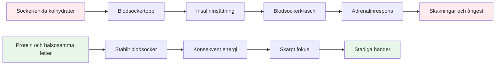

# Näring för precisionsprestanda

Boule är en precisionssport, inte en uthållighetssport. Dina näringsbehov skiljer sig från en maratonlöpares eller en fotbollsspelares. Det som är viktigast är **stabilitet i hjärnans bränsle** – att hålla ditt sinne skarpt och dina händer stadiga under en lång tävlingsdag.

::: tip Den stora idén
**Din hjärna är ditt viktigaste verktyg i boule. Ge den stabil bränsle, inte berg-och-dalbaneenergi.** Fokusera på protein, hälsosamma fetter och att hålla dig hydrerad. Undvik sockertoppar.
:::

## Precisionsidrottarens utmaning

Till skillnad från högintensiva sporter kräver inte boule massiva glykogenlager eller snabb energipåfyllning. Det som krävs är:

- **Stabilt blodsocker** - inga toppar eller krascher
- **Konsekvent mental klarhet** - fokus som varar hela dagen
- **Stadig hand** - inga skakningar eller skakningar
- **Lugna nerverna** - låg ångest och stressreaktion

Din näringsstrategi bör optimera för dessa faktorer, inte för rå energiproduktion.

## Problemet med socker och enkla kolhydrater

Många idrottare väljer en kolhydratrik diet som standard. För boulespelare kan detta faktiskt försämra prestationen.

### Blodsockrets berg-och-dalbana

När du äter socker eller enkla kolhydrater:
1. Blodsockret stiger snabbt
2. Insulin frisätts för att sänka det
3. Blodsockret sjunker (hypoglykemi)
4. Din kropp frigör adrenalin för att kompensera
5. Du upplever skakningar, ångest och dålig fokus

**Detta är motsatsen till vad du behöver för precision.**

### Symtom på blodsockerinstabilitet

| Symptom | Påverkan på prestanda |
|---------|----------------------|
| Darrande händer | Inkonsekvent utgåva |
| Koncentrationssvårigheter | Dåligt beslutsfattande |
| Irritabilitet | Lagkonflikt, dåligt lugn |
| Trötthet efter måltider | Eftermiddagssvacka |
| Ångest | Tryckkänslighet |
| Hjärndimma | Långsamt taktiskt tänkande |

## En bättre metod: Stabil energi

Målet är att förse din hjärna med regelbundet bränsle utan berg-och-dalbanan.

### Viktiga principer

1. **Prioritera protein och hälsosamma fetter** - De ger långsam, stadig energi
2. **Välj komplexa kolhydrater framför enkla** - Om du äter kolhydrater, välj de som smälter långsamt
3. **Undvik sockertoppar** - Speciellt före och under tävling
4. **Håll dig hydrerad** - Uttorkning påverkar koncentrationen avsevärt
5. **Ät regelbundet** - Låt dig inte bli för hungrig

### Livsmedel som hjälper

| Mattyp | Exempel | Varför det fungerar |
|-----------|----------|--------------|
| Protein | Ägg, nötter, ost, kött | Långsam matsmältning, stabil energi |
| Hälsosamma fetter | Avokado, olivolja, nötter | Långvarigt bränsle |
| Komplexa kolhydrater | Grönsaker, baljväxter | Fiber saktar upptaget |
| Frukter med lågt sockerinnehåll | Bär, äpplen | Näringsämnen utan spik |

### Livsmedel att begränsa

| Mattyp | Exempel | Varför det är problematiskt |
|-----------|----------|---------------------|
| Socker | Godis, läsk, bakverk | Snabb topp och krasch |
| Vitt bröd/pasta | Smörgåsar, pastarätter | Snabb omvandling till socker |
| Fruktjos | Apelsinjuice, smoothies | Koncentrerat socker |
| Energidrycker | De flesta kommersiella varumärken | Socker + koffein-krasch |

## Näringslära på tävlingsdagen

### Före tävlingen

**2–3 timmar innan:**
- Balanserad måltid med protein, fett och grönsaker
- Undvik tunga kolhydrater som kan orsaka dåsighet
- Exempel: Ägg med grönsaker, eller sallad med kyckling

**1 timme innan:**
- Lättare mellanmål om det behövs
- Nötter, ost eller en liten portion protein
- Undvik allt som är sockerartat

### Under tävlingen

**Mellan spelen:**
- Vatten (viktigast)
- Små proteinsnacks (nötter, ost, kött)
- Undvik söta snacks och drycker

**Tecken på att du behöver äta:**
- Koncentrationssvårigheter
- Irritabilitet
- Känsla av skakighet
- Huvudvärk

### Efter tävlingen

- Fyll på med en balanserad måltid
- Rehydrera helt
- &quot;Belöna&quot; inte dig själv med socker – det kommer att påverka din återhämtning

## Hydrering

Uttorkning påverkar kognitiv funktion innan du känner dig törstig.

### Riktlinjer

- **Börja med att dricka vätska** - Drick vatten under dagen före tävlingen
- **Under lek** - Drick vatten regelbundet, vänta inte tills du är törstig
- **Undvik överskott av koffein** - Det är ett vätskedrivande medel
- **Var uppmärksam på tecken** - Huvudvärk, mörk urin, trötthet

### Hur mycket?

En allmän riktlinje: sikta på ljusgul urin. Om den är mörk behöver du mer vatten.

## Lågkolhydratalternativet

Vissa precisionsidrottare använder sig av lågkolhydratkost eller ketogen kost. Teorin:

**Potentiella fördelar:**
- Mycket stabilt blodsocker (inga toppar möjliga)
- Konsekvent mental klarhet
- Minskad ångest och skakningar
- Inga energikrascher på eftermiddagen

**Att tänka på:**
- Kräver anpassningsperiod (1-2 veckor)
- Inte lämplig för alla
- Kräver planering och engagemang
- Rådfråga en vårdgivare först

Detta är en avancerad strategi – inte nödvändig för alla, men värd att överväga om blodsockrets stabilitet är ett betydande problem för dig.

## Praktiska tips

### Enkla tävlingssnacks
- Blandade nötter (osaltade)
- Hårdkokta ägg
- Ostbitar
- Jerky nötkött eller kalkon
- Grönsaker med hummus
- Oliver

### Vad man ska undvika
- Snacksautomater
- Sockrade sportdrycker
- Bakverk och bakverk
- Godis- och chokladkakor
- De flesta &quot;energibars&quot; (kontrollera sockerhalten)

## Viktig slutsats

> Din hjärna är ditt viktigaste verktyg i boule. Ge den stabil bränsle, inte berg-och-dalbaneenergi.

Fokusera på protein, hälsosamma fetter och att hålla dig hydrerad. Undvik sockertoppar. Din koncentration, ditt lugn och dina stadiga händer kommer att tacka dig.

