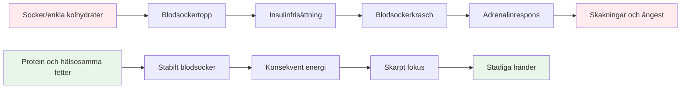
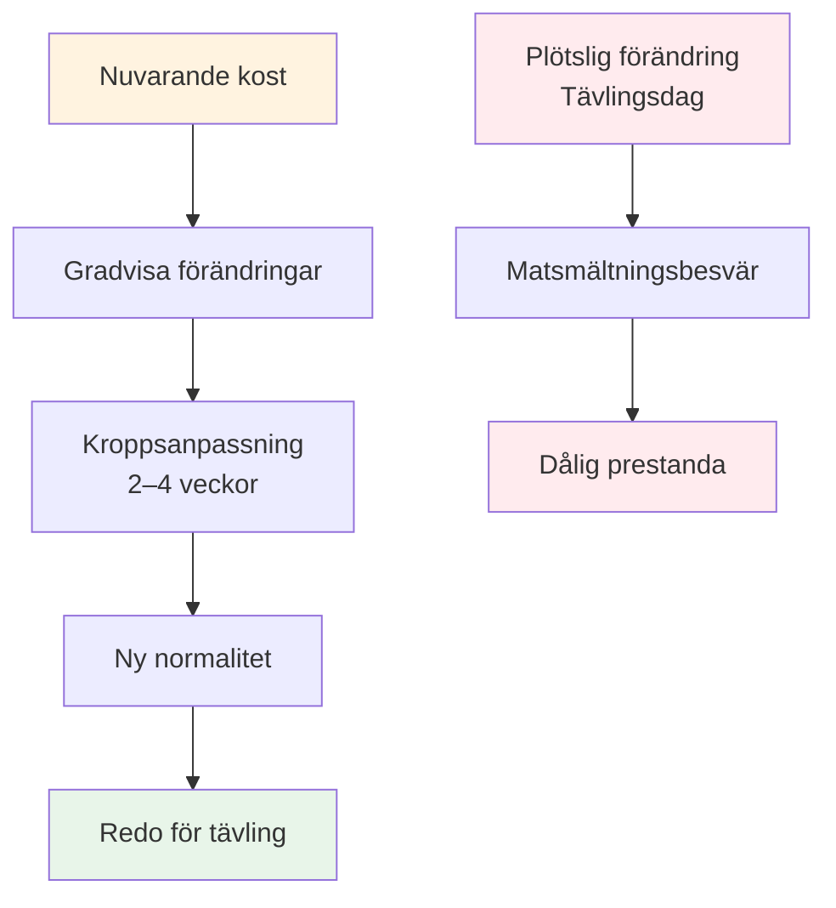

# Näring för precisionsprestanda


Boule är en precisionssport, inte en uthållighetssport. Dina näringsbehov skiljer sig från en maratonlöpares eller en fotbollsspelares. Det som är viktigast är **stabilitet i hjärnans bränsle** – att hålla ditt sinne skarpt och dina händer stadiga under en lång tävlingsdag.

::: tip Den stora idén
**Din hjärna är ditt viktigaste verktyg i boule. Ge den stabil bränsle, inte berg-och-dalbaneenergi.** Fokusera på protein, hälsosamma fetter och att hålla dig hydrerad. Undvik sockertoppar.
:::



## Precisionsidrottarens utmaning

Till skillnad från högintensiva sporter kräver inte boule massiva glykogenlager eller snabb energipåfyllning. Det som krävs är:

- **Stabilt blodsocker** - inga toppar eller krascher
- **Konsekvent mental klarhet** - fokus som varar hela dagen
- **Stadig hand** - inga skakningar eller skakningar
- **Lugna nerverna** - låg ångest och stressreaktion

Din näringsstrategi bör optimera för dessa faktorer, inte för rå energiproduktion.

## Problemet med socker och enkla kolhydrater

Många idrottare väljer en kolhydratrik diet som standard. För boulespelare kan detta faktiskt försämra prestationen.

### Blodsockrets berg-och-dalbana

När du äter socker eller enkla kolhydrater:
1. Blodsockret stiger snabbt
2. Insulin frisätts för att sänka det
3. Blodsockret sjunker (hypoglykemi)
4. Din kropp frigör adrenalin för att kompensera
5. Du upplever skakningar, ångest och dålig fokus

**Detta är motsatsen till vad du behöver för precision.**

### Symtom på blodsockerinstabilitet

| Symptom | Påverkan på prestanda |
|---------|----------------------|
| Darrande händer | Inkonsekvent utgåva |
| Koncentrationssvårigheter | Dåligt beslutsfattande |
| Irritabilitet | Lagkonflikt, dåligt lugn |
| Trötthet efter måltider | Eftermiddagssvacka |
| Ångest | Tryckkänslighet |
| Hjärndimma | Långsamt taktiskt tänkande |

## En bättre metod: Stabil energi

Målet är att förse din hjärna med regelbundet bränsle utan berg-och-dalbanan.

### Viktiga principer

1. **Prioritera protein och hälsosamma fetter** - De ger långsam, stadig energi
2. **Välj komplexa kolhydrater framför enkla** - Om du äter kolhydrater, välj de som smälter långsamt
3. **Undvik sockertoppar** - Speciellt före och under tävling
4. **Håll dig hydrerad** - Uttorkning påverkar koncentrationen avsevärt
5. **Ät regelbundet** - Låt dig inte bli för hungrig

### Livsmedel som hjälper

| Mattyp | Exempel | Varför det fungerar |
|-----------|----------|--------------|
| Protein | Ägg, nötter, ost, kött | Långsam matsmältning, stabil energi |
| Hälsosamma fetter | Avokado, olivolja, nötter | Långvarigt bränsle |
| Komplexa kolhydrater | Grönsaker, baljväxter | Fiber saktar upptaget |
| Frukter med lågt sockerinnehåll | Bär, äpplen | Näringsämnen utan spik |

### Livsmedel att begränsa

| Mattyp | Exempel | Varför det är problematiskt |
|-----------|----------|---------------------|
| Socker | Godis, läsk, bakverk | Snabb topp och krasch |
| Vitt bröd/pasta | Smörgåsar, pastarätter | Snabb omvandling till socker |
| Fruktjos | Apelsinjuice, smoothies | Koncentrerat socker |
| Energidrycker | De flesta kommersiella varumärken | Socker + koffein-krasch |

## Näringslära på tävlingsdagen

### Före tävlingen

**2–3 timmar innan:**
- Balanserad måltid med protein, fett och grönsaker
- Undvik tunga kolhydrater som kan orsaka dåsighet
- Exempel: Ägg med grönsaker, eller sallad med kyckling

**1 timme innan:**
- Lättare mellanmål om det behövs
- Nötter, ost eller en liten portion protein
- Undvik allt som är sockerartat

### Under tävlingen

**Mellan spelen:**
- Vatten (viktigast)
- Små proteinsnacks (nötter, ost, kött)
- Undvik söta snacks och drycker

**Tecken på att du behöver äta:**
- Koncentrationssvårigheter
- Irritabilitet
- Känsla av skakighet
- Huvudvärk

### Efter tävlingen

- Fyll på med en balanserad måltid
- Rehydrera helt
- &quot;Belöna&quot; inte dig själv med socker – det kommer att påverka din återhämtning

## Hydrering

Uttorkning påverkar kognitiv funktion innan du känner dig törstig.

### Riktlinjer

- **Börja med att dricka vätska** - Drick vatten under dagen före tävlingen
- **Under lek** - Drick vatten regelbundet, vänta inte tills du är törstig
- **Undvik överskott av koffein** - Det är ett vätskedrivande medel
- **Var uppmärksam på tecken** - Huvudvärk, mörk urin, trötthet

### Hur mycket?

En allmän riktlinje: sikta på ljusgul urin. Om den är mörk behöver du mer vatten.

## Lågkolhydratalternativet

Vissa precisionsidrottare använder sig av lågkolhydratkost eller ketogen kost. Teorin:

**Potentiella fördelar:**
- Mycket stabilt blodsocker (inga toppar möjliga)
- Konsekvent mental klarhet
- Minskad ångest och skakningar
- Inga energikrascher på eftermiddagen

**Att tänka på:**
- Kräver anpassningsperiod (1-2 veckor)
- Inte lämplig för alla
- Kräver planering och engagemang
- Rådfråga en vårdgivare först


Detta är en avancerad strategi – inte nödvändig för alla, men värd att överväga om blodsockrets stabilitet är ett betydande problem för dig.

## Mat som övning: Träna din kropp

::: warning Kritiskt koncept
**Mat är inte bara bränsle – det är något man tränar med.** Precis som du tränar ditt kast måste du öva på din kost för att din kropp ska bli bekväm med att äta på tävlingsdagen.
:::

### Varför livsmedelsrutiner är viktiga

Ditt matsmältningssystem är träningsbart. Det du äter regelbundet blir vad din kropp förväntar sig och hanterar bäst. Om du bara äter protein och grönsaker på tävlingsdagar kommer din kropp inte att anpassa sig till det.

**Problemet:**
- Att äta obekant mat på tävlingsdagen kan orsaka matsmältningsbesvär
- Din kropp behöver tid för att anpassa sig till nya matvanor
- Stress + obekant mat = potentiella magproblem
- Prestationsångest är tillräckligt dålig utan att det ger matsmältningsångest

**Lösningen:**
- Öva på din tävlingskost under träningen
- Gör din tävlingsdagsmat till en del av din vanliga rutin
- Träna din kropp att vara bekväm med mat med stabil energi

### Anpassningsprocessen



När du ändrar din kost:
1. **Vecka 1-2:** Din kropp anpassar sig till nya livsmedel, kan kännas annorlunda
2. **Vecka 3-4:** Anpassning sker, nya livsmedel känns normala
3. **Vecka 5+:** Din kropp mår bra och är effektiv med dessa livsmedel

**Det är därför du inte bara kan &quot;äta hälsosamt&quot; på tävlingsdagen och förvänta dig optimala resultat.**

### Hur du övar din kost

#### 1. Börja under träningen

**Öva på din tävlingsdagsmat under träningspassen:**
- Ät samma måltid före träning som du skulle äta före tävling
- Ta med samma snacks som du skulle ta med till en tävling
- Lägg märke till hur din kropp reagerar
- Anpassa utifrån vad som fungerar

**Exempel på träningsdag:**
```
2-3 hours before: Eggs with vegetables (same as competition)
During training: Water + nuts (same as competition)
After training: Balanced meal with protein
```

#### 2. Gör det till ditt normala

**Inte ha en &quot;tävlingsdiet&quot; och en &quot;vanlig diet&quot;** – detta skapar två problem:
- Din kropp anpassar sig aldrig helt till någon av dem
- Tävlingsmat känns obekant och stressigt

**I stället:**
- Gör mat med stabil energi till din dagliga norm
- Din kropp blir effektivare på att använda protein och fett
- Tävlingsdagen känns normal, inte annorlunda
- Inga överraskningar i matsmältningen

#### 3. Testa och förfina

**Använd träning för att experimentera:**

| Testa | Vad man bör lägga märke till | Justera |
|------|----------------|--------|
| Måltider före träning | Energinivåer, fokus | Hitta ditt optimala fönster |
| Olika proteinkällor | Matsmältning, komfort | Identifiera vad som fungerar bäst |
| Mellanmålstyper | Hållbar energi | Hitta dina favoritsnacks |
| Hydreringsmängder | Koncentration, toalettpauser | Balansintag |

**För en enkel logg:**
- Vad du åt och när
- Hur du kände dig under träningen
- Energinivåer och fokus
- Eventuella matsmältningsproblem

#### 4. Bygg komfort och självförtroende

**Den psykologiska fördelen:**

När du har övat på din kost hundratals gånger under träning:
- Du vet exakt hur din kropp kommer att reagera
- Ingen oro över matval
- En sak mindre att oroa sig för på tävlingsdagen
- Förtroende för dina förberedelser

**Detta är samma princip som att öva ditt kast** – repetition bygger komfort och pålitlighet.

### Vanliga anpassningsutmaningar

::: details Övergång från högkolhydratkost till stabil energikost

**Utmaning:** Du är van vid bröd, pasta och söta snacks

**Anpassningsperiod:** 2–4 veckor

**Vad du kan förvänta dig:**
- Vecka 1: Kan kännas annorlunda, sug efter gammal mat
- Vecka 2: Energin stabiliseras, suget minskar
- Vecka 3-4: Nytt normalvärde, kroppen effektiv med fett/protein

**Hur man övar:**
- Börja med en måltid i taget
- Byt först ut enkla kolhydrater mot komplexa kolhydrater
- Öka gradvis protein och hälsosamma fetter
- Öva först under träning med låga insatser
:::

::: details Att hitta mat som fungerar för dig

**Utmaning:** Alla smälter inte samma mat lika bra

**Vad ska testa:**
- Olika proteinkällor (ägg kontra kött kontra nötter)
- Måltidernas tidpunkt (2 timmar vs. 3 timmar före)
- Portionsstorlekar (för mycket = trög, för lite = hungrig)
- Specifika livsmedel som orsakar obehag

**Övningsmetod:**
- Testa en variabel i taget
- Ge varje test 2–3 träningstillfällen
- Notera vad som får dig att må bäst
- Skapa din personliga &quot;tävlingsmeny&quot;
:::

::: details Att hantera turneringsmatmiljöer

**Utmaning:** Turneringar har ofta begränsade matalternativ

**Övningslösning:**
- Ta alltid med egna snacks (öva på detta)
- Undersök platser i förväg när det är möjligt
- Ha reservalternativ som du vet fungerar
- Öva på att äta i olika miljöer

**Mental förberedelse:**
- Lita inte på maten på stället
- Behandla mat som en del av din utrustning
- Packa det som du packar dina boulebollar
:::

### 30-dagars kostplan

**Mål:** Gör stabil energikost till din bekväma vardag

**Vecka 1-2: Grunden**
- Ersätt en måltid per dag med tävlingsliknande måltider
- Öva på kost före träning
- Börja ta med snacks till träningen
- Lägg märke till hur din kropp reagerar

**Vecka 3-4: Utökning**
- Gör två måltider per dag stabilt energifokuserade
- Öva på att äta hela tävlingsdagen på träningsdagarna
- Förfina dina mellanmålsval
- Skapa din lista över maträtter

**Vecka 5+: Mästerskap**
- Stabil energiätning är din nya normalitet
- Kroppen är helt anpassad
- Tävlingsdagen känns rutinmässig
- Förtroende för din kost

### Ditt tävlingsmatkit

**Öva på att packa detta inför varje träningspass:**

**Före tävling (2-3 timmar innan):**
- [ ] Proteinkälla (ägg, kött eller nötter)
- [ ] Grönsaker eller sallad
- [ ] Hälsosamt fett (avokado, olivolja, ost)

**Under tävling:**
- [ ] Vattenflaska (påfyllningsbar)
- [ ] Blandade nötter (små portioner)
- [ ] Hårdkokta ägg (om du kan hålla dig sval)
- [ ] Ostbitar eller oststrängar
- [ ] Jerky eller torkat kött
- [ ] Reservsnacks

**Ju mer du övar med det här kitet, desto mer automatiskt blir det.**

## Praktiska tips

### Enkla tävlingssnacks
- Blandade nötter (osaltade)
- Hårdkokta ägg
- Ostbitar
- Jerky nötkött eller kalkon
- Grönsaker med hummus
- Oliver

### Vad man ska undvika
- Snacksautomater
- Sockrade sportdrycker
- Bakverk och bakverk
- Godis- och chokladkakor
- De flesta &quot;energibars&quot; (kontrollera sockerhalten)

## Viktig slutsats

> Din hjärna är ditt viktigaste verktyg i boule. Ge den stabil bränsle, inte berg-och-dalbaneenergi. Och öva på din kost precis som du övar ditt kast – repetition bygger komfort och pålitlighet.

Fokusera på protein, hälsosamma fetter och att hålla dig hydrerad. Undvik sockertoppar. **Viktigast av allt: gör din tävlingsdagskost till din dagliga kost.** Din kropp behöver träning för att prestera som bäst.

**Kom ihåg:** Du skulle inte dyka upp till en turnering med en kastteknik du aldrig har övat på. Kom inte heller upp med en näringsstrategi du aldrig har övat på.

