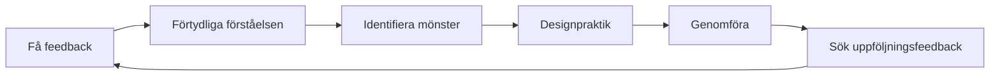

# Få och använda feedback

Feedback är ett av de kraftfullaste verktygen för utveckling – och ett av de mest underutnyttjade. Den här sidan lär dig hur du aktivt söker feedback, tar emot den konstruktivt och omvandlar den till konkreta förbättringar.

---

## Varför vi motsätter oss feedback

Innan du lär dig att söka feedback, förstå varför det är svårt:

### Egoskydd

Din hjärna behandlar kritik av din prestation som ett hot mot din identitet. Detta utlöser defensiva reaktioner:
- Avfärda feedbacken
- Att hitta orsaker till varför personen har fel
- Undviker liknande situationer i framtiden

### Bekräftelsebias

Vi söker naturligt information som bekräftar det vi redan tror. Om du tror att du är en bra pekare kommer du att lägga märke till dina lyckade poänger och bortförklara missarna.

### Skiftet i tillväxttänkande

::: tip Omformulera feedback
**Fast inställning:** &quot;Kritik betyder att jag har brister&quot;
**Tillväxttänkande:** &quot;Feedback är information som hjälper mig att förbättra mig&quot;

Skillnaden är inte positivitet – det är noggrannhet. Feedback är data, inte bedömning.
:::

---

## Källor till objektiv feedback

### 1. Kvantitativa data

Siffror ljuger inte eller mjukar upp sanningen:

| Metrisk | Vad det avslöjar |
|--------|-----------------|
| **Peknoggrannhet %** | Teknisk baslinje och trender |
| **Precision i första vs. sent spel** | Trötthets-/tryckeffekter |
| **Lyckad skjutning** | Efter avstånd, måltyp, matchsituation |
| **Carreau-procent** | Risktagande effektivitet |

### 2. Lagkamrater

Dina lagkamrater ser dig i tävling – när din självuppfattning är minst korrekt:

**Vad man ska fråga:**
- &quot;Hur framstår jag i dina ögon när vi ligger efter?&quot;
- &quot;Vad lägger du märke till med mitt tillvägagångssätt i jämna matcher?&quot;
- &quot;Vad är en sak jag skulle kunna göra för att bli en bättre lagkamrat?&quot;

### 3. Motståndare

Samtal efter matchen med betrodda motståndare kan vara avslöjande:

**Vad man ska fråga:**
- &quot;Vad försökte du utnyttja i mitt spel?&quot;
- &quot;Var det något som förvånade dig med hur jag spelade?&quot;

### 4. Tränare/Erfarna spelare

Extern expertis ger perspektiv som du inte kan skapa själv:

**Vad man ska fråga:**
- &quot;Vad är den största skillnaden mellan min potential och min nuvarande prestation?&quot;
- &quot;Vilket mönster ser du i mina missar?&quot;
- &quot;Vad skulle du prioritera om du coachade mig?&quot;

### 5. Videoanalys

Den mest objektiva spegeln som finns tillgänglig. Se [Videoanalys](/sv/utbildning/självmedvetenhet/video) för detaljerade protokoll.

---

## Hur man ber om feedback effektivt

### SEEK-ramverket

**S - Specifik**
Fråga inte: &quot;Hur spelade jag?&quot;
Fråga: &quot;Hur såg min poängprecision ut i tredje omgången när vi låg under?&quot;

**E - Exempel**
Fråga: &quot;Kan du ge mig ett specifikt exempel?&quot;
Detta tvingar fram konkret feedback istället för generaliseringar.

**E - Utforskande**
Närma dig med nyfikenhet, inte försvar.
&quot;Jag försöker förstå mina blinda fläckar. Vad kan jag missa?&quot;

**K - Snäll (mot dig själv)**
Kom ihåg: Att söka feedback är modigt. Du gör ett hårt arbete.

### Tidpunkten spelar roll

| När | Bäst för | Undvika |
|------|----------|-------|
| **Omedelbart efter** | Specifika tekniska observationer | Emotionell bearbetning |
| **Nästa dag** | Balanserat perspektiv, mönster | Om detaljerna har bleknat |
| **Videorecension** | Objektiv analys | Om det fördröjer åtgärder för länge |

---

## Att ta emot feedback utan att vara defensiv

När feedback kommer in kommer din hjärna att vilja försvara sig. Så här åsidosätter du det:

### 3-sekundersregeln

När du får feedback, **vänta 3 sekunder innan du svarar**. Detta ger din rationella hjärna tid att engagera sig innan din emotionella hjärna reagerar.

### Tekniken &quot;Berätta mer&quot;

Istället för att försvara dig, säg: &quot;Berätta mer om det.&quot;

Detta:
- Köper handläggningstid
- Visar att du värdesätter inputen
- Avslöjar ofta grundinsikten

### Separat mottagning från utvärdering

**Steg 1:** Ta emot (bara lyssna)
**Steg 2:** Förklara (se till att du förstår)
**Steg 3:** Tacka (bekräfta gåvan)
**Steg 4:** Utvärdera (bestäm senare privat vad du ska agera utifrån)

Du behöver inte hålla med om feedback direkt. Du måste bara ta emot den med öppenhet.

---

## Protokollet för återkopplingssvar

Använd detta när du får feedback:

1. **&quot;Tack för att du berättade det för mig.&quot;**
   - Genuin uppskattning, även om feedbacken svider

2. **&quot;Kan du ge mig ett specifikt exempel?&quot;**
   - Går från generellt till handlingsbart

3. **&quot;Vad skulle du föreslå att jag provar?&quot;**
   - Inbjuder till partnerskap för förbättring

4. **&quot;Jag ska fundera på det.&quot;**
   - Ärligt åtagande utan omedelbar överenskommelse

---

## Omvandla feedback till handling

Feedback utan handling är bara obehagliga samtal.

### Feedback-till-handling-processen

### Åtgärdsmall

För varje handlingsbar feedback:

| Element | Ditt svar |
|---------|---------------|
| **Återkopplingen** | (Vad som sades) |
| **Mönstret** | (Vilket återkommande problem avslöjar detta?) |
| **Handlingen** | (Vad specifikt kommer du att öva på?) |
| **Måtet** | (Hur vet du om du har förbättrats?) |
| **Tidslinjen** | (När kommer du att omvärdera?) |

---

## Skapa en feedbackkultur

### Med ditt team

- **Normalisera det:** Regelbunden feedback blir förväntad, inte exceptionell
- **Tvåvägsgata:** Ge feedback för att ta emot den på ett bekvämt sätt
- **Tidsöverenskommelser:** &quot;Låt oss avrapportera efter matcher&quot; kontra oombedd kritik
- **Fokusera på detaljer:** &quot;Jag märkte att X&quot; är bättre än &quot;Du alltid Y&quot;

### Med dig själv

- **Veckovis självgranskning:** Dedikerad tid för att utvärdera din vecka
- **Skriftlig reflektion:** Skrivande skapar klarhet
- **Mönsterspårning:** Leta efter återkommande teman i flera källor

---

## Den feedbackresistenta spelaren

Om du känner igen dig i något av detta, prioritera detta arbete:

::: warning Tecken på återkopplingsmotstånd
- Du kan alltid förklara varför feedbacken inte gäller
- Du söker bara feedback från personer som håller med dig
- Du känner dig attackerad när du får konstruktiv feedback
- Du undviker människor som utmanar din självuppfattning
- Du rationaliserar dåliga resultat som externa faktorer
:::

Att bryta dessa mönster kräver medveten ansträngning – men resultatet är snabbare förbättring.

---

## Relaterat innehåll

- [Fördelen med självkännedom](/sv/utbildning/självkännedom/) — Varför självkännedom är viktig
- [Videoanalys](/sv/utbildning/självkännedom/video) — Objektiv självobservation
- [Teamdynamik](/sv/utbildning/teamdynamik/) — Kommunikation med lagkamrater
- [Mental styrka](/sv/utbildning/mentalt-spel/mental-styrka/) — Att hantera svåra sanningar

