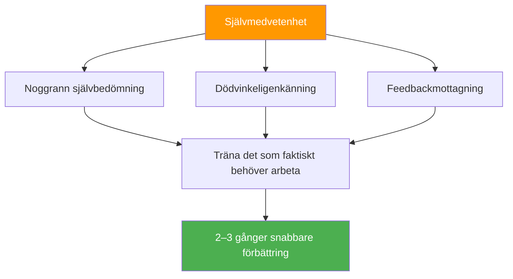

# Fördelen med självkännedom

::: tip Metafärdigheten som multiplicerar allt
**Vikt: 400 poäng** — Spelare med korrekt självuppfattning förbättras 2–3 gånger snabbare eftersom de tränar det som faktiskt behöver arbetas med.
:::

## Varför detta är din dolda multiplikator

> &quot;Man kan inte förbättra det man inte kan se.&quot;

De flesta spelare spenderar timmar på att öva, men **övar de på rätt saker?** Självkännedom är den metafärdighet som säkerställer att din träningstid faktiskt är effektiv.

### Förbättringsmultiplikatoreffekten



Utan självinsikt kanske du:
- Öva på det du redan är bra på (känns bra, begränsad utveckling)
- Missa tekniska brister du inte kan se
- Felaktigt hänföra förluster till externa faktorer
- Motstå feedback som kan hjälpa dig

Med självkännedom kan du:
- Identifiera faktiska svagheter korrekt
- Acceptera och integrera användbar feedback
- Förstå hur pressen påverkar ditt specifika spel
- Känn dina mönster under olika förhållanden

---

## Självkännedomsparadoxen

::: danger Den obekväma sanningen
Forskning visar konsekvent: De som behöver mer självkännedom tror vanligtvis att de har utmärkt självkännedom. De med hög självkännedom ifrågasätter ständigt sig själva och söker extern input.

**Vilken är du?**
:::

Detta kallas **Dunning-Kruger-effekten** tillämpad på självuppfattning. Just den brist på medvetenhet som håller dig tillbaka hindrar dig också från att se att du saknar medvetenhet.

### Lösningen: Utvändiga speglar

Eftersom vi inte helt kan lita på vår inre uppfattning behöver vi externa speglar:

| Spegel | Vad det avslöjar |
|--------|-----------------|
| **Videoanalys** | Teknisk verklighet kontra vad du tror att du gör |
| **Prestandadata** | Mönster du kanske inte märker |
| **Feedback från lagkamrater** | Hur du uppfattas under press |
| **Coachobservation** | Expertöga på ditt spel |

---

## Johari-fönstret för boulespelare

Johari-fönstret är en psykologisk modell som kartlägger vad du och andra vet om ert spel:

```
                    Known to Self    Unknown to Self
                   ┌────────────────┬────────────────┐
 Known to Others   │     OPEN       │     BLIND      │
                   │  Arena         │  Spot          │
                   │                │                │
                   │ Your conscious │ What others    │
                   │ skills and     │ see but you    │
                   │ tendencies     │ don't          │
                   ├────────────────┼────────────────┤
 Unknown to Others │    HIDDEN      │   UNKNOWN      │
                   │    Facade      │   Potential    │
                   │                │                │
                   │ What you know  │ Undiscovered   │
                   │ but don't      │ capabilities   │
                   │ share          │                │
                   └────────────────┴────────────────┘
```

### Ditt mål: Utöka det &quot;öppna&quot; området

**1. Minska dina blinda fläckar**
- Sök videoanalys
- Be om specifik feedback
- Se upp för mönster i resultaten

**2. Dela mer (Minska dolda)**
- Berätta för dina lagkamrater när du har det svårt
- Diskutera din strategi öppet
- Be om hjälp när det behövs

**3. Upptäck din okända potential**
- Prova nya tillvägagångssätt
- Experiment i träning
- Knyckla utanför komfortzonen

---

## Självkännedom kontra självkritik

::: warning Kritisk distinktion
Självmedvetenhet är **neutral observation** av verkligheten.
Självkritik är **negativ bedömning** av dig själv.

De är INTE samma sak.
:::

| Självmedvetenhet | Självkritik |
|----------------|----------------|
| &quot;Jag missade tre karuseller idag&quot; | &quot;Jag är hemsk på carreaux&quot; |
| &quot;Jag spänner mig i jämna matcher&quot; | &quot;Jag kvävs alltid under press&quot; |
| &quot;Min pekning är mindre exakt när jag är trött&quot; | &quot;Jag klarar inte av långa turneringar&quot; |
| &quot;Jag kommunicerar mindre när jag förlorar&quot; | &quot;Jag är en dålig lagkamrat när jag är stressad&quot; |

**Skillnaden spelar roll eftersom:**
- Självkännedom leder till riktad förbättring
- Självkritik leder till skam och undvikande
- Självkännedom är faktabaserad och specifik
- Självkritik är känslomässig och generaliserad

---

## De tre nivåerna av självkännedom

### Nivå 1: Teknisk självkännedom
*&quot;Hur presterar jag egentligen?&quot;*

- Noggrannhet under olika förhållanden
- Tekniska exekveringsmönster
- Fysiskt tillstånd påverkar prestation

### Nivå 2: Psykologisk självkännedom
*&quot;Hur reagerar jag mentalt och känslomässigt?&quot;*

- Stressreaktioner och triggers
- Förtroendefluktuationer
- Fokusmönster och distraktorer

### Nivå 3: Social självkännedom
*&quot;Hur påverkar jag andra och hur ser de på mig?&quot;*

- Teamkommunikationsmönster
- Ledarskapsögonblick (eller luckor)
- Hur dina känslor påverkar lagkamrater

---

## Självbedömning: Din nuvarande självkännedom

Betygsätt dig själv ärligt (1 = Aldrig, 5 = Alltid):

| Fråga | Göra |
|----------|-------|
| Jag kan noggrant förutsäga min prestation i olika situationer | /5 |
| Jag vet vilka omständigheter som gör att jag underpresterar | /5 |
| Jag förstår hur lagkamrater uppfattar mig under press | /5 |
| Jag välkomnar och integrerar kritisk feedback | /5 |
| Min självbedömning stämmer överens med min tränares/lagkamraters bedömning | /5 |
| Jag kan objektivt analysera min prestation utan känslomässig reaktion | /5 |
| Jag märker att mitt eget mentala tillstånd förändras under tävling | /5 |

**Poängsättning:**
- **28–35:** Hög självkännedom (men var ödmjuk – fortsätt söka input)
- **21-27:** Måttlig självkännedom (bra grund att bygga vidare på)
- **14-20:** Självkännedomsgap (denna modul är avgörande för dig)
- **Under 14:** Betydande blinda fläckar (prioritera detta arbete)

---

## I den här modulen

### [Att få och använda feedback](/sv/utbildning/självkännedom/feedback)
- Källor till objektiv feedback
- Hur man ber om feedback effektivt
- Ta emot feedback utan att vara defensiv
- Omvandla feedback till handling

### [Videoanalys för självupptäckt](/sv/utbildning/självkännedom/video)
- Vad som ska spelas in och när
- Vad du ska leta efter i ditt filmmaterial
- Jämförelse av självuppfattning med videoverklighet
- Protokoll för videoanalys

---

## Snabb vinst: De tre frågorna

Efter nästa träningspass eller match, fråga dig själv:

1. **Vad tyckte jag att jag gjorde bra?** (Var specifik)
2. **Vad skulle en objektiv observatör säga?** (Separera uppfattning från verklighet)
3. **Vad är en sak jag undviker att titta på?** (Hitta den blinda fläcken)

Skriv ner dina svar. Jämför dem över tid. Mönster kommer att framträda.

---

## Relaterade faktorer

- [Mentalt spel](/sv/utbildning/mentalt-spel/) — Självkännedom stöder mental träning
- [Teamdynamik](/sv/utbildning/teamdynamik/) — Förstå hur andra uppfattar dig
- [Motivation](/sv/utbildning/motivation/) — Känn dina verkliga drivkrafter
- [Teknik](/sv/utbildning/teknik/) — Videoanalys avslöjar teknisk sanning

