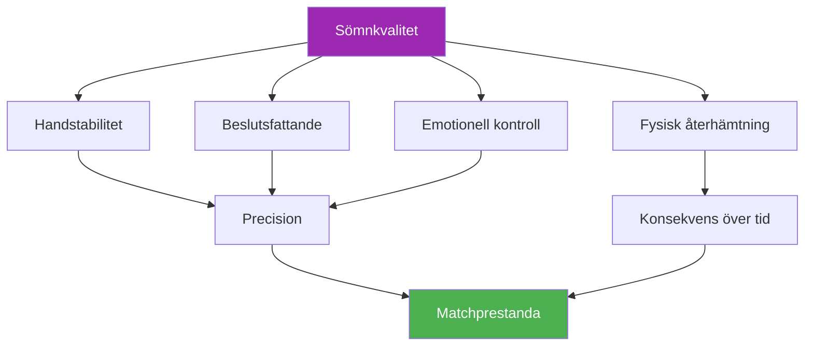

# Sömn och återhämtning

::: tip En kritisk prestationsfaktor
**Vikt: 400 poäng** — Sömn är den mest underskattade faktorn inom precisionssporter. Dina händer, beslut och känslor är alla beroende av god vila.
:::

## Den dolda prestationsfördelen

> &quot;Spelaren som sov bättre vinner ofta.&quot;

I boule, till skillnad från uthållighetssporter där idrottare ibland kan &quot;pressa igenom&quot; trötthet, **är precision inte förhandlingsbar**. Din förmåga att placera ett klot inom centimeter från cochonnetten beror på system som är utomordentligt känsliga för sömnbrist:

- Finmotorisk kontroll
- Beslutsfattande under press
- Emotionell reglering
- Minneskonsolidering

Den här modulen avslöjar varför sömn kan vara din största outnyttjade konkurrensfördel.

---

## Hur sömn påverkar ditt spel

### Handstabilitet och motorisk kontroll

Forskning visar att finmotorik försämrar **10–15 % per timme av ackumulerad sömnbrist**. För boulespelare manifesterar sig detta som:

- **Ökade mikrotremor** — Omärkbara för dig, men påverkar frisättningskonsistensen
- **Minskad proprioception** — Mindre medvetenhet om grepptryck och armposition
- **Långsammare felkorrigering** — Din kropp kan inte göra de mikrojusteringar som ger noggrannhet

::: warning Varför pekandet lider först
Att peka kräver den finaste motoriska kontrollen av alla skott. Det är ofta den första färdigheten som försämras när man sover för lite – även när man &quot;mår bra&quot;.
:::

### Beslutsfattande och taktik

Din prefrontala cortex – ansvarig för planering, riskbedömning och strategiskt tänkande – är mycket känslig för sömnbrist:

- **Riskbedömningen försämras** — Du kan försöka med sprutor med lägre procentandel
- **Taktisk flexibilitet minskar** — Svårare att anpassa sig mitt i spelet
- **Fenomenet &quot;beslutet två på morgonen&quot;** — Val som verkar rimliga när man är trött ser tvivelaktiga ut i efterhand

### Emotionell reglering

Sömnbrist orsakar **hyperaktivitet i amygdalan**, hjärnans känslomässiga centrum:

- Trycket känns mer intensivt
- Frustrationen efter missar förstärks
- Återhämtning från motgångar tar längre tid
- Lagdynamiken kan bli lidande av korta humör

### Minneskonsolidering

Motorminnet konsolideras under sömnen – särskilt under djupsömnfaser:

- **Övning utan sömn = begränsad lagring**
- **&quot;Att sova på det&quot; fungerar faktiskt** för teknikbyten
- Formeln: **Kvalitetspraxis + Kvalitetssömn = Permanent skicklighet**

---

## Sambandet mellan sömn och prestanda

---

## Sömnskuldens verklighet

### Vad är sömnskuld?

Sömnskuld är **kumulativ**. Att missa en timmes sömn påverkar inte bara den dagen – den ackumuleras:

| Dagar | Timmar korta | Total skuld | Prestandapåverkan |
|------|-------------|------------|-------------------|
| 1 | -1 timme | 1 timme | Minimal |
| 3 | -1 timme/dag | 3 timmar | Märkbar |
| 7 | -1 timme/dag | 7 timmar | Signifikant |
| 14 | -1 timme/dag | 14 timmar | Svår |

::: danger Helgens myt
Du kan inte helt &quot;komma ikapp&quot; på helgerna. Extra sömn hjälper visserligen, men det raderar inte uppsamlade skulder. Konsekvens är viktigare än långa sömnsträckor då och då.
:::

### Hur mycket behöver du?

&quot;8 timmar för alla&quot; är en myt. Individuella behov varierar:

- **De flesta vuxna:** 7–9 timmar
- **Vissa fungerar bra på:** 6–7 timmar
- **Vissa kräver:** 9+ timmar

**Hitta DITT optimala sömnbehov:**
1. Under semestern (utan alarm), låt dig själv sova naturligt i 5–7 dagar
2. Efter den inledande &quot;ikappfasen&quot;, notera hur länge du sover
3. Det är troligtvis nära ditt biologiska behov

---

## Vetenskapen i korthet

### Sömnstadier som spelar roll

| Etapp | Fungera | Boule-relevans |
|-------|----------|-------------------|
| **Djupsömn (N3)** | Fysisk återhämtning, tillväxthormon | Muskelåterhämtning, energiåterställning |
| **REM-sömn** | Emotionell bearbetning, minneskonsolidering | Bevarande av motoriska färdigheter, emotionell motståndskraft |
| **Lätt sömn (N1-N2)** | Övergång, underhåll | Stöder övergripande arkitektur |

### Viktiga forskningsresultat

1. **Stanford Basketball Study** — Spelare som förlängde sömnen till 10 timmar förbättrade sin straffkastprecision med 9 % (Mah et al., 2011)
2. **Tennisserveprecision** — Sömnbegränsning minskade serveprecisionen med 53 % (Reyner &amp; Horne, 2013)
3. **Metaanalys av reaktionstid** — Även en natt med dålig sömn saktar ner reaktionstiden med 300 % (Lim &amp; Dinges, 2010)

---

## Självbedömning: Din sömnverklighet

Betygsätt dig själv ärligt (1-5):

| Fråga | Göra |
|----------|-------|
| Jag sover lika mycket de flesta nätter | /5 |
| Jag somnar inom 15-20 minuter | /5 |
| Jag vaknar sällan på natten | /5 |
| Jag vaknar och känner mig utvilad | /5 |
| Jag bibehåller energin hela dagen | /5 |

**Poängsättning:**
- **20–25:** Utmärkta sömnvanor
- **15-19:** Bra, men utrymme för förbättringar
- **10–14:** Sömn påverkar sannolikt din prestation
- **Under 10:** Sömnförbättring bör prioriteras

---

## I den här modulen

### [Sömnprotokoll för tävlingar](/sv/utbildning/sömn/tävling)
- Veckan före tävlingen
- Rese- och tidszonshantering
- Protokoll för power napping
- Akuta &quot;Jag kunde inte sova&quot;-strategier

### [Sömnhygien för idrottare](/sv/utbildning/sömn/vanor)
- De 10 grunderna för sömn
- Mallar för kvällsrutiner
- 30-dagars sömnutmaning
- Felsökning av vanliga problem

---

## Snabbvinst: Ikväll

Om du inte gör något annat, implementera dessa två ändringar ikväll:

1. **Ställ in en konsekvent väckningstid** — Samma tid imorgon som idag, inom 30 minuter
2. **Inga skärmar 30 minuter före sänggåendet** — Läs, stretcha eller förbered dig för morgondagen istället

Enbart dessa två förändringar kan förbättra sömnkvaliteten inom några dagar.

---

## Relaterade faktorer

Sömn kopplas till allt annat i din framträdande:

- [Spänningshantering](/sv/utbildning/spänning/) — PMR och avslappningstekniker hjälper sömnen
- [Näring](/sv/utbildning/näring/) — Måltider och blodsocker påverkar sömnkvaliteten
- [Mentalt spel](/sv/utbildning/mentalt-spel/) — Sömn stöder kognitiv funktion och emotionell kontroll
- [Självkännedom](/sv/utbildning/självkännedom/) — Att känna igen när trötthet påverkar ditt spel

