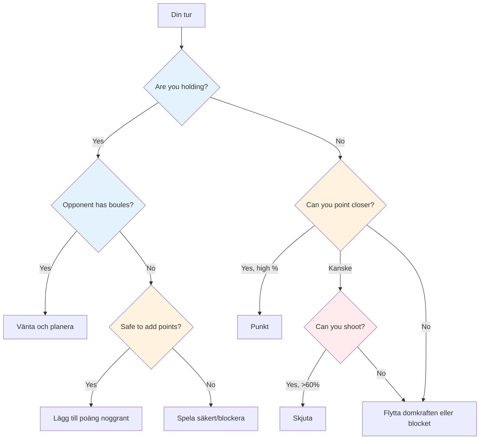
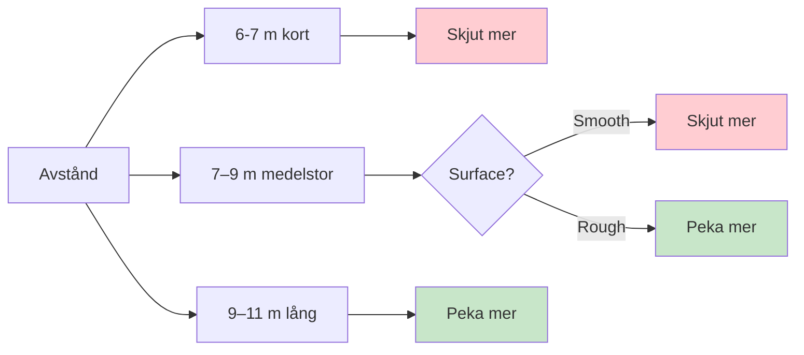

# Taktiskt tänkande i boule

På elitnivå förutsätts teknisk skicklighet. Det som skiljer vinnare från resten är taktisk intelligens – att veta vilket kast man ska försöka och när. De bästa spelarna läser spelet flera drag framåt och utnyttjar varje fördel.

::: tip Kärnprincipen
**På elitnivå är skillnaden sällan tekniken – det är beslutsfattandet.** Det lag som gör färre taktiska misstag vinner.
:::

## Ramverk för snabba beslut

## Det taktiska tankesättet

### Tänk i sannolikheter

Varje kast har en sannolikhet att lyckas. Bra taktik innebär att välja kast där:
- Sannolikheten för att lyckas är tillräckligt hög
- Belöningen rättfärdigar risken
- Misslyckande gör inte så ont

**Exempel på beslut:**
- Svårt skott: 40% framgång, vinner 3 poäng
- Säker poäng: 80 % framgång, vinner 1 poäng

Vilket är bäst? Det beror på resultatet, situationen och ditt självförtroende.

### Överväg alla alternativ

Före varje kast, tänk på:
1. **Point:** Placera ett klot nära jacken
2. **Skjut:** Ta bort en motståndares klot
3. **Blockera:** Placera ett klot för att blockera
4. **Flytta domkraften:** Slå avsiktligt i domkraften
5. **Offer:** Acceptera en dålig position för att skapa den senare

Välj inte det självklara alternativet. Tänk igenom alternativ.

### Läs situationen

Faktorer att beakta:
- Nuvarande resultat (vem leder, med hur mycket)
- Boules kvar (dina och deras)
- Position på terrängen
- Motståndarnas tendenser
- Ditt lags styrkor

## Kärntaktiska principer

::: tip De 6 taktiska principerna
1. **Kontrollera domkraften** - Position är makt
2. **Strategi för distans och yta** - Anpassa dig till förhållandena
3. **Diktera spelstilen** - Tvinga fram dina styrkor
4. **Hantera risk kontra belöning** - Matcha risk med situation
5. **Använd boule klokt** - Ibland släpper man in 1 för att undvika 3
6. **Tänk framåt** - Visualisera nästa 2-3 drag
:::

### Princip 1: Kontrollera domkraften

Laget som kontrollerar jackpositionen har en betydande fördel.

**Sätt att kontrollera:**
- Vinn rätten att kasta knekt
- Flytta domkraften till gynnsam terräng
- Skydda domkraften från att flyttas

**Strategi för placering av knekt:**
- Kort jack: Föredrar skytte, lättare att träffa mål på nära håll
- Lång jack: Fördelar med att peka, skjuta blir svårare
- Nära hinder: Skapar utmaningar för motståndare

**Utnyttja motståndarens svagheter:**
- Observera deras pekteknik – använder de alltid samma båge eller stil?
- Om de inte kan anpassa sig (t.ex. bara rulla, bara lobba), placera jacken för att tvinga fram obekväma kast
- Placera domkraften på avstånd eller positioner som avslöjar deras begränsningar
- Utnyttja bara en svaghet om du inte delar den – tänk först på ditt eget lags styrkor.

### Princip 2: Avstånds- och ytstrategi

Den optimala balansen mellan att sikta och skjuta beror starkt på avstånd och terräng:

::: info Distansstrategi
**Kort (6–7 m):** Föredrar skytte – lättare att träffa på nära håll
**Medelstor (7–9 m):** Ytan är viktigast
- Slät yta → skjut mer
- Grov yta → peka mer

**Lång (9–11 m):** Fördelaktig siktning – skottprecisionen minskar avsevärt
:::

**Din personliga skottprocent:**
- Om du skjuter med en framgångsgrad på över 75 %, skjut oftare
- Överväg att skjuta för att minska motståndarens poäng (även om du inte tar ledningen)
- Att skjuta för att minska motståndarens poängande klot (från 3 ner till 1) är värdefull skadekontroll.

**Skytte som en långsiktig strategi:**
- Om du skjuter med alla dina klot, tänk på din kumulativa framgångsgrad
- Beräkna: när du träffar alla slag får du betydligt fler poäng
- Även att missa några skott kan minska motståndarens poäng
- Exempel: Missa 1–2 skott men eliminera fortfarande hot, och vinn sedan stort när du träffar alla
- Detta är en kalkylerad risk – acceptera några förlorade mål för större vinster när det fungerar

### Princip 3: Diktera spelstilen

På elitnivå kan de flesta spelare både sikta och skjuta bra. Nyckeln är att tvinga fram spelet till ditt lags starkaste stil.

**Om ditt lag har starka skyttar:**
- Skjut så mycket som möjligt - använd din fördel
- Slösa inte din styrka genom att peka när du kan dominera genom att skjuta
- Kontrollera spelet genom att eliminera hot innan de ackumuleras
- Kort till medelstor jack håller skjutningen effektiv

**Mot lika starka skyttar:**
- Förvägra dem som enkla måltavlor genom att skjuta först
- Spela på långa avstånd för att minska allas skottprocent
- Det lag som skjuter först styr ofta slutet

**Om motståndare skjuter bättre än dig:**
- Spela lång knekt konsekvent - även elitskyttar sänker procentandelen vid 10m+
- Tvinga fram en poängstrid där du kan tävla
- Få dem att skjuta från svåra vinklar eller genom hinder

### Princip 4: Hantera risk kontra belöning

| Situation | Risktolerans |
|-----------|---------------|
| Bekvämt framåt | Låg - skydda din ledning |
| Stäng spelet | Medel - beräknade risker |
| Betydligt efter | Hög - behov av att ta chanser |
| Slutgiltigt slut | Beror på poängskillnaden |

### Princip 5: Använd dina boulespel klokt

Boulehantering skiljer elitspelare åt:
- När motståndaren får slut på klot, bestäm dig noga: lägga till poäng eller spela säkert?
- När du ligger efter, beräkna om du realistiskt sett kan ta tillbaka poängen
- Ibland är det bättre att släppa in 1 poäng än att slösa bort klot och ge upp 3.
- Håll koll på kvarvarande klot – dina och deras – hela tiden

### Princip 6: Tänk flera steg framåt

Elittänkande:
- Innan du kastar, visualisera de nästa 2-3 kloten från båda lagen
- Vad är din motståndares bästa svar om du lyckas? Om du misslyckas?
- Hur lägger det här kastet upp planen för ditt nästa?
- Tänk på slutspelsscenariot från nuvarande position

## Vanliga taktiska situationer

### Du håller bollen och motståndaren har boule kvar

Du måste vänta – det är deras tur att kasta. Använd den här tiden till att:
- Analysera vad de sannolikt kommer att göra
- Planera din reaktion på deras möjliga kast
- Håll dig fokuserad och redo

### Du håller bollen och motståndaren har slut på boule

Nu kan du spela dina återstående klot. **Alternativ:**
- Lägg till fler poäng om du kan göra det på ett säkert sätt
- Block för att skydda mot domkraftens rörelse
- Spela säkert – riskera inte att förvandla en 2-poängsvinst till en förlust

**Viktigt beslut:** Är risken att lägga till poäng värd att potentiellt öppna upp spelet?

### Du håller inte

Du måste kasta. **Alternativ:**
- Poäng närmare än deras bästa boule
- Skjut deras bästa klot
- Flytta lillen till dina klot
- Blockera för att begränsa deras poäng (om du inte kan ta poängen)

**Beslutsfaktorer:** Din skottprocent, antal kvarvarande klot (båda lagen), aktuellt resultat

### Sista boulesituationer

När du har den sista kulan:
- Maximalt tryck men också maximal kontroll
- Ta din tid – utvärdera alla alternativ
- Tänk på: sikta, skjuta eller flytta domkraften?
- Utför med fullt engagemang

När motståndaren har sista klotet:
- Du har gjort vad du kan - acceptera resultatet
- Om möjligt, skapa en situation där det inte finns någon enkel lösning för dem
- Flera hot är bättre än ett

## Att läsa sina motståndare

På elitnivå är scouting viktigt. Känn dina motståndare innan du spelar.

### Information före matchen
- Vilken är deras föredragna spelstil (skjutande kontra poängande lag)?
- Vem är deras starkaste skytt? Pointer?
- Vilka avstånd föredrar de?
- Hur presterar de under press i finaler?

### Observation under matchen
- Spåra deras framgångsfrekvens under matchen
- Lägg märke till om någon har en ledig dag
- Identifiera vem som hanterar press bra och vem som inte gör det
- Justera din domkraftsplacering baserat på vad du observerar

### Utnyttja det du hittar
- Rikta in dig på de svagare spelarna när det är möjligt
- Tvinga deras svaga skytt att skjuta, eller deras svaga pekare att peka
- Om någon har det svårt, fortsätt att sätta press på dem

## I detta avsnitt

- **[Sannolikhetsbaserade beslut](/sv/utbildning/taktik/sannolikhet)** - Använda matematik för att göra bättre val

## Sammanfattning: Alla taktiska regler

::: tip Regel nr 1: Sannolikhetsregeln
**Välj kast där sannolikheten för framgång motiverar risken.**
Tänk på: framgångsgrad, belöning om lyckat, kostnad om misslyckande
:::

::: tip Regel nr 2: Jackkontrollregeln
**Laget som kontrollerar domkraftens position har fördelen.**
Använd knektplacering för att utnyttja motståndarens svagheter och gynna dina styrkor
:::

::: tip Regel nr 3: Avståndsregeln
**Kort avstånd gynnar skott, långt avstånd gynnar pekande.**
Medeldistans: ytkvaliteten avgör balansen
:::

::: tip Regel #4: Stilregeln
**Tvinga fram spelet till ditt lags starkaste stil.**
Om du är en duktig skyttar, skjut mer. Slösa inte bort din fördel.
:::

::: tip Regel #5: Boulehanteringsregeln
Ibland är det bättre att släppa in 1 poäng än att riskera 3.
Vet när du ska minska dina förluster och spara klot till nästa omgång
:::

::: tip Regel #6: Regeln att tänka framåt
**Visualisera de kommande 2-3 dragen från båda lagen.**
Vad är deras bästa svar? Hur förbereder detta ditt nästa kast?
:::

::: tip Regel #7: Scoutregeln
**Känn dina motståndare innan du spelar.**
Spåra deras preferenser, framgångsfrekvens och pressreaktioner
:::

## Viktig slutsats

> På elitnivå är skillnaden sällan tekniken – det är beslutsfattandet. Det lag som gör färre taktiska misstag vinner.

Läs spelet. Känn dina styrkor. Utnyttja deras svagheter. Utför med självförtroende.

