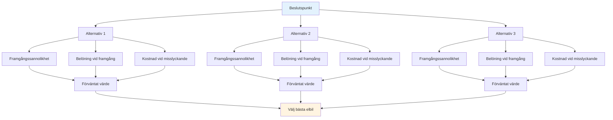

# Sannolikhetsbaserat beslutsfattande
<AdBanner />

Elitärt taktiskt tänkande använder sannolikhet för att fatta bättre beslut. Istället för att gissa eller gå på magkänsla tänker du systematiskt på dina alternativ.

::: tip Den stora idén
**Tänk i sannolikheter, inte i säkerheter.** Det bästa beslutet är inte alltid det mest aggressiva eller säkraste – det är det som ger dig det bästa förväntade värdet jämfört med många liknande situationer.
:::

## Det grundläggande ramverket

Varje kast har tre komponenter:

| Komponent | Fråga | Exempel |
|-----------|----------|---------|
| **Sannolikhet för framgång** | Hur troligt är det att jag genomför detta? | 70 % framgångsgrad på denna distans |
| **Belöning om du lyckas** | Vad vinner jag? | Vinn poängen, ta position |
| **Kostnad om misslyckande** | Vad förlorar jag? | Ge motståndaren enkel poäng |

::: info Formeln
**Förväntat värde = (Sannolikhet × Belöning) - ((1 - Sannolikhet) × Kostnad)**

Bra beslut maximerar förväntat värde över tid.
:::

## Tänkande i sannolikheter

När du väljer mellan alternativ, överväg:
- Vad är min realistiska framgångsgrad för varje alternativ?
- Vad vinner jag om det fungerar?
- Vad kostar det om det misslyckas?
- Hur påverkar spelsituationen mitt val?

Det bästa alternativet är inte alltid det mest aggressiva eller säkraste – det är det som ger dig det bästa resultatet jämfört med många liknande situationer.

## Känn dina siffror

För att använda sannolikhetslära behöver du veta dina faktiska framgångsgrader:

| Kasttyp | Avstånd | Din framgångsgrad |
|------------|----------|-------------------|
| Punkt (nära) | 6–7 månader | ___% |
| Punkt (medelstor) | 8–9 månader | ___% |
| Punkt (lång) | 10+ månader | ___% |
| Skjut (nära) | 6–7 månader | ___% |
| Skjut (medium) | 8–9 månader | ___% |
| Skjut (långt) | 10+ månader | ___% |

<AdInArticle />

Följ dessa under träning. Var ärlig – de flesta spelare överskattar sina framgångsgrader.

## Justering för förhållanden

Dina grundpriser ändras baserat på:

| Faktor | Effekt på framgångsgraden |
|--------|----------------------|
| Okänd terräng | -10 till -20 % |
| Trycksituation | -5 till -15 % |
| Trötthet | -5 till -10 % |
| Förtroende (högt) | +5 till +10 % |
| Senaste framgång | +5% |
| Senaste misslyckandet | -5 till -10 % |

Var realistisk kring dessa justeringar.

## Boule-fördelsprincipen

När du har fler klot kvar än din motståndare:

**Prioritet 1: Säkra punkten**
- Först, se till att du håller minst en poäng
- Bli inte girig innan du har säkrat grunderna

**Prioritet 2: Maximera poäng med kalkylerad risk**
- När du väl håller, bedöm om du kan lägga till fler poäng
- Varje ytterligare kast är ett risk/belöningsbeslut
- Förvandla inte en säker 2-poängsvinst till en förlust genom att överanstränga dig

**Färre klot kvar:** Du måste se till att varje kast räknas. Säkra spel kanske inte räcker – överväg alternativ med högre belöning för att komma tillbaka till slut.

## &quot;Une Boule Devant&quot;-principen

En klot framför lillen (mellan lillen och motståndaren) är extremt värdefullt:
- Den blockerar direkta peklinjer
- Det tvingar motståndare att gå runt eller över
- Den kan avleda inkommande klot
- Det är en &quot;pengaboll&quot; - värd att skydda

**Taktisk implikation:** Ibland är det bättre att placera en blockerande klot än att försöka komma närmast.

## Risktolerans per spelstat

### Med tidsgräns

När man spelar med en tidsgräns spelar poängskillnaden roll:

| Poängsituation | Riskstrategi |
|-----------------|---------------|
| Ledande med 4+ | Mycket konservativ - skydda ledningen, kör klockan |
| Ledning med 1-3 | Konservativ - ge inte bort poäng |
| Bunden | Balanserade - kalkylerade risker |
| Underläge med 1-3 | Aggressiv - behöver vinna mark |
| Efter med 4+ | Mycket aggressiv - måste ta chanser, tiden rinner ut |

### Utan tidsgräns

När det inte finns någon tidspress:
- Håll dig till din spelplan – ändra inte strategi bara på grund av resultatet
- Poängen kommer att fluktuera – lita på din strategi
- Överväg bara att ändra din spelplan om det uppenbarligen inte fungerar mot den här motståndaren.
- Panikförändringar när man är bakom gör ofta saken värre

### Justeringar i slutet av spelet

**Om man vinner denna ände, vinner man matchen:**
- Var mer konservativ
- Riskera inte att ge bort flera poäng
- En enda poäng kan räcka

**Om man förlorar i denna ände förlorar man matchen:**
- Ta större risker
- Behöver göra flera poäng
- Säkert spel räddar dig inte

## Vanliga sannolikhetsmisstag

### 1. Överdriven självsäkerhet
&quot;Jag kan göra det där skottet&quot; – men kan du göra det 7 gånger av 10? Var ärlig.

### 2. Ignorera basräntor
Din skottprocent ändras inte eftersom ögonblicket är viktigt.

### 3. Fallet med nedsänkta kostnader
&quot;Jag har redan missat två gånger, jag borde fortsätta skjuta&quot; - varje kast är oberoende.

### 4. Resultatbias
Ett riskabelt skott som fungerade var fortfarande riskabelt. Ett säkert spel som misslyckades var fortfarande korrekt.

### 5. Ignorera motståndarens alternativ
Tänk på vad de kommer att göra efter ditt kast, oavsett om det lyckades eller inte.

## Praktisk tillämpning

### Före varje kast

1. **Identifiera alternativ** (sikta, skjuta, blockera, etc.)
2. **Uppskatta sannolikheten för framgång** för varje
3. **Beakta resultat** (framgång och misslyckande)
4. **Faktor i spelets tillstånd** (resultat, återstående klot)
5. **Välj** alternativet med bäst förväntat värde
6. **Fullständigt förbindelsekrav** - inga tveksamheter under utförandet

### Bygga intuition

Med tiden blir sannolikhetstänkande intuitivt:
- Följ dina resultat ärligt
- Granska beslut efter matcher
- Lägg märke till mönster i dina framgångsgrader
- Anpassa din mentala modell

## Viktig slutsats

> Bra beslut leder inte alltid till bra resultat. Men bra beslut leder över tid till bättre resultat.

Tänk i sannolikheter. Känn till dina siffror. Gör det smarta spelet, inte det hoppfulla.

<AdBanner />
