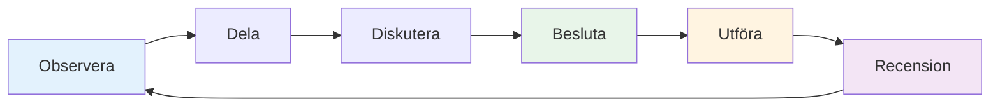

# Teamkommunikation

Effektiv kommunikation är det som förvandlar en grupp individer till ett team. I boule, där strategin ständigt förändras och pressen är hög, kan hur du kommunicerar avgöra resultatet.

::: tip Den stora idén
**Kommunikation är det som förvandlar individer till ett team.** Tydlig, specifik och stödjande kommunikation under press skiljer bra team från fantastiska.
:::

## Kommunikationscykeln

God teamkommunikation följer en cykel:

| Steg | Handling | Exempel |
|------|--------|---------|
| **Observera** | Lägg märke till vad som händer | Terräng, positioner, motståndare |
| **Dela** | Berätta för dina lagkamrater vad du ser | &quot;Marken sluttar därifrån&quot; |
| **Diskutera** | Utbytesperspektiv | &quot;Ska jag blockera eller satsa på poäng?&quot; |
| **Besluta** | Överens om tillvägagångssätt | &quot;Vi provar den höga lobben&quot; |
| **Utföra** | Gör det med engagemang | Fullt fokus på kastet |
| **Recension** | Lär dig av resultatet | &quot;Det fungerade bra&quot; eller &quot;Nästa gång...&quot; |

## När man ska kommunicera

### Före varje slut
- Bedöm terrängen tillsammans
- Diskutera den allmänna strategin
- Förtydliga vem som kastar när
- Sätt tonen (lugn, fokuserad)

### Under slutet
- Dela observationer (&quot;Marksluttningen som lämnas där&quot;)
- Koordinationsstrategi (&quot;Ska jag försöka blockera eller gå för poängen?&quot;)
- Erbjud stöd (&quot;Ta din tid, du klarar det här&quot;)
- Anpassa planer när situationen förändras

### Mellan ändarna
- Snabb genomgång (vad fungerade, vad fungerade inte)
- Återställ mentalt
- Förbered dig för nästa slut
- Håll kontakten som ett team

### Efter matchen
- Fullständig debriefing (vid behov)
- Erkänn bidrag
- Identifiera lärdomar
- Upprätthåll relationen

## Hur man kommunicerar

### Var tydlig och specifik

**Vagt:** &quot;Försök att komma nära&quot;
**Klart:** &quot;Sikta mot vänster sida av domkraften, cirka 20 cm ut&quot;

**Vagt:** &quot;Bra försök&quot;
**Klart:** &quot;Bra vikt, bara en liten bit kvar av linjen&quot;

### Var konstruktiv

Fokusera på lösningar, inte problem:

**Problemfokuserad:** &quot;Du fortsätter att missa till höger&quot;
**Lösningsfokuserad:** &quot;Kanske försöka sikta lite mer åt vänster för att kompensera?&quot;

### Var stödjande

Din ton är lika viktig som dina ord:
- Behåll lugnet, även när du är frustrerad
- Använd uppmuntrande kroppsspråk
- Erkänn ansträngningar, inte bara resultat
- Bygg upp, riv inte ner

### Lyssna aktivt

Kommunikation är tvåvägs:
- Ge full uppmärksamhet när lagkamrater pratar
- Ställ förtydligande frågor
- Bekräfta vad du har hört
- Avbryt inte eller avfärda

## Kommunikationsutmaningar

### Oenighet om strategi

**Dåligt tillvägagångssätt:**
- Insistera på din väg
- Bli defensiv
- Ge efter bittert
- Bråka under spelets gång

**Bättre tillvägagångssätt:**
1. Dela ditt perspektiv tydligt
2. Lyssna på deras helt
3. Diskutera för- och nackdelar kortfattat
4. Besluta tillsammans (eller låt det gå till utsedd ledare)
5. Förbind dig helt och hållet till beslutet
6. Recension efter matchen

### Efter en lagkamrats misstag

**Vad de behöver:**
- Snabb bekräftelse
- Tillstånd att gå vidare
- Förtroendet att du fortfarande litar på dem
- Fokusera på nästa kast

**Vad ska man säga:**
- &quot;Inga problem, nästa&quot;
- &quot;Tuff paus, du har nästa&quot;
- &quot;Vi är fortfarande inne på det här&quot;
- *Ibland räcker det med en nick eller klapp*

**Vad man INTE ska säga:**
- Ingenting (tystnad känns som en dom)
- &quot;Det är okej&quot; (kan låta avfärdande)
- Något om vad som gick fel (inte nu)
- Synlig frustration (kroppsspråk räknas)

### När du gör ett misstag

**Vad man ska göra:**
- Kort tack (&quot;Mitt fel&quot;)
- Be inte om ursäkt för mycket
- Hitta inte på ursäkter
- Återställ och fokusera på nästa kast
- Lita på att dina lagkamrater stöttar dig

### Spänningen i laget

Om spänningen byggs upp under en match:
1. Inse att det händer
2. Ta ett andetag innan du svarar
3. Fokusera på spelet, inte konflikten
4. Ta itu med det ordentligt efter matchen
5. Låt det inte påverka ditt spelande

## Icke-verbal kommunikation

Mycket av teamets kommunikation är icke-verbal:

### Positiva signaler
- Ögonkontakt
- Nickar
- Tummen upp
- Avslappnad hållning
- Rör sig mot lagkamrater
- Leende (när det är lämpligt)

### Negativa signaler (undvik dessa)
- Ögonrullning
- Vändande bort
- Korsade armar
- Suckande
- Skakar på huvudet
- Spänt kroppsspråk

**Kom ihåg:** Dina lagkamrater ser allt. Ditt kroppsspråk påverkar deras självförtroende och prestation.

## Bygga kommunikationsvanor

### Praktikkommunikation

Vänta inte på att konkurrenterna ska kommunicera:
- Öva strategiska diskussioner i utbildningen
- Ge varandra feedback regelbundet
- Utveckla ert lagspråk
- Bygg trygghet med ärliga samtal

### Utveckla teamsignaler

Vissa team utvecklar förkortningar:
- Handsignaler för strategi
- Kodord för situationer
- Snabba fraser med gemensam betydelse

### Regelbundna incheckningar

Utanför spelen:
- Hur arbetar vi tillsammans?
- Vad går bra?
- Vad kan vara bättre?
- Några problem att åtgärda?

## Kaptenens roll

Om ert team har en utsedd ledare:

**Kaptenens ansvarsområden:**
- Slutgiltigt beslut när laget är oense
- Sätter tonen och energin
- Hantera teamdynamik
- Att hålla fokus under press

**Alla andra:**
- Dela ditt perspektiv
- Stöd beslutet när det väl är fattat
- Hjälp till att upprätthålla teamets energi
- Ta ansvar för din roll

## Viktig slutsats

> Bra team pratar med varandra, inte om varandra. De kommunicerar med ärlighet, respekt och ett gemensamt engagemang för framgång.

Öva kommunikation på samma sätt som du övar på att kasta. Det är en färdighet som förbättras med uppmärksamhet.

