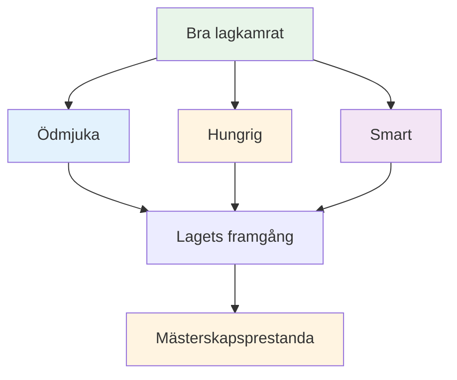

# Att vara en bra lagspelare

Boule spelas ofta i lag – dubbel (dublettes) eller trippel (triplettes). Individuell skicklighet spelar roll, men lagdynamik kan avgöra resultatet. De bästa lagen är inte alltid de skickligaste – det är de som fungerar bäst tillsammans.

::: tip Den stora idén
**De bästa lagen är inte alltid de skickligaste – det är de som fungerar bäst tillsammans.** Att vara ödmjuk, hungrig och känslomässigt smart gör dig till en bra lagkamrat.
:::

## Vad kännetecknar en bra lagkamrat?

Forskning och erfarenhet pekar på tre viktiga egenskaper:

### 1. Ödmjuk
- Prioriterar lagets framgång framför personlig ära
- Uppskattar andras bidrag
- Erkänner misstag utan ursäkter
- Öppen för feedback och lärande
- Behöver inte vara stjärnan

### 2. Hungrig
- Självmotiverad och driven
- Gör jobbet utan att bli tillfrågad
- Alltid strävar efter att förbättra
- Ger energi till laget
- Löser inte på talang

### 3. Smart (känslomässigt)
- Läser situationer och människor väl
- Vet när man ska tala och när man ska lyssna
- Hanterar sina egna känslor
- Stödjer lagkamraterna på lämpligt sätt
- Hanterar konflikter konstruktivt

## Grunden för teamframgång

### Gemensamma mål och vision

Starka lag har:
- Tydliga, överenskomna mål
- Individuella mål i linje med lagets mål
- Gemensam förståelse för hur framgång ser ut
- Engagemang för det kollektiva uppdraget

**Frågor att diskutera med ditt team:**
- Vad försöker vi uppnå tillsammans?
- Hur ser framgång ut för oss?
- Hur stödjer våra individuella mål laget?

### Effektiv kommunikation

Kommunikation är livsnerven för ett lags prestation.

**Bra teamkommunikation:**
- Öppen och ärlig
- Respektfull, även vid oenighet
- Tydlig och specifik
- Tvåvägs (talar OCH lyssnar)
- Aktuell (rätt information vid rätt tidpunkt)

**Under matcher:**
- Diskutera strategi före varje omgång
- Dela observationer om terräng, motståndare
- Samordna vem som kastar när
- Stöd varandra efter kast (bra eller dåliga)

### Förtroende och respekt

Utan förtroende faller lag isär under press.

**Bygg förtroende:**
- Var pålitlig (gör vad du säger)
- Var kompetent (gör ditt jobb bra)
- Var ärlig (även när det är svårt)
- Visa sårbarhet (erkänn svårigheter)
- Stöd andra konsekvent

**Visa respekt:**
- Värdesätt varje persons bidrag
- Lyssna på olika perspektiv
- Erkänn ansträngningar, inte bara resultat
- Betrakta allas roll som viktig

### Tydliga roller

Alla borde förstå:
- Deras primära ansvarsområden
- Hur de bidrar till laget
- Vad andra räknar med dem för
- När man ska ta ett steg framåt och när man ska ta ett steg tillbaka

**I trippel:**
| Roll | Primärt fokus | Viktiga egenskaper |
|------|--------------|---------------|
| Pekare | Placera boule nära jacken | Precision, konsekvens |
| Mitten | Anpassa dig till situationen | Mångsidighet, lässpel |
| Skjutskytte | Ta bort motståndarens klot | Noggrannhet under press |

Roller kan vara flexibla, men tydlighet hjälper.

## Lagdynamik under tävling

### Före matchen
- Kom tillsammans, värm upp tillsammans
- Diskutera den allmänna strategin
- Sätt tonen (positiv, fokuserad)
- Kolla in hur alla mår

### Under spelet
- Kommunicera mellan ändarna
- Var positiv oavsett poäng
- Stödja varandra efter misstag
- Fira framgångar tillsammans (kortfattat)
- Håll fokus på processen, inte resultatet

### Efter misstag
Vad man INTE ska göra:
- Visa synligt frustration
- Kritisera eller skylla på
- Dra dig tillbaka eller bli tyst
- Tänk på vad som hände

Vad man ska göra:
- Snabb bekräftelse (&quot;inga problem&quot;)
- Flytta fokus till nästa kast
- Behåll ett positivt kroppsspråk
- Lita på att din lagkamrat återhämtar sig

### Efter matchen
- Genomgång gemensamt (vad fungerade, vad fungerade inte)
- Erkänn individuella bidrag
- Diskutera förbättringar inför nästa gång
- Behåll relationer oavsett resultat

## Kommunikationsmönster

### Konstruktiv feedback
**Dåligt:** &quot;Du missar de där skotten hela tiden&quot;
**Bättre:** &quot;Jag märkte att slagen går åt vänster – vill du försöka justera din hållning?&quot;

### Stödjande svar på misstag
**Dålig:** *Tystnad eller synlig frustration*
**Bättre:** &quot;Svårt. Du har nästa.&quot;

### Strategisk diskussion
**Dåligt:** &quot;Skjut bara&quot;
**Bättre:** &quot;Vad tycker du - att point blockera eller att försöka skjuta? Jag ser för- och nackdelar åt båda hållen.&quot;

## Bygga lagkultur

Bra team utvecklas gemensamt:
- **Värderingar:** Vad vi står för
- **Normer:** Hur vi beter oss
- **Språk:** Hur vi kommunicerar
- **Ritualer:** Vad vi gör tillsammans

**Exempel:**
- Skaka alltid hand före och efter
- Specifika uppmuntrande fraser
- Rutin tillsammans före matchen
- Måltid eller dryck efter matchen

## I detta avsnitt

- **[Teamkommunikation](/sv/utbildning/lagspelare/kommunikation)** - Detaljerad guide till effektiv kommunikation

## Viktig slutsats

> Ditt lag är bara så starkt som dess svagaste relation, inte dess svagaste spelare.

Investera i dina lagkamrater. Bygg förtroende. Kommunicera väl. Vinn tillsammans.

