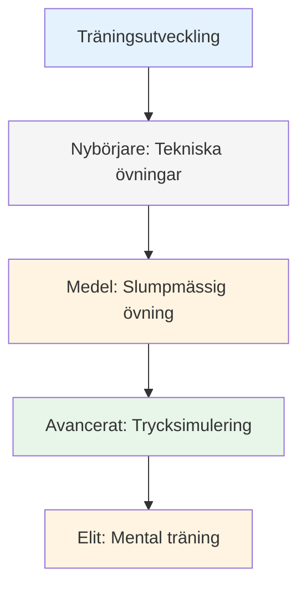
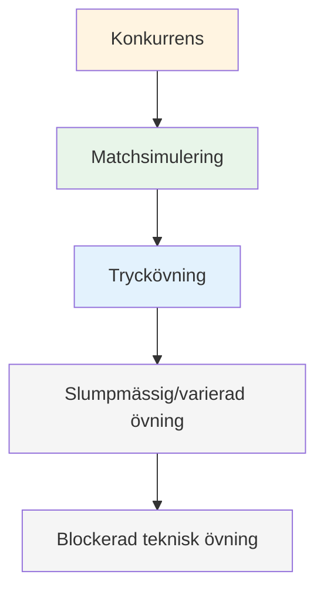

# Träningsmetoder

När din teknik är stabil, vad övar du på? Det är här många spelare stannar av – de fortsätter att öva på sin teknik när den verkliga utvecklingen ligger någon annanstans.

::: tip Den stora idén
**De flesta spelare stannar av eftersom de behåller sin träningsteknik när den verkliga utvecklingen ligger någon annanstans.** Elitspelare tränar anpassningsförmåga, beslutsfattande och mental styrka – inte bara mekanik.
:::

## Bortom teknisk repetition

De flesta spelare tränar genom att upprepa kast. Det är viktigt för nybörjare, men avancerade spelare behöver mer:

| Utbildningstyp | Vad det utvecklar | När man ska använda |
|--------------|------------------|-------------|
| Tekniska övningar | Mekanik, form | Lära sig nya färdigheter, lösa problem |
| Slumpmässig övning | Anpassningsförmåga, beslutsfattande | Tävlingsförberedelser |
| Trycksimulering | Mental styrka | Inför viktiga händelser |
| Mental träning | Fokus, återhämtning, självförtroende | Pågående, ofta försummad |

## Träningspyramiden

::: warning Vanligt misstag
**De flesta spelare tillbringar för mycket tid längst ner.** Elitspelare arbetar på alla nivåer i pyramiden, med fokus på de översta nivåerna allt eftersom de avancerar.
:::

## Blockerad kontra slumpmässig övning

### Blockerad övning
Upprepa samma kast många gånger:
- 20 poäng från 7 meter
- 20 skott mot samma måltavla
- Samma avstånd, samma kast

**Bra för:** Inledande inlärning, bygga upp självförtroende, uppvärmning
**Begränsning:** Överförs inte bra till tävling

### Slumpmässig övning
Variera allt:
- Olika avstånd per kast
- Alternativ siktning och skjutning
- Ändra mål ständigt

**Bra för:** Tävlingsförberedelser, bygga upp anpassningsförmåga
**Känslor:** Svårare, fler misstag, mindre &quot;produktiv&quot;
**Verklighet:** Bättre långsiktig retention och överföring

### Forskningen

Studier visar konsekvent:
- Blockerad träning känns bättre (snabb förbättring synlig)
- Slumpmässig träning ger bättre tävlingsprestationer
- Det är i den slumpmässiga övningens &quot;kamp&quot; som lärandet sker.

## Trycksimulering

Du klarar inte av tävlingspress om du aldrig upplever den på träning.

### Skapa träningspress

**Konsekvenser:**
- Armhävningar för missar
- Förloraren köper kaffe
- Poäng räknas mot något

**Scenarier:**
- &quot;Måste göras&quot;-situationer
- Underläge 12-10, måste göra mål
- Sista klotet i matchen

**Publik:**
- Öva med att titta på folk
- Spela in dig själv på video
- Berätta vad du försöker göra

**Trötthet:**
- Träna när du är trött
- Slut på lång session
- Efter fysisk träning

### Skjutstegen

En klassisk tryckborr:
1. Börja på 6 meter
2. Träffa målet = flytta tillbaka en meter
3. Missa = gå framåt en meter (eller börja om)
4. Mål: Nå 10 meter

Detta skapar ett naturligt tryck allt eftersom du utvecklas.

## Mentala träningspass

Avsätt tid specifikt för mentala färdigheter:

### Visualiseringssession (15–20 min)
1. Hitta en lugn plats
2. Slut dina ögon
3. Visualisera dig själv på en tävling
4. Se lyckade kast i detalj
5. Känn självförtroendet och flödet
6. Öva på att hantera tryckmoment

### Rutinövning före skott
- Öva din rutin utan att kasta
- Fokusera på de mentala övergångarna
- Bygg upp vanan att förbereda sig regelbundet

### Återhämtningspraktik
- Gör avsiktligt misstag i praktiken
- Öva på ditt SOAS-svar
- Bygg upp vanan med snabb mental återställning

## Strukturera din träningsvecka

### Exempel: Seriös amatör (6 timmar/vecka)

| Dag | Varaktighet | Fokus |
|-----|----------|-------|
| måndag | 1,5 timmar | Tekniskt: Spetsborrar |
| onsdag | 1,5 timmar | Tekniskt: Skjutövningar |
| Fredag | 1 timme | Mental: Visualisering, rutinmässig övning |
| lördag | 2 timmar | Matchspel med presselement |

### Exempel: Tävlingsspelare (10 timmar/vecka)

| Dag | Varaktighet | Fokus |
|-----|----------|-------|
| måndag | 2 timmar | Teknisk: Pekning (blockerad → slumpmässig) |
| tisdag | 1 timme | Mental träning + visualisering |
| onsdag | 2 timmar | Tekniskt: Skottkast (blockerat → slumpmässigt) |
| torsdag | 1 timme | Videorecension + mentalt arbete |
| Fredag | 2 timmar | Trycksimulering, spelscenarier |
| lördag | 2 timmar | Tävling eller matchspel |

## Träningsprinciper

### 1. Kvalitet framför kvantitet
- 30 fokuserade minuter slår 2 timmar av tanklös repetition
- Stanna när fokus tappas
- Bättre att sluta tidigt än att utveckla dåliga vanor

### 2. Avsiktlig praxis
- Ha ett specifikt mål för varje session
- Arbeta på gränsen till din förmåga
- Få feedback (video, partner, resultat)
- Anpassa baserat på vad du lär dig

### 3. Återhämtningsfrågor
- Vilodagar är en del av träningen
- Sömn påverkar prestationsförmågan avsevärt
- Mental trötthet är verklig - respektera den

### 4. Spåra allt
- För en träningsdagbok
- Notera vad som fungerar och vad som inte fungerar
- Granska regelbundet
- Anpassa din plan baserat på data

## I detta avsnitt

- **[Träningsövningar](/sv/utbildning/teknik/träning/övningar)** - Specifika övningar för olika färdigheter

## Viktig slutsats

> Hur du tränar avgör hur du presterar. Träna som du vill spela.

Variera din träning. Inkludera mentalt arbete. Skapa press. Följ dina framsteg.

