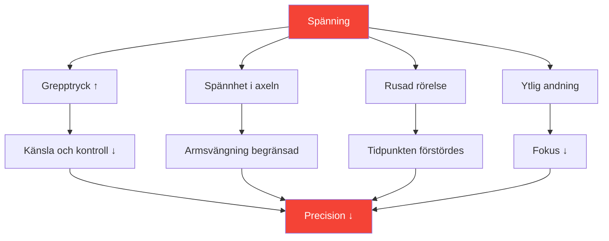

# Att förstå spänning i precisionssporter

::: tip Spänning är precisionens fiende
**Vikt: 300 poäng** — Du kan inte vara både spänd och precis. Att lära sig hantera spänning är avgörande för konsekvent prestation.
:::

## Precisionsparadoxen

> &quot;Ju hårdare du försöker, desto värre går det.&quot;

Det här är inte svaghet – det är fysik och fysiologi. Boule kräver avslappnade, flytande rörelser. Spänning förstör just de egenskaper som ger precisa kast.

### Hur spänning förstör precision



---

## Fysisk kontra mental spänning

Spänning existerar i två sammanhängande former:

### Fysisk spänning

Muskelspänning som direkt påverkar ditt kast:

| Område | Effekt på kast |
|------|-----------------|
| **Grepp** | Förlust av känsel, inkonsekvent frisättning |
| **Underarm** | Begränsad handledsrörelse |
| **Axel** | Förkortad, hackig armsving |
| **Hals** | Begränsad huvudställning, syn |
| **Käke** | Kopplat till den övergripande kroppsspänningen |
| **Kärna** | Balans- och viktöverföringsproblem |

### Mental spänning

Psykisk stress som skapar fysiska symtom:

- Tävlingstankar
- Oroa dig för resultaten
- Rädsla för misslyckande
- Tryckmedvetenhet
- Tidigare misstag uppspelning

::: warning Spänningsslingan
Mental spänning → Fysisk spänning → Dålig prestation → Mer mental spänning

Att bryta den här loopen är avgörande för ett konsekvent spel.
:::

---

## Yerkes-Dodson-lagen

Sambandet mellan upphetsning (aktiveringsnivå) och prestation följer en inverterad U-kurva:

```
Performance
    ↑
    │         ★ Optimal Zone
    │        /\
    │       /  \
    │      /    \
    │     /      \
    │    /        \
    │   /          \
    └──┴────────────┴──→ Arousal
     Low           High

   "Flat"   "Alert"   "Tense"
   Unfocused Relaxed  Anxious
```

### För låg (underupphetsad)
- Platt, ofokuserad
- Slarviga misstag
- Brist på intensitet
- Att gå igenom rörelserna

### För hög (överupphetsad)
- Spänd, stressad
- Övertänkande
- Hårt grepp, begränsad rörelse
- Kan inte återhämta sig från misstag

### Optimal zon
- Vaken men avslappnad
- Fokuserad men ändå flytande
- Lämplig intensitet
- Snabb återhämtning

---

## Hitta DIN optimala zon

Varje spelare har en annan optimal upphetsningsnivå:

### Självbedömningsprocessen

1. **Minns dina bästa prestationer**
   - Hur kände du dig fysiskt?
   - Vad var din energinivå?
   - Hur skulle du betygsätta din upphetsning (1-10)?

2. **Minns dina sämsta prestationer**
   - Var du för platt eller för spänd?
   - Vilka fysiska symtom märkte du?
   - Vad utlöste det suboptimala tillståndet?

3. **Identifiera ditt mönster**
   - Tenderar du att bli överaktiv eller underaktiv?
   - Vilka situationer utlöser ditt mönster?
   - Vad hjälper dig att återgå till optimalt läge?

### Vanliga spelarprofiler

| Profil | Tendens | Risksituationer | Strategi |
|---------|----------|-----------------|----------|
| **Den orolige** | Överdriven upphetsning | Höga insatser, jämna matcher | Avslappningstekniker |
| **Flatlinern** | Under-arousal | Låga insatser, tidiga rundor | Aktiveringstekniker |
| **Reaktorn** | Variabel | Efter missar skiftar momentum | Emotionell reglering |
| **Jägaren** | Överdriven upphetsning när man är bakom | Comebacks, tidspress | Acceptanstekniker |

---

## Att känna igen spänningssignaler

### Fysiska varningstecken

Lär dig att lägga märke till dessa innan de påverkar ditt kast:

| Signal | Plats | Handling |
|--------|----------|--------|
| **Fast grepp** | Hand | Mjuka upp före varje kast |
| **Höjda axlar** | Övre delen av ryggen | Släpp och rulla |
| **Knuten käke** | Ansikte | Öppna munnen lätt |
| **Ytlig andedräkt** | Bröst | Djupt andetag i magen |
| **Snabb rörelse** | Hela kroppen | Sakta ner medvetet |
| **Rostlöst nervositet** | Allmän | Jorda dig själv |

### Mentala varningstecken

- Tävlingstankar
- Negativt självprat ökar
- Fokusera på resultat, inte process
- Medvetenhet om insatser/poäng
- Att tänka på tidigare misstag

---

## Självkontroll av spänning och prestanda

Använd denna snabba bedömning mellan kast eller vid pauser:

**Fysisk skanning (5 sekunder):**
1. Grepp → Mjukt?
2. Axlar → Ner?
3. Käke → Ospänd?
4. Andning → Långsam och djup?

**Mental skanning (5 sekunder):**
1. Tankar → Fokuserad på nuet?
2. Energi → Optimalt intervall?
3. Nästa åtgärd → Rensa?

::: tip Gör det till en vana
De bästa spelarna gör detta automatiskt. Du kan träna dig själv att göra detsamma genom repetition.
:::

---

## I den här modulen

### [Tekniker för spänningsfrigöring](/sv/utbildning/spänning/tekniker)
- Progressiv muskelavslappning (PMR)
- Snabbfrigöringstekniker för tävling
- Andningsprotokoll
- Återställning av förkastspänning

### [Hantera spänningar i tävling](/sv/utbildning/spänning/tävling)
- Förberedelser inför matchen
- Protokoll under matchen
- Akut &quot;för spänd&quot; återhämtning
- Återställning efter misstag

---

## Snabbvinst: 10-sekunders återställning

Innan ditt nästa kast, använd detta snabba protokoll:

1. **Axlar** — Sänk dem medvetet
2. **Grepp** — Lättare med 20 %
3. **Käke** — Avklämning, tungan borttagen från gommen
4. **Andning** — En långsam, full utandning

Detta tar 10 sekunder och kan omedelbart förbättra ditt nästa kast.

---

## Relaterade faktorer

- [Mental styrka](/sv/utbildning/mentalt-spel/mental-styrka/) — Hantering av press
- [Sömn och återhämtning](/sv/utbildning/sömn/) — Vila minskar grundspänningen
- [Mindfulness](/sv/utbildning/mentalt-spel/mindfulness/) — Medvetenhet i nuet
- [Zonen](/sv/utbildning/mentalt-spel/zonen/) — Optimalt prestationstillstånd

